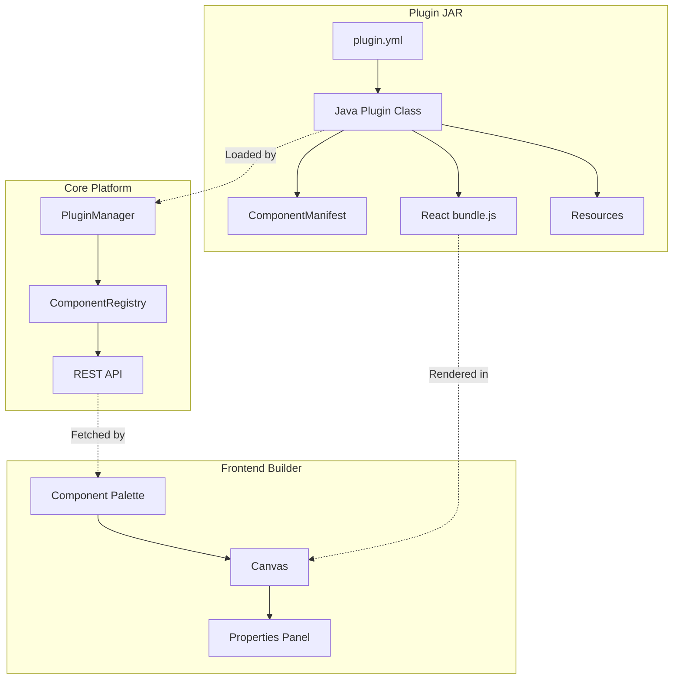
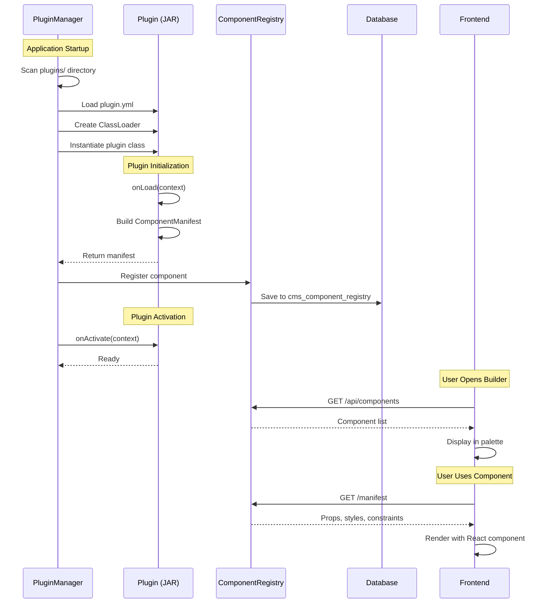
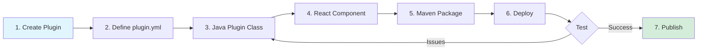
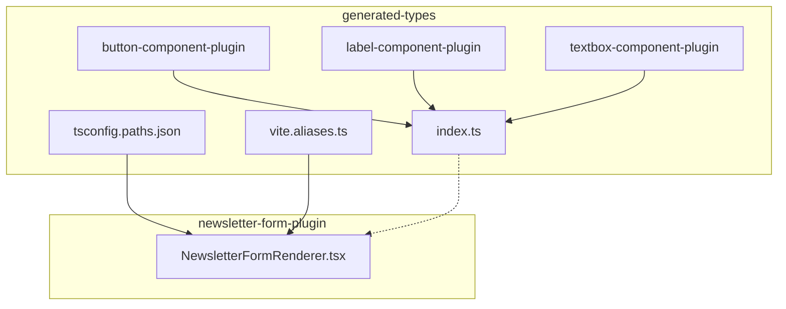
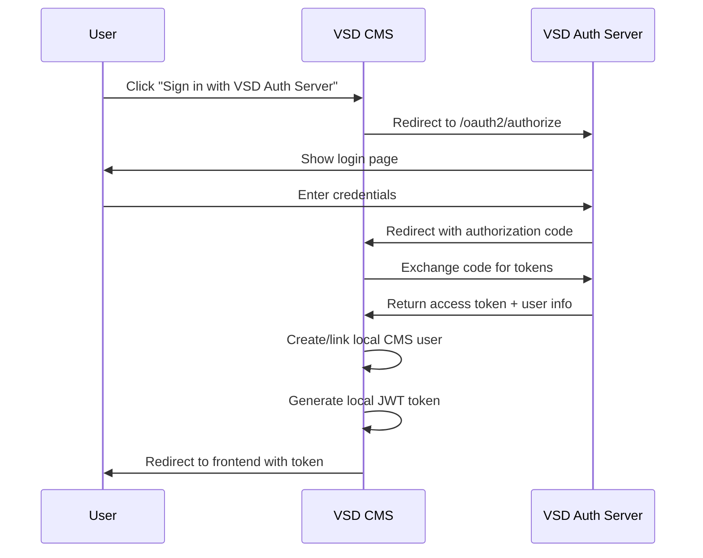
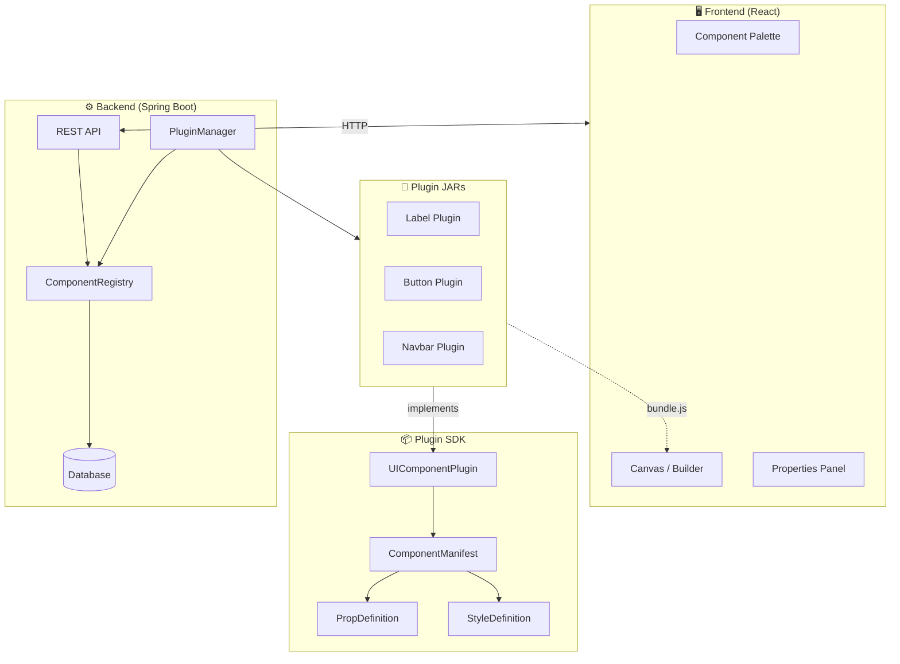
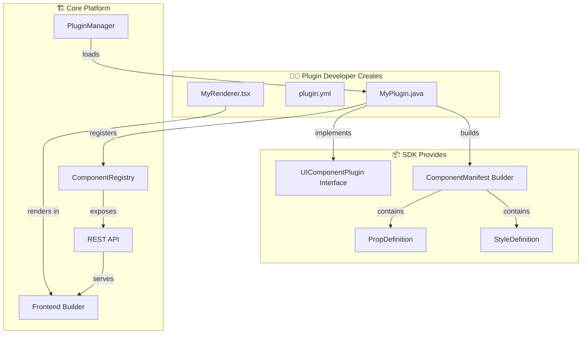
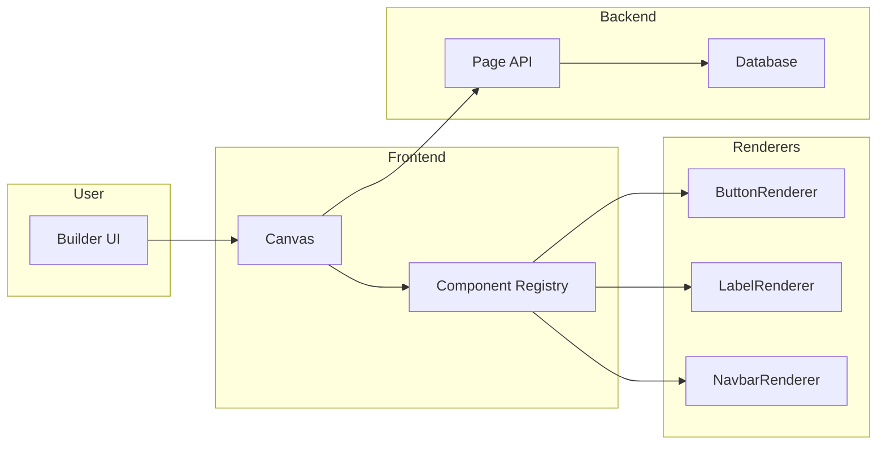
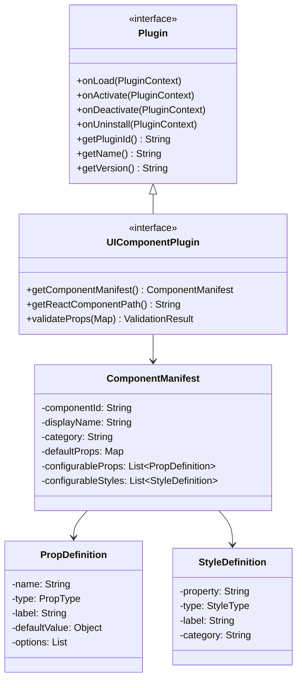
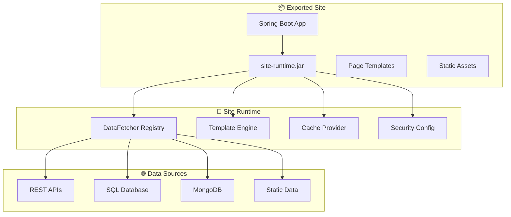

# Visual Site Designer (VSD)

A visual drag-and-drop website builder platform with a plugin-based architecture for creating and exporting sites.

---

## Table of Contents

**Getting Started**

- [Chapter 1: Quick Start](#chapter-1-quick-start)
- [Chapter 2: Running the Application](#chapter-2-running-the-application)

**Using the Builder**

- [Chapter 3: Builder Features](#chapter-3-builder-features)
  - [Container Height Modes](#container-component-height-modes)

**Plugin Development**

- [Chapter 4: Plugin Development Overview](#chapter-4-plugin-development-overview)
- [Chapter 5: Simple Plugin Development](#chapter-5-simple-plugin-development)
- [Chapter 6: Compound Plugin Development](#chapter-6-compound-plugin-development)
- [Chapter 7: Plugin SDK Reference](#chapter-7-plugin-sdk-reference)

**IDE Tooling**

- [Chapter 8: VSD IntelliJ Plugin](#chapter-8-vsd-intellij-plugin)

**Authentication**

- [Chapter 9: Authentication](#chapter-9-authentication)

**Reference**

- [Chapter 10: Architecture](#chapter-10-architecture)
- [Chapter 11: Site Runtime Library](#chapter-11-site-runtime-library)
- [Chapter 12: API Reference](#chapter-12-api-reference)
- [Chapter 13: Testing](#chapter-13-testing)
- [Chapter 14: Troubleshooting](#chapter-14-troubleshooting)

---

## Chapter 1: Quick Start

### Prerequisites

- **Java**: JDK 21 or higher
- **Maven**: 3.6+
- **Node.js**: 20.10.0+ (for frontend)
- **npm**: 10.2.3+

### Installation

```bash
# 1. Clone the repository
git clone https://github.com/mainul35/dynamic-site-builder.git
cd dynamic-site-builder

# 2. Install the BOM and SDK (required once)
cd vsd-cms-bom && mvn clean install && cd ..
cd flashcard-cms-plugin-sdk && mvn clean install && cd ..

# 3. Build everything
mvn clean install -DskipTests

# 4. Start the application
cd core && mvn spring-boot:run
```

### Access the Builder

Open your browser and navigate to:
- **Application**: http://localhost:8080
- **H2 Console**: http://localhost:8080/h2-console (JDBC URL: `jdbc:h2:file:./data/vsddb`)

### Default Credentials

- **Username**: `admin`
- **Password**: `admin123`

---

## Chapter 2: Running the Application

### Backend Only

```bash
cd core
mvn clean install -DskipTests
mvn spring-boot:run
```

**Configuration** (`core/src/main/resources/application.properties`):

```properties
# Server
server.port=8080

# Database (H2 embedded)
spring.datasource.url=jdbc:h2:file:./data/vsddb

# Plugin System
app.plugin.directory=plugins
app.plugin.hot-reload.enabled=true
app.plugin.validation.enabled=true
```

### Frontend Development (Hot Reload)

For frontend development with hot reload:

```bash
cd frontend
npm install
npm run dev

# Frontend dev server: http://localhost:5173
```

### Production Build

```bash
cd core
mvn clean package -DskipTests

# Run the JAR
java -jar target/core-1.0.0-SNAPSHOT.jar
```

### Docker Deployment

```bash
docker-compose up -d
docker-compose logs -f vsd-app
```

---

## Chapter 3: Builder Features

The Visual Site Builder provides a comprehensive interface for creating and managing pages.

### Component Palette

The left sidebar shows available components organized by category:
- **UI**: Label, Button, Image, Horizontal Row
- **Layout**: Container, Scrollable Container
- **Form**: Textbox, Newsletter Form
- **Navigation**: Navbar (with variants)
- **Auth**: Login Form, Register Form, Social Login Buttons

### Properties Panel

The right sidebar allows component customization with four tabs:

| Tab | Description |
|-----|-------------|
| **Props** | Component-specific properties (text, variants, options) |
| **Styles** | CSS styles (colors, spacing, typography, borders) |
| **Layout** | Position, size, span, z-index |
| **Events** | Click handlers, navigation, API calls |

### Page Management

- Create multiple pages per site
- Set homepage (route `/`)
- Page versioning with rollback capability
- Multi-page preview with navigation

### Export Options

| Format | Description |
|--------|-------------|
| **Static HTML** | Self-contained HTML/CSS/JS files |
| **Spring Boot + Thymeleaf** | Server-side rendered application |

### Component Resizing

Components can be resized in the builder using resize handles. The resizing behavior follows these rules:

#### Dimension Priority

Component dimensions are determined in this priority order:

1. **Props (Properties Panel)** - Explicit width/height set by user
2. **Stored Size (from resize)** - Dimensions saved after resize operation
3. **Default** - Component-specific defaults (e.g., `100%` for children, `auto` for root)

#### Image Component Sizing

Image components have special sizing behavior:

| Context | Width | Height |
|---------|-------|--------|
| Root level (no parent) | `auto` | `100%` |
| Inside container | `100%` | `100%` |
| After resize | Stored pixel value | Stored pixel value |

**Note:** The `'auto'` value is treated as "not set" and falls back to defaults. This ensures images fill their parent containers properly.

#### Layout Container Sizing

Layout containers (Container, Scrollable Container) use:

- **Width**: `100%` by default, respects resized values
- **Height**: `auto` (grows with content) or explicit pixel value after resize
- **Min-height**: `100px` to ensure visibility

For detailed technical information, see [DIMENSION_SYNC_RULES.md](frontend/src/components/builder/DIMENSION_SYNC_RULES.md).

### Container Component Height Modes

The Container component provides three height modes that control how the container behaves vertically. This is configured via the **Height Mode** property in the Properties panel.

#### Height Mode Options

| Mode | Height Behavior | Overflow Behavior | Use Case |
|------|-----------------|-------------------|----------|
| **wrap** | Auto-expands with content | Visible (allows expansion) | Content should always be fully visible |
| **fill** | 100% of parent height | Auto (scrolls on overflow) | Fill a slot in PageLayout or parent container |
| **resizable** | User-defined pixel height | Auto (scrolls on overflow) | Fixed height with scrollable content |

#### Wrap Mode Behavior

When **Height Mode** is set to `wrap`:

1. Container **always** automatically expands to fit all children
2. Height is always `auto` - ignores any stored resize values
3. Overflow is always `visible` - content is never clipped

```
Wrap Mode
┌──────────────────┐
│ Child 1          │
│ Child 2          │
│ Child 3          │  Container grows
│ Child 4          │  to fit all
│ Child 5          │  children
│ Child 6          │
└──────────────────┘
Height: auto (always expands)
Overflow: visible
```

**Note:** If you need a fixed height with scrolling, use `resizable` mode instead.

#### Fill Mode Behavior

When **Height Mode** is set to `fill`:

1. Container takes 100% of parent height
2. Content scrolls when it exceeds the container height
3. Useful for sidebar panels, fixed-height regions

```
Parent Container (400px)
┌─────────────────────────┐
│ Container (fill mode)   │
│ ┌─────────────────────┐ │
│ │ Child 1             │ │
│ │ Child 2             │ │
│ │ Child 3  ▼scroll    │ │
│ └─────────────────────┘ │
└─────────────────────────┘
Height: 100% of parent
```

#### Resizable Mode Behavior

When **Height Mode** is set to `resizable` (default):

1. Uses the stored height from resize operations
2. If no resize yet, uses default height
3. Content scrolls when it exceeds the container height

#### Priority Order for Height

The container height is determined by this priority:

1. **Properties Panel height** - Explicit height set via Properties panel
2. **Stored resize height** - Pixel height saved from drag-resize operation
3. **Height Mode** - wrap (auto), fill (100%), or resizable (stored/default)

#### Overflow Handling

| Scenario | Overflow | Behavior |
|----------|----------|----------|
| `wrap` mode, no resize | `visible` | Container expands with content |
| `wrap` mode, after resize | `auto` | Content scrolls if overflow |
| `fill` mode | `auto` | Content scrolls if overflow |
| `resizable` mode | `auto` | Content scrolls if overflow |

#### Best Practices

1. **Use `wrap` for dynamic content**: When the container should grow to show all children
2. **Use `fill` for layout slots**: When container should fill a PageLayout region
3. **Use `resizable` for fixed sections**: When you want a specific height with scrolling
4. **Manual resize overrides wrap**: Drag to shrink a `wrap` container if you need fixed height

---

## Chapter 4: Plugin Development Overview

VSD uses a plugin architecture where each UI component is a separate Maven project.

### Plugin Architecture



### Plugin Lifecycle



### Development Workflow



### Plugin Types

| Type | Description | Example |
|------|-------------|---------|
| **Simple Plugin** | Single UI component | Label, Button, Image |
| **Compound Plugin** | Composes other plugin renderers | Newsletter Form |

### Project Structure

```
my-plugin/
├── pom.xml                              # Maven configuration
├── frontend/
│   ├── package.json                     # npm dependencies
│   ├── vite.config.ts                   # Vite build configuration
│   ├── tsconfig.json                    # TypeScript configuration
│   └── src/
│       ├── index.ts                     # Entry point (exports renderers)
│       ├── types.ts                     # TypeScript interfaces
│       └── renderers/
│           └── MyComponentRenderer.tsx  # React component
└── src/main/
    ├── java/.../MyComponentPlugin.java  # Plugin class
    └── resources/
        ├── plugin.yml                   # Plugin metadata
        └── frontend/
            └── bundle.js                # Built frontend (auto-generated)
```

---

## Chapter 5: Simple Plugin Development

This chapter walks through creating a simple plugin using the **Label Component Plugin** as reference.

### Step 1: Create Maven Project

Create `pom.xml`:

```xml
<?xml version="1.0" encoding="UTF-8"?>
<project xmlns="http://maven.apache.org/POM/4.0.0"
         xmlns:xsi="http://www.w3.org/2001/XMLSchema-instance"
         xsi:schemaLocation="http://maven.apache.org/POM/4.0.0
         https://maven.apache.org/xsd/maven-4.0.0.xsd">
    <modelVersion>4.0.0</modelVersion>

    <groupId>dev.mainul35.plugins</groupId>
    <artifactId>my-component-plugin</artifactId>
    <version>1.0.0</version>
    <packaging>jar</packaging>

    <!-- Import BOM for dependency management -->
    <dependencyManagement>
        <dependencies>
            <dependency>
                <groupId>dev.mainul35</groupId>
                <artifactId>vsd-cms-bom</artifactId>
                <version>1.0.0-SNAPSHOT</version>
                <type>pom</type>
                <scope>import</scope>
            </dependency>
        </dependencies>
    </dependencyManagement>

    <dependencies>
        <!-- Plugin SDK (provided by runtime) -->
        <dependency>
            <groupId>dev.mainul35</groupId>
            <artifactId>vsd-cms-plugin-sdk</artifactId>
            <scope>provided</scope>
        </dependency>
    </dependencies>

    <build>
        <plugins>
            <plugin>
                <groupId>org.apache.maven.plugins</groupId>
                <artifactId>maven-compiler-plugin</artifactId>
                <version>3.11.0</version>
                <configuration>
                    <source>21</source>
                    <target>21</target>
                </configuration>
            </plugin>
        </plugins>
    </build>
</project>
```

### Step 2: Create Plugin Class

Create `src/main/java/dev/mainul35/plugins/ui/MyComponentPlugin.java`:

```java
package dev.mainul35.plugins.ui;

import dev.mainul35.cms.sdk.PluginContext;
import dev.mainul35.cms.sdk.UIComponentPlugin;
import dev.mainul35.cms.sdk.annotation.UIComponent;
import dev.mainul35.cms.sdk.component.*;
import org.slf4j.Logger;
import org.slf4j.LoggerFactory;

import java.util.*;

@UIComponent(
    componentId = "myComponent",
    displayName = "My Component",
    category = "ui",
    icon = "M",
    resizable = true,
    defaultWidth = "200px",
    defaultHeight = "auto",
    minWidth = "50px",
    maxWidth = "100%"
)
public class MyComponentPlugin implements UIComponentPlugin {

    private static final Logger log = LoggerFactory.getLogger(MyComponentPlugin.class);
    private PluginContext context;
    private ComponentManifest manifest;

    @Override
    public void onLoad(PluginContext context) throws Exception {
        this.context = context;
        log.info("Loading My Component Plugin");
        this.manifest = buildComponentManifest();
    }

    @Override
    public void onActivate(PluginContext context) throws Exception {
        log.info("Activating My Component Plugin");
    }

    @Override
    public void onDeactivate(PluginContext context) throws Exception {
        log.info("Deactivating My Component Plugin");
    }

    @Override
    public void onUninstall(PluginContext context) throws Exception {
        log.info("Uninstalling My Component Plugin");
    }

    @Override
    public ComponentManifest getComponentManifest() {
        return manifest;
    }

    @Override
    public String getReactComponentPath() {
        return "/components/MyComponent.jsx";
    }

    @Override
    public byte[] getComponentThumbnail() {
        return null;
    }

    @Override
    public ValidationResult validateProps(Map<String, Object> props) {
        List<String> errors = new ArrayList<>();
        // Add custom validation logic here
        return ValidationResult.builder()
                .isValid(errors.isEmpty())
                .errors(errors)
                .build();
    }

    private ComponentManifest buildComponentManifest() {
        UIComponent ann = getClass().getAnnotation(UIComponent.class);
        return ComponentManifest.builder()
                .componentId(ann.componentId())
                .displayName(ann.displayName())
                .category(ann.category())
                .icon(ann.icon())
                .description("My custom component description")
                .pluginId("my-component-plugin")
                .pluginVersion("1.0.0")
                .reactComponentPath("/components/MyComponent.jsx")
                .defaultProps(buildDefaultProps())
                .defaultStyles(buildDefaultStyles())
                .configurableProps(buildConfigurableProps())
                .configurableStyles(buildConfigurableStyles())
                .sizeConstraints(buildSizeConstraints())
                .canHaveChildren(false)
                .build();
    }

    private Map<String, Object> buildDefaultProps() {
        Map<String, Object> props = new HashMap<>();
        props.put("text", "Default Text");
        props.put("variant", "default");
        return props;
    }

    private Map<String, String> buildDefaultStyles() {
        Map<String, String> styles = new HashMap<>();
        styles.put("color", "#333333");
        styles.put("padding", "8px");
        return styles;
    }

    private List<PropDefinition> buildConfigurableProps() {
        List<PropDefinition> props = new ArrayList<>();

        props.add(PropDefinition.builder()
                .name("text")
                .type(PropDefinition.PropType.STRING)
                .label("Text Content")
                .defaultValue("Default Text")
                .required(true)
                .helpText("The text to display")
                .build());

        props.add(PropDefinition.builder()
                .name("variant")
                .type(PropDefinition.PropType.SELECT)
                .label("Variant")
                .defaultValue("default")
                .options(List.of("default", "primary", "secondary"))
                .helpText("Visual variant of the component")
                .build());

        return props;
    }

    private List<StyleDefinition> buildConfigurableStyles() {
        List<StyleDefinition> styles = new ArrayList<>();

        styles.add(StyleDefinition.builder()
                .property("color")
                .type(StyleDefinition.StyleType.COLOR)
                .label("Text Color")
                .defaultValue("#333333")
                .category("text")
                .build());

        styles.add(StyleDefinition.builder()
                .property("padding")
                .type(StyleDefinition.StyleType.SIZE)
                .label("Padding")
                .defaultValue("8px")
                .allowedUnits(List.of("px", "rem", "em"))
                .category("spacing")
                .build());

        return styles;
    }

    private SizeConstraints buildSizeConstraints() {
        return SizeConstraints.builder()
                .resizable(true)
                .defaultWidth("200px")
                .defaultHeight("auto")
                .minWidth("50px")
                .maxWidth("100%")
                .build();
    }

    @Override
    public String getPluginId() {
        return "my-component-plugin";
    }

    @Override
    public String getName() {
        return "My Component";
    }

    @Override
    public String getVersion() {
        return "1.0.0";
    }

    @Override
    public String getDescription() {
        return "My custom component for VSD";
    }
}
```

### Step 3: Create plugin.yml

Create `src/main/resources/plugin.yml`:

```yaml
plugin-id: my-component-plugin
plugin-name: My Component
version: 1.0.0
author: Your Name
description: My custom component for VSD
main-class: dev.mainul35.plugins.ui.MyComponentPlugin
plugin-type: ui-component

# Spring configuration (optional)
spring:
  component-scan:
    - dev.mainul35.plugins.ui

# UI Component Configuration
ui-component:
  component-id: myComponent
  display-name: My Component
  category: ui
  icon: M
  description: My custom component
  default-width: 200px
  default-height: auto
  resizable: true
```

### Step 4: Create Frontend

Create `frontend/src/renderers/MyComponentRenderer.tsx`:

```tsx
import React from 'react';

export interface MyComponentProps {
  text?: string;
  variant?: 'default' | 'primary' | 'secondary';
  isEditMode?: boolean;
  style?: React.CSSProperties;
  color?: string;
  padding?: string;
}

const MyComponentRenderer: React.FC<MyComponentProps> = (props) => {
  const {
    text = 'Default Text',
    variant = 'default',
    isEditMode = false,
    color = '#333333',
    padding = '8px',
    style,
  } = props;

  const variantStyles: Record<string, React.CSSProperties> = {
    default: { backgroundColor: '#f8f9fa' },
    primary: { backgroundColor: '#007bff', color: '#ffffff' },
    secondary: { backgroundColor: '#6c757d', color: '#ffffff' },
  };

  const componentStyles: React.CSSProperties = {
    color,
    padding,
    borderRadius: '4px',
    ...variantStyles[variant],
    ...style,
  };

  return (
    <div style={componentStyles}>
      {text}
    </div>
  );
};

export default MyComponentRenderer;
export { MyComponentRenderer };
```

Create `frontend/src/index.ts`:

```typescript
export { default as MyComponentRenderer, MyComponentRenderer } from './renderers/MyComponentRenderer';
export type { MyComponentProps } from './renderers/MyComponentRenderer';
```

Create `frontend/vite.config.ts`:

```typescript
import { defineConfig } from 'vite';
import react from '@vitejs/plugin-react';
import { resolve } from 'path';

const rootFrontend = resolve(__dirname, '../../../frontend');

export default defineConfig({
  plugins: [react()],
  build: {
    outDir: resolve(__dirname, '../src/main/resources/frontend'),
    emptyOutDir: true,
    lib: {
      entry: resolve(__dirname, 'src/index.ts'),
      name: 'MyComponentPlugin',
      formats: ['iife'],
      fileName: () => 'bundle.js',
    },
    rollupOptions: {
      external: ['react', 'react-dom', 'react/jsx-runtime'],
      output: {
        globals: {
          react: 'React',
          'react-dom': 'ReactDOM',
          'react/jsx-runtime': 'jsxRuntime',
        },
        extend: true,
        exports: 'named',
      },
    },
  },
  resolve: {
    modules: [
      resolve(rootFrontend, 'node_modules'),
      resolve(__dirname, 'node_modules'),
      'node_modules',
    ],
  },
});
```

### Step 5: Build and Deploy

Using the **VSD IntelliJ Plugin** (recommended):
1. Open the project in IntelliJ IDEA
2. Select the plugin in the Component Explorer
3. Click the **Build** button
4. The plugin is automatically built and deployed

Manual build:
```bash
# Build frontend
cd frontend
npm install
npm run build

# Build plugin JAR
cd ..
mvn clean package

# Copy to plugins directory
cp target/my-component-plugin-1.0.0.jar ../core/plugins/
```

---

## Chapter 6: Compound Plugin Development

Compound plugins compose renderers from other plugins. This chapter uses the **Newsletter Form Plugin** as reference.

### Understanding Compound Plugins

A compound plugin:
- Imports renderers from other plugins using `@vsd/*` aliases
- Combines multiple components into a higher-level component
- Shares the same SDK and lifecycle as simple plugins

### Cross-Plugin Import System



**Import Usage:**

```typescript
import { LabelRenderer } from '@vsd/label-component-plugin';
import { ButtonRenderer } from '@vsd/button-component-plugin';
import { TextboxRenderer } from '@vsd/textbox-component-plugin';
```

### Step 1: Configure vite.config.ts for Cross-Plugin Imports

```typescript
import { defineConfig } from 'vite';
import react from '@vitejs/plugin-react';
import { resolve } from 'path';

const rootFrontend = resolve(__dirname, '../../../frontend');
const generatedTypesDir = resolve(__dirname, '../../../generated-types');

export default defineConfig({
  plugins: [react()],
  build: {
    outDir: resolve(__dirname, '../src/main/resources/frontend'),
    emptyOutDir: true,
    lib: {
      entry: resolve(__dirname, 'src/index.ts'),
      name: 'NewsletterFormPlugin',
      formats: ['iife'],
      fileName: () => 'bundle.js',
    },
    rollupOptions: {
      external: ['react', 'react-dom', 'react/jsx-runtime'],
      output: {
        globals: {
          react: 'React',
          'react-dom': 'ReactDOM',
          'react/jsx-runtime': 'jsxRuntime',
        },
        extend: true,
        exports: 'named',
      },
    },
  },
  resolve: {
    alias: {
      '@': resolve(__dirname, 'src'),
      // Cross-plugin imports - VSD component aliases
      '@vsd/components': resolve(generatedTypesDir, 'plugins/index.ts'),
      '@vsd/button-component-plugin': resolve(generatedTypesDir, 'plugins/button-component-plugin/index.ts'),
      '@vsd/label-component-plugin': resolve(generatedTypesDir, 'plugins/label-component-plugin/index.ts'),
      '@vsd/textbox-component-plugin': resolve(generatedTypesDir, 'plugins/textbox-component-plugin/index.ts'),
    },
    modules: [
      resolve(rootFrontend, 'node_modules'),
      resolve(__dirname, 'node_modules'),
      'node_modules',
    ],
  },
});
```

### Step 2: Create Compound Renderer

```tsx
import React, { useState } from 'react';

// Cross-plugin imports using @vsd aliases
import { LabelRenderer } from '@vsd/label-component-plugin';
import { ButtonRenderer } from '@vsd/button-component-plugin';
import { TextboxRenderer } from '@vsd/textbox-component-plugin';

export interface NewsletterFormProps {
  title?: string;
  subtitle?: string;
  placeholder?: string;
  buttonText?: string;
  buttonVariant?: 'primary' | 'secondary' | 'success';
  layout?: 'stacked' | 'inline';
  showTitle?: boolean;
  showSubtitle?: boolean;
  isEditMode?: boolean;
  style?: React.CSSProperties;
  backgroundColor?: string;
  padding?: string;
  borderRadius?: string;
}

const NewsletterFormRenderer: React.FC<NewsletterFormProps> = (props) => {
  const [email, setEmail] = useState('');
  const [isSubmitted, setIsSubmitted] = useState(false);

  const {
    title = 'Subscribe to Our Newsletter',
    subtitle = 'Get the latest updates delivered to your inbox.',
    placeholder = 'Enter your email address',
    buttonText = 'Subscribe',
    buttonVariant = 'primary',
    layout = 'stacked',
    showTitle = true,
    showSubtitle = true,
    isEditMode = false,
    backgroundColor = '#f8f9fa',
    padding = '24px',
    borderRadius = '8px',
  } = props;

  const handleSubmit = (e: React.FormEvent) => {
    e.preventDefault();
    if (!isEditMode && email) {
      setIsSubmitted(true);
      console.log('Newsletter subscription:', email);
    }
  };

  const containerStyles: React.CSSProperties = {
    backgroundColor,
    padding,
    borderRadius,
    textAlign: 'center',
  };

  if (isSubmitted && !isEditMode) {
    return (
      <div style={containerStyles}>
        <LabelRenderer text="Thank you for subscribing!" variant="p" color="#28a745" />
      </div>
    );
  }

  return (
    <div style={containerStyles}>
      {/* Title - Using LabelRenderer with direct props */}
      {showTitle && (
        <LabelRenderer
          text={title}
          variant="h3"
          textAlign="center"
          isEditMode={isEditMode}
        />
      )}

      {/* Subtitle */}
      {showSubtitle && (
        <LabelRenderer
          text={subtitle}
          variant="p"
          textAlign="center"
          color="#666666"
          isEditMode={isEditMode}
        />
      )}

      {/* Form */}
      <form onSubmit={handleSubmit}>
        <div style={{ display: layout === 'inline' ? 'flex' : 'block', gap: '10px' }}>
          {/* Email Input */}
          <TextboxRenderer
            type="email"
            placeholder={placeholder}
            onChange={(e) => setEmail(e.target.value)}
            isEditMode={isEditMode}
            style={{ width: layout === 'inline' ? '70%' : '100%' }}
          />

          {/* Submit Button */}
          <div style={layout === 'inline' ? {} : { marginTop: '12px' }}>
            <ButtonRenderer
              text={buttonText}
              variant={buttonVariant}
              size="medium"
              fullWidth={layout !== 'inline'}
              isEditMode={isEditMode}
            />
          </div>
        </div>
      </form>
    </div>
  );
};

export default NewsletterFormRenderer;
export { NewsletterFormRenderer };
```

### Step 3: Ensure generated-types Exists

The `generated-types/` directory is automatically created by the **VSD IntelliJ Plugin** when you open the project. It contains:

| File | Purpose |
|------|---------|
| `plugins/<id>/index.ts` | Renderer exports for each plugin |
| `plugins/<id>/types.ts` | TypeScript interfaces for props/styles |
| `plugins/index.ts` | Central export of all renderers |
| `component-manifest.json` | Metadata for all plugins and components |
| `tsconfig.paths.json` | TypeScript path aliases for `@vsd/*` |
| `vite.aliases.ts` | Vite alias helpers for bundling |

**Note:** This directory is in `.gitignore` and regenerated automatically.

---

## Chapter 7: Plugin SDK Reference

The VSD Plugin SDK provides interfaces and classes for building plugins.

### Core Interfaces

#### UIComponentPlugin

The main interface for UI component plugins:

```java
public interface UIComponentPlugin extends Plugin {
    // Required methods
    ComponentManifest getComponentManifest();
    String getReactComponentPath();
    byte[] getComponentThumbnail();
    ValidationResult validateProps(Map<String, Object> props);

    // Optional hooks
    default String renderToHTML(Map<String, Object> props, Map<String, String> styles);
    default void onComponentAdded(PluginContext context, Long pageId, String instanceId);
    default void onComponentRemoved(PluginContext context, Long pageId, String instanceId);
    default void onPropsUpdated(PluginContext context, String instanceId, Map<String, Object> oldProps, Map<String, Object> newProps);
}
```

#### Plugin Lifecycle

```java
public interface Plugin {
    void onLoad(PluginContext context) throws Exception;      // Called when JAR is loaded
    void onActivate(PluginContext context) throws Exception;  // Called when plugin is activated
    void onDeactivate(PluginContext context) throws Exception;// Called when plugin is deactivated
    void onUninstall(PluginContext context) throws Exception; // Called before uninstall

    String getPluginId();
    String getName();
    String getVersion();
    String getDescription();
}
```

### Annotations

#### @UIComponent

Marks a class as a UI component plugin:

```java
@UIComponent(
    componentId = "myComponent",     // Unique identifier
    displayName = "My Component",    // Display name in palette
    category = "ui",                 // Category: ui, layout, form, widget
    icon = "M",                      // Icon identifier
    resizable = true,                // Whether resizable
    defaultWidth = "200px",          // Default width
    defaultHeight = "auto",          // Default height
    minWidth = "50px",               // Minimum width
    maxWidth = "100%",               // Maximum width
    minHeight = "0px",               // Minimum height
    maxHeight = "none"               // Maximum height
)
public class MyComponentPlugin implements UIComponentPlugin { ... }
```

### Data Classes

#### PropDefinition

Defines a configurable property:

```java
PropDefinition.builder()
    .name("text")                           // Property name
    .type(PropDefinition.PropType.STRING)   // Type: STRING, NUMBER, BOOLEAN, SELECT, COLOR
    .label("Text Content")                  // Display label
    .defaultValue("Default")                // Default value
    .required(true)                         // Is required
    .options(List.of("a", "b", "c"))         // Options for SELECT type
    .helpText("Help text for user")         // Help text
    .build();
```

**PropType Values:**

| Type | Description |
|------|-------------|
| `STRING` | Text input |
| `NUMBER` | Numeric input |
| `BOOLEAN` | Toggle/checkbox |
| `SELECT` | Dropdown selection |
| `COLOR` | Color picker |
| `JSON` | JSON object/array |

#### StyleDefinition

Defines a configurable CSS style:

```java
StyleDefinition.builder()
    .property("color")                       // CSS property name
    .type(StyleDefinition.StyleType.COLOR)   // Type: COLOR, SIZE, SELECT, STRING
    .label("Text Color")                     // Display label
    .defaultValue("#333333")                 // Default value
    .allowedUnits(List.of("px", "rem", "%")) // Allowed units for SIZE
    .category("text")                        // Category for grouping
    .build();
```

#### ComponentManifest

Complete component metadata:

```java
ComponentManifest.builder()
    .componentId("myComponent")
    .displayName("My Component")
    .category("ui")
    .icon("M")
    .description("Component description")
    .pluginId("my-component-plugin")
    .pluginVersion("1.0.0")
    .reactComponentPath("/components/MyComponent.jsx")
    .defaultProps(propsMap)
    .defaultStyles(stylesMap)
    .configurableProps(propsList)
    .configurableStyles(stylesList)
    .sizeConstraints(constraints)
    .canHaveChildren(false)
    .build();
```

#### ValidationResult

Result of prop validation:

```java
ValidationResult.builder()
    .isValid(true)                          // Overall validity
    .errors(List.of("Error message"))       // Error messages
    .warnings(List.of("Warning message"))   // Warning messages
    .build();
```

---

## Chapter 8: VSD IntelliJ Plugin

The VSD IntelliJ Plugin provides IDE support for plugin development.

### Features

| Feature | Description |
|---------|-------------|
| **Component Explorer** | Browse plugins and components in a tree view |
| **One-Click Build** | Build frontend + Maven and deploy with hot-reload |
| **Auto Types Generation** | Generate `generated-types/` on project open |
| **Code Completion** | Autocomplete for component IDs, props, and imports |
| **Quick Documentation** | Hover documentation for components |
| **New Plugin Wizard** | Create new plugins from template |

### Installation

1. Open IntelliJ IDEA
2. Go to **Settings > Plugins > Marketplace**
3. Search for "VSD Component Helper"
4. Click **Install**

### Configuration

1. Go to **Settings > Tools > VSD Plugin Deployment**
2. Set the target plugins directory (e.g., `plugins/`)
3. Configure CMS API URL for hot-reload (e.g., `http://localhost:8080`)

### Build Workflow

1. Open the VSD project in IntelliJ IDEA
2. The plugin automatically generates `generated-types/`
3. Select a plugin in the **Component Explorer** tool window
4. Click the **Build** button
5. Frontend is built with npm, then Maven packages the JAR
6. JAR is deployed and hot-reloaded automatically

### Generated Types

On project open, the plugin generates:

```
generated-types/
├── plugins/
│   ├── button-component-plugin/
│   │   ├── index.ts          # export { ButtonRenderer }
│   │   └── types.ts          # export interface ButtonProps
│   ├── label-component-plugin/
│   │   ├── index.ts
│   │   └── types.ts
│   └── index.ts              # export * from all plugins
├── component-manifest.json   # All component metadata
├── components.d.ts           # Union types
├── registry.ts               # Type-safe renderer lookup
├── tsconfig.paths.json       # @vsd/* path mappings
├── vite.aliases.ts           # Vite alias helper
└── IMPORTS.md                # Import documentation
```

---

## Chapter 9: Authentication

VSD CMS supports multiple authentication methods including local credentials and Single Sign-On (SSO) with VSD Auth Server.

### Authentication Modes

| Mode | Description | Use Case |
|------|-------------|----------|
| **Local Authentication** | Username/password with JWT tokens (HS256) | Standalone deployment |
| **VSD Auth Server SSO** | OAuth2 login with centralized auth server (RS256) | Multi-application SSO |
| **Dual Mode** | Both local and SSO enabled simultaneously | Migration, flexibility |

### Local Authentication

Default authentication using username/password credentials stored in the CMS database.

**Login Request:**

```json
POST /api/auth/login
{
  "usernameOrEmail": "admin",
  "password": "admin123"
}
```

**Response:**

```json
{
  "accessToken": "eyJhbGciOiJIUzI1NiIs...",
  "refreshToken": "eyJhbGciOiJIUzI1NiIs...",
  "expiresIn": 3600,
  "user": {
    "id": 1,
    "username": "admin",
    "email": "admin@localhost",
    "roles": ["ADMIN"]
  }
}
```

### VSD Auth Server SSO

For centralized authentication across multiple VSD applications, enable OAuth2 SSO with VSD Auth Server.

#### SSO Configuration

Enable SSO in `application.properties`:

```properties
# Enable VSD Auth Server integration
app.auth-server.enabled=true
app.auth-server.jwk-set-uri=http://localhost:9000/oauth2/jwks

# OAuth2 Client Configuration
spring.security.oauth2.client.registration.vsd-auth.client-id=vsd-cms
spring.security.oauth2.client.registration.vsd-auth.client-secret=your-secret
spring.security.oauth2.client.registration.vsd-auth.scope=openid,profile,email
spring.security.oauth2.client.registration.vsd-auth.authorization-grant-type=authorization_code
spring.security.oauth2.client.registration.vsd-auth.redirect-uri={baseUrl}/login/oauth2/code/{registrationId}

spring.security.oauth2.client.provider.vsd-auth.issuer-uri=http://localhost:9000
spring.security.oauth2.client.provider.vsd-auth.authorization-uri=http://localhost:9000/oauth2/authorize
spring.security.oauth2.client.provider.vsd-auth.token-uri=http://localhost:9000/oauth2/token
spring.security.oauth2.client.provider.vsd-auth.user-info-uri=http://localhost:9000/userinfo
spring.security.oauth2.client.provider.vsd-auth.jwk-set-uri=http://localhost:9000/oauth2/jwks
```

#### SSO Login Flow



#### Dual Authentication Mode

When both local and SSO are enabled, the system automatically detects the token type:

- **HS256 tokens** → Processed by local JWT filter
- **RS256 tokens** → Delegated to OAuth2 Resource Server

This allows users to log in with either method without configuration changes.

### Role Management

VSD CMS uses the `RoleName` enum for type-safe role management:

```java
public enum RoleName {
    ADMIN,      // Full system access
    DESIGNER,   // Site design permissions
    EDITOR,     // Content editing permissions
    VIEWER,     // Read-only access
    USER,       // Default registered user
    ANONYMOUS;  // Unauthenticated access
}
```

#### Role Mapping from Auth Server

When users log in via SSO, their auth server roles are mapped to CMS roles:

| Auth Server Role | CMS Role |
|------------------|----------|
| `ROLE_ADMIN` or `ROLE_CMS_ADMIN` | `ADMIN` |
| `ROLE_EDITOR` or `ROLE_CMS_EDITOR` | `EDITOR` |
| `ROLE_VIEWER` or `ROLE_CMS_VIEWER` | `VIEWER` |
| `ROLE_DESIGNER` or `ROLE_CMS_DESIGNER` | `DESIGNER` |
| (default) | `USER` |

### User Status

User accounts have a status managed by the `UserStatus` enum:

```java
public enum UserStatus {
    PENDING,    // Awaiting admin approval
    APPROVED,   // Active account
    REJECTED    // Access denied
}
```

- **Local registration** → Status is `PENDING` until admin approves
- **SSO login** → Status is automatically `APPROVED`

### Security Configuration

Role-based access control is configured in `CmsSecurityConfig`:

```java
// Admin endpoints - require ADMIN role
auth.requestMatchers("/api/admin/**").hasRole(RoleName.ADMIN.name())

// User management endpoints
.requestMatchers("/api/users/pending").hasRole(RoleName.ADMIN.name())
.requestMatchers("/api/users/*/approve", "/api/users/*/reject").hasRole(RoleName.ADMIN.name())

// Protected API endpoints - require authentication
.requestMatchers("/api/**").authenticated()
```

### Frontend Login Page

The login page displays both authentication options when SSO is enabled:

- **Username/Password form** - For local authentication
- **"Sign in with VSD Auth Server" button** - For SSO authentication

After successful SSO login, the frontend receives the token via the `/oauth2/callback` route.

---

## Chapter 10: Architecture

### System Overview



### SDK's Role in the System

The **Plugin SDK** (`vsd-cms-plugin-sdk`) defines the contract between plugins and the core platform:



### Module Structure

```
dynamic-site-builder/
├── vsd-cms-bom/              # Bill of Materials (dependency versions)
├── flashcard-cms-plugin-sdk/ # Plugin SDK (artifact: vsd-cms-plugin-sdk)
├── core/                     # Main Spring Boot application
│   ├── plugins/              # Runtime plugin JARs (loaded at startup)
│   └── src/main/java/        # Core services, controllers
├── site-runtime/             # Site runtime library (for exported sites)
├── frontend/                 # React frontend
│   └── src/
│       ├── components/       # Builder components, canvas, palette
│       ├── services/         # API services, plugin loader
│       └── stores/           # Zustand state management
├── plugins/                  # Plugin source code (development)
│   ├── button-component-plugin/
│   ├── label-component-plugin/
│   ├── navbar-component-plugin/
│   ├── container-layout-plugin/
│   ├── newsletter-form-plugin/   # Compound plugin example
│   └── ...
└── generated-types/          # Auto-generated (by IDE plugin)
```

### Data Flow



### Class Diagram: Plugin SDK



---

## Chapter 11: Site Runtime Library

The **Site Runtime Library** (`site-runtime`) is a standalone runtime library that gets bundled with exported sites. When you export a site from VSD CMS, this library provides the runtime functionality for the exported site to work independently without needing the full VSD CMS platform.

### Purpose

When you build a site in VSD CMS and export it, the exported application needs:

- Data fetching from APIs, databases, or static sources
- Template rendering for server-side rendering (SSR)
- Caching for performance
- Authentication/authorization

The site-runtime module provides all of these capabilities as a lightweight, configurable library.

### Architecture



### Data Fetching

The runtime supports multiple data source types through a pluggable `DataFetcher` interface:

| Type | Description | Use Case |
|------|-------------|----------|
| `API` | Fetch from REST APIs | External services, microservices |
| `DATABASE` | Direct database queries | JPA (SQL) or MongoDB |
| `STATIC` | Hardcoded data | Configuration, constants |
| `CONTEXT` | Request context data | User info, session data |

#### DataFetcher Interface

```java
public interface DataFetcher {
    Object fetch(DataSourceConfig config, Map<String, String> params);
    boolean supports(DataSourceType type);
}
```

#### Available Implementations

| Fetcher | Data Source | Description |
|---------|-------------|-------------|
| `RestApiDataFetcher` | REST APIs | HTTP GET/POST with headers, auth |
| `JpaDataFetcher` | SQL Databases | JPA/Hibernate queries |
| `MongoDataFetcher` | MongoDB | MongoDB queries |
| `StaticDataFetcher` | Static Data | Returns configured static data |
| `ContextDataFetcher` | Request Context | User session, request attributes |

### Configuration Properties

Configure the runtime in your exported site's `application.properties`:

#### API Gateway

```properties
# API configuration
site.runtime.api.gateway-url=http://api.example.com
site.runtime.api.timeout-ms=30000
site.runtime.api.max-retries=3
```

#### Database

```properties
# Database type: none, jpa, mongodb
site.runtime.database.type=jpa
site.runtime.database.url=jdbc:postgresql://localhost:5432/mydb
site.runtime.database.username=user
site.runtime.database.password=secret
```

#### Caching

```properties
# Cache type: memory, redis
site.runtime.cache.type=memory
site.runtime.cache.default-ttl-ms=60000

# Redis configuration (if cache.type=redis)
site.runtime.cache.redis-host=localhost
site.runtime.cache.redis-port=6379
```

#### Authentication

```properties
# Auth type: none, basic, oauth2, jwt, social, sso
site.runtime.auth.type=oauth2
site.runtime.auth.session-timeout-minutes=30
site.runtime.auth.login-success-url=/
site.runtime.auth.logout-success-url=/
```

### Authentication Options

#### Social Login (Google, GitHub, Facebook)

```properties
site.runtime.auth.type=social

# Google
site.runtime.auth.social.google.enabled=true
site.runtime.auth.social.google.client-id=your-google-client-id
site.runtime.auth.social.google.client-secret=your-google-client-secret

# GitHub
site.runtime.auth.social.github.enabled=true
site.runtime.auth.social.github.client-id=your-github-client-id
site.runtime.auth.social.github.client-secret=your-github-client-secret

# Facebook
site.runtime.auth.social.facebook.enabled=true
site.runtime.auth.social.facebook.client-id=your-facebook-client-id
site.runtime.auth.social.facebook.client-secret=your-facebook-client-secret
```

#### Enterprise SSO (Okta, Keycloak, Azure AD)

```properties
site.runtime.auth.type=sso

# Provider: okta, keycloak, azure, custom
site.runtime.auth.sso.provider=okta
site.runtime.auth.sso.client-id=your-client-id
site.runtime.auth.sso.client-secret=your-client-secret
site.runtime.auth.sso.scopes=openid,profile,email

# Okta specific
site.runtime.auth.sso.okta-domain=dev-12345.okta.com

# Keycloak specific
site.runtime.auth.sso.realm=myrealm
site.runtime.auth.sso.auth-server-url=https://keycloak.example.com

# Azure AD specific
site.runtime.auth.sso.tenant-id=your-tenant-id
```

#### Custom OIDC Provider

```properties
site.runtime.auth.type=sso
site.runtime.auth.sso.provider=custom
site.runtime.auth.sso.issuer-uri=https://idp.example.com
site.runtime.auth.sso.client-id=your-client-id
site.runtime.auth.sso.client-secret=your-client-secret
site.runtime.auth.sso.authorization-uri=https://idp.example.com/authorize
site.runtime.auth.sso.token-uri=https://idp.example.com/token
site.runtime.auth.sso.user-info-uri=https://idp.example.com/userinfo
site.runtime.auth.sso.jwk-set-uri=https://idp.example.com/.well-known/jwks.json
```

### Using in Exported Sites

When you export a site from VSD CMS, the exported Spring Boot application includes `site-runtime` as a dependency:

```xml
<dependency>
    <groupId>dev.mainul35</groupId>
    <artifactId>site-runtime</artifactId>
    <version>1.0.0-SNAPSHOT</version>
</dependency>
```

The runtime auto-configures based on your `application.properties`. You can customize:

1. **Data Sources** - Configure which APIs or databases to connect to
2. **Caching** - Choose in-memory or Redis caching
3. **Authentication** - Enable social login or enterprise SSO
4. **Template Rendering** - Thymeleaf templates for SSR

### Site Runtime Module Structure

```text
site-runtime/
├── pom.xml
└── src/main/java/dev/mainul35/siteruntime/
    ├── config/
    │   ├── SiteRuntimeProperties.java      # Configuration properties
    │   ├── SiteRuntimeAutoConfiguration.java
    │   └── SecurityAutoConfiguration.java
    ├── data/
    │   ├── DataFetcher.java                # Interface
    │   ├── DataSourceType.java             # Enum: API, STATIC, CONTEXT, DATABASE
    │   ├── DataSourceConfig.java           # Configuration model
    │   ├── DataSourceRegistry.java         # Registry of data sources
    │   ├── RestApiDataFetcher.java         # REST API implementation
    │   ├── JpaDataFetcher.java             # JPA implementation
    │   ├── MongoDataFetcher.java           # MongoDB implementation
    │   ├── StaticDataFetcher.java          # Static data implementation
    │   ├── ContextDataFetcher.java         # Context implementation
    │   └── FieldMappingConfig.java         # Field mapping configuration
    └── service/
        ├── PageDataService.java            # Page data aggregation
        └── InMemoryCacheProvider.java      # In-memory cache
```

---

## Chapter 12: API Reference

### Auth Endpoints

| Endpoint | Method | Description |
|----------|--------|-------------|
| `/api/auth/login` | POST | User login |
| `/api/auth/register` | POST | User registration |
| `/api/auth/refresh` | POST | Refresh access token |
| `/api/auth/me` | GET | Get current user profile |

**Login Request:**

```json
POST /api/auth/login
{
  "username": "admin",
  "password": "admin123"
}
```

**Login Response:**

```json
{
  "accessToken": "eyJhbGciOiJIUzI1NiIs...",
  "refreshToken": "eyJhbGciOiJIUzI1NiIs...",
  "tokenType": "Bearer",
  "expiresIn": 900000
}
```

### Sites

| Endpoint | Method | Description |
|----------|--------|-------------|
| `/api/sites` | GET | Get all sites |
| `/api/sites` | POST | Create site |
| `/api/sites/{id}` | GET | Get site by ID |
| `/api/sites/{id}` | PUT | Update site |
| `/api/sites/{id}` | DELETE | Delete site |

### Pages

| Endpoint | Method | Description |
|----------|--------|-------------|
| `/api/sites/{siteId}/pages` | GET | Get all pages for site |
| `/api/sites/{siteId}/pages` | POST | Create page |
| `/api/sites/{siteId}/pages/{pageId}` | GET | Get page |
| `/api/sites/{siteId}/pages/{pageId}` | PUT | Update page |
| `/api/sites/{siteId}/pages/{pageId}` | DELETE | Delete page |
| `/api/sites/{siteId}/pages/{pageId}/versions` | GET | Get page versions |
| `/api/sites/{siteId}/pages/{pageId}/versions` | POST | Save page version |

**Page Content Structure:**

```json
{
  "pageId": 1,
  "pageName": "Home",
  "pageSlug": "home",
  "routePath": "/",
  "content": {
    "components": [
      {
        "id": "comp-1",
        "pluginId": "label-component-plugin",
        "componentId": "label",
        "props": {
          "text": "Welcome",
          "variant": "h1"
        },
        "styles": {
          "color": "#333333"
        },
        "layout": {
          "x": 0,
          "y": 0,
          "width": "100%"
        }
      }
    ]
  }
}
```

### Components

| Endpoint | Method | Description |
|----------|--------|-------------|
| `/api/components` | GET | Get all registered components |
| `/api/components/{pluginId}/{componentId}` | GET | Get component metadata |
| `/api/plugins/{pluginId}/bundle.js` | GET | Get plugin frontend bundle |

### Content Repository

| Endpoint | Method | Description |
|----------|--------|-------------|
| `/api/content/upload` | POST | Upload file |
| `/api/content/images` | GET | Get all images |
| `/api/content/{id}` | GET | Get content item |
| `/api/content/{id}` | DELETE | Delete content |
| `/api/content/stats` | GET | Get repository statistics |

### Plugin Management

| Endpoint | Method | Description |
|----------|--------|-------------|
| `/api/plugins` | GET | Get all plugins |
| `/api/plugins/upload` | POST | Upload plugin JAR |
| `/api/plugins/{pluginId}/activate` | POST | Activate plugin |
| `/api/plugins/{pluginId}/deactivate` | POST | Deactivate plugin |
| `/api/plugins/{pluginId}` | DELETE | Uninstall plugin |

---

## Chapter 13: Testing

### Backend Testing

#### Unit Tests

```java
@ExtendWith(MockitoExtension.class)
class MyComponentPluginTest {

    @Mock
    private PluginContext context;

    private MyComponentPlugin plugin;

    @BeforeEach
    void setUp() throws Exception {
        plugin = new MyComponentPlugin();
        plugin.onLoad(context);
    }

    @Test
    void shouldReturnValidManifest() {
        ComponentManifest manifest = plugin.getComponentManifest();

        assertNotNull(manifest);
        assertEquals("myComponent", manifest.getComponentId());
        assertEquals("My Component", manifest.getDisplayName());
    }

    @Test
    void shouldValidateProps() {
        Map<String, Object> validProps = Map.of(
            "text", "Hello World",
            "variant", "primary"
        );

        ValidationResult result = plugin.validateProps(validProps);

        assertTrue(result.isValid());
    }

    @Test
    void shouldRejectInvalidProps() {
        Map<String, Object> invalidProps = Map.of(
            "variant", "invalid-variant"
        );

        ValidationResult result = plugin.validateProps(invalidProps);

        assertFalse(result.isValid());
        assertFalse(result.getErrors().isEmpty());
    }
}
```

#### Integration Tests

```java
@SpringBootTest
@AutoConfigureMockMvc
class ComponentApiIntegrationTest {

    @Autowired
    private MockMvc mockMvc;

    @Test
    void shouldGetAllComponents() throws Exception {
        mockMvc.perform(get("/api/components"))
            .andExpect(status().isOk())
            .andExpect(jsonPath("$").isArray());
    }

    @Test
    void shouldGetPluginBundle() throws Exception {
        mockMvc.perform(get("/api/plugins/label-component-plugin/bundle.js"))
            .andExpect(status().isOk())
            .andExpect(content().contentType("application/javascript"));
    }
}
```

### Frontend Testing

#### Component Tests

```tsx
import { render, screen } from '@testing-library/react';
import { MyComponentRenderer } from './MyComponentRenderer';

describe('MyComponentRenderer', () => {
  it('renders with default props', () => {
    render(<MyComponentRenderer />);
    expect(screen.getByText('Default Text')).toBeInTheDocument();
  });

  it('renders with custom text', () => {
    render(<MyComponentRenderer text="Hello World" />);
    expect(screen.getByText('Hello World')).toBeInTheDocument();
  });

  it('applies variant styles', () => {
    const { container } = render(<MyComponentRenderer variant="primary" />);
    expect(container.firstChild).toHaveStyle({ backgroundColor: '#007bff' });
  });
});
```

### Running Tests

```bash
# Backend tests
cd core
mvn test

# Frontend tests
cd frontend
npm test

# All tests
mvn test -pl core,flashcard-cms-plugin-sdk
```

---

## Chapter 14: Troubleshooting

### Port Already in Use

```properties
# core/src/main/resources/application.properties
server.port=8081
```

Or kill the process using port 8080:

```bash
# Windows
netstat -ano | findstr :8080
taskkill /F /PID <PID>

# Linux/Mac
lsof -i :8080
kill -9 <PID>
```

### Schema Validation Error

If you see database schema errors after changes:

```bash
# Delete the database and restart
rm -rf data/vsddb.mv.db
cd core && mvn spring-boot:run
```

### Plugin Not Loading

1. Verify JAR is in `core/plugins/` directory
2. Check `plugin.yml` format and `main-class` value
3. Review logs: `docker-compose logs vsd-app | grep -i plugin`
4. Ensure SDK version matches: check `pom.xml` imports BOM correctly

### Frontend Build Fails

```bash
# Clear node_modules and reinstall
cd frontend
rm -rf node_modules package-lock.json
npm install
npm run build
```

### generated-types Not Found

The `generated-types/` directory is created by the VSD IntelliJ Plugin:

1. Open the project in IntelliJ IDEA with VSD Component Helper installed
2. Wait for the plugin to initialize
3. Check **Tools > VSD > Generate Plugin Types** if not auto-generated

### Hot Reload Not Working

1. Verify `app.plugin.hot-reload.enabled=true` in `application.properties`
2. Check CMS API URL in IDE plugin settings
3. Ensure auth token is valid (get new token from login)

### Import Errors in Compound Plugin

```typescript
// Ensure vite.config.ts has correct aliases
resolve: {
  alias: {
    '@vsd/label-component-plugin': resolve(generatedTypesDir, 'plugins/label-component-plugin/index.ts'),
    // Add all plugins your compound plugin imports
  }
}
```

---

## License

MIT License - See [LICENSE](LICENSE) for details.
