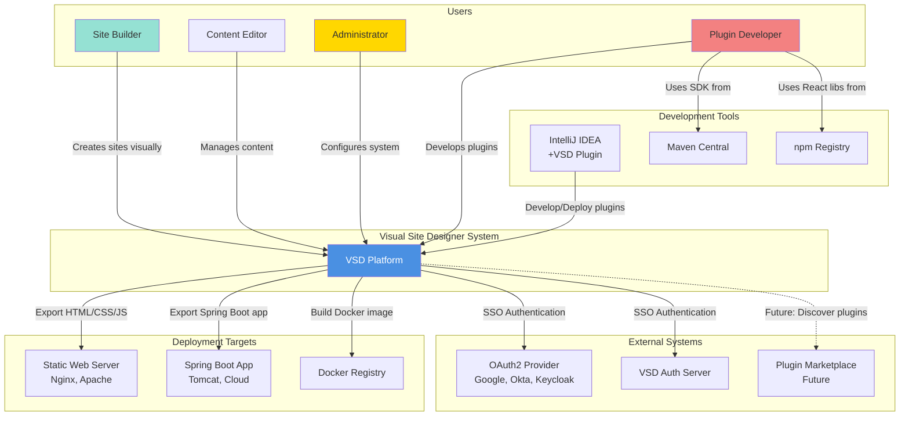
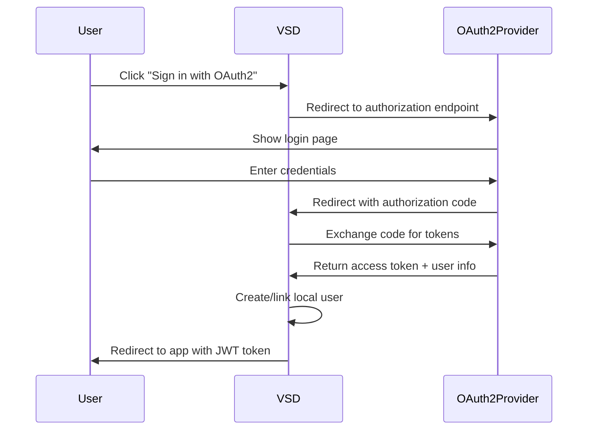
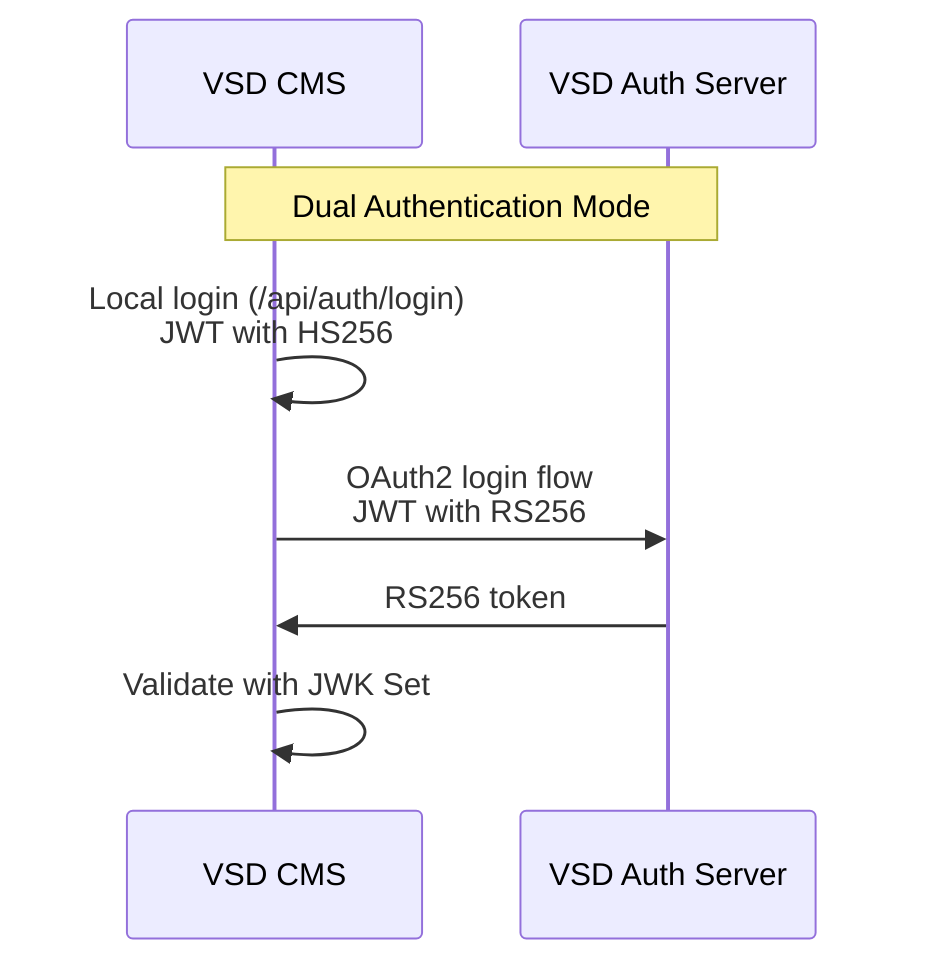

# 3. System Scope and Context

This section defines the boundaries of Visual Site Designer and its relationships with external systems and actors.

> For formal C4 model diagrams (System Context, Container, and Component levels), see [C4 Architecture Model](C4_MODEL.md).

---

## 3.1 Business Context

### Context Diagram



### External Entities

#### Users

| Actor | Role | Interactions |
|-------|------|--------------|
| **Site Builder** | Creates websites using visual builder | Drag-and-drop components, configure properties, preview, export sites |
| **Content Editor** | Manages site content | Upload images, edit text, manage media repository |
| **Administrator** | System configuration and user management | Configure auth, manage users, approve registrations, configure public APIs |
| **Plugin Developer** | Extends VSD functionality | Develop plugins, test with hot-reload, package and distribute |

#### External Systems

| System | Purpose | Protocol/Interface |
|--------|---------|-------------------|
| **OAuth2 Providers** | Social/Enterprise SSO authentication | OAuth 2.0 Authorization Code Flow |
| **VSD Auth Server** | Centralized authentication for VSD ecosystem | OAuth 2.0 + OIDC, JWT (RS256) |
| **Plugin Marketplace** (Future) | Plugin discovery and distribution | REST API (planned) |
| **Static Web Servers** | Host exported HTML sites | HTTP/HTTPS file serving |
| **Spring Boot Runtime** | Host exported dynamic sites | Java application server |
| **Docker Registry** | Store and distribute container images | Docker Registry API v2 |

#### Development Tools

| Tool | Purpose | Integration |
|------|---------|-------------|
| **IntelliJ IDEA + VSD Plugin** | Plugin development acceleration | File system, VSD REST API |
| **Maven Central** | Dependency resolution for plugins | Maven repository protocol |
| **npm Registry** | JavaScript dependencies for frontend | npm CLI |

---

## 3.2 Technical Context

### Technical Interfaces

#### TI-01: OAuth2 Authentication



**Protocol**: OAuth 2.0 Authorization Code Flow
**Data Format**: JSON (tokens), JWT (claims)
**Security**: HTTPS required, state parameter for CSRF protection

**Configuration**:
```properties
spring.security.oauth2.client.registration.google.client-id=${GOOGLE_CLIENT_ID}
spring.security.oauth2.client.registration.google.client-secret=${GOOGLE_CLIENT_SECRET}
spring.security.oauth2.client.registration.google.scope=openid,profile,email
```

#### TI-02: VSD Auth Server Integration



**Protocol**: OAuth 2.0 + OIDC
**Token Validation**: JWK Set URI (`/oauth2/jwks`)
**Dual Mode**: Supports both local JWT (HS256) and Auth Server JWT (RS256)

#### TI-03: Plugin Loading API

**Interface**: Java SPI (Service Provider Interface)
**Discovery**: Classpath scanning for `plugin.yml`

```java
public interface UIComponentPlugin extends Plugin {
    ComponentManifest getComponentManifest();
    String getReactComponentPath();
    ValidationResult validateProps(Map<String, Object> props);
}
```

**Plugin Manifest**:
```yaml
plugin-id: my-component-plugin
plugin-name: My Component
version: 1.0.0
main-class: com.example.MyComponentPlugin
plugin-type: ui-component
```

#### TI-04: Frontend-Backend API

**Protocol**: REST over HTTP(S)
**Data Format**: JSON
**Authentication**: JWT Bearer token in `Authorization` header

**Key Endpoints**:
```
GET    /api/components              # List all components
GET    /api/sites/{id}/pages        # List pages
PUT    /api/sites/{id}/pages/{pid}  # Update page
POST   /api/auth/login              # Local authentication
GET    /api/plugins/{id}/bundle.js  # Fetch plugin React bundle
```

**CORS Configuration**:
```properties
cors.allowed-origins=http://localhost:5173,https://cms.example.com
cors.allowed-methods=GET,POST,PUT,DELETE,OPTIONS
cors.allow-credentials=true
```

#### TI-05: Plugin Hot-Reload API

**Protocol**: REST
**Endpoint**: `POST /api/plugins/{pluginId}/reload`
**Authentication**: Admin role required

```bash
curl -X POST http://localhost:8080/api/plugins/button-component-plugin/reload \
  -H "Authorization: Bearer ${ADMIN_TOKEN}"
```

#### TI-06: Static Site Export

**Output Format**: ZIP archive containing:
```
exported-site/
├── index.html
├── about.html
├── css/
│   └── styles.css
├── js/
│   └── bundle.js
└── assets/
    └── images/
```

**Implementation**: Client-side export via `staticExportService.ts`
**Mechanism**: The frontend reads the page definitions from the store, renders HTML/CSS/JS using export templates from each component's `ComponentManifest`, and packages the result into a ZIP archive for download. No backend endpoint is involved.

#### TI-07: Spring Boot Site Export (Thymeleaf)

**Output Format**: Maven project with:
```
exported-spring-boot-app/
├── pom.xml                    # Includes site-runtime dependency
├── src/main/
│   ├── java/
│   │   └── Application.java
│   ├── resources/
│   │   ├── application.properties
│   │   └── templates/         # Thymeleaf templates
│   └── static/                # Assets
└── README.md
```

**Implementation**: Client-side export via `thymeleafExportService.ts`
**Mechanism**: The frontend generates a Spring Boot project structure with Thymeleaf templates using export templates from each component's `ComponentManifest`. The generated project is packaged as a ZIP archive for download. No backend endpoint is involved.

**Runtime Dependency**:
```xml
<dependency>
    <groupId>dev.mainul35</groupId>
    <artifactId>site-runtime</artifactId>
    <version>1.0.0-SNAPSHOT</version>
</dependency>
```

#### TI-08: Real-time Preview

**Protocol**: BroadcastChannel API (browser-native)
**Fallback**: localStorage events for older browsers

```typescript
// Broadcast channel for cross-window communication
const channel = new BroadcastChannel('vsd-preview-channel');

// Send page update
channel.postMessage({
  type: 'PAGE_UPDATE',
  payload: { page, pageMeta }
});

// Receive updates
channel.onmessage = (event) => {
  const { type, payload } = event.data;
  if (type === 'PAGE_UPDATE') {
    renderPage(payload.page);
  }
};
```

#### TI-09: Database Connections

**Development**: H2 Embedded
```properties
spring.datasource.url=jdbc:h2:file:./data/vsddb
spring.datasource.username=sa
spring.datasource.password=
```

**Production**: PostgreSQL
```properties
spring.datasource.url=jdbc:postgresql://localhost:5432/vsd_cms
spring.datasource.username=vsdcms
spring.datasource.password=${DB_PASSWORD}
```

**Schema Management**: Flyway migrations
```
db/migration/
├── V1__baseline_schema.sql
├── V2__add_plugin_support.sql
├── V3__create_cms_tables.sql
...
```

#### TI-10: IntelliJ Plugin Integration

**Protocol**: File system + REST API
**Functions**:
- Scan project for plugins (file system)
- Generate `generated-types/` directory (file system)
- Trigger plugin build (Maven CLI)
- Deploy plugin (file system copy + REST API hot-reload)

```bash
# IntelliJ plugin executes:
cd plugins/my-plugin/frontend && npm run build
cd plugins/my-plugin && mvn clean package
# Copy to runtime plugin directory (configured as core/plugins in application.properties)
cp target/my-plugin-1.0.0.jar ../../core/plugins/
curl -X POST http://localhost:8080/api/plugins/my-plugin/reload
```

**Note**: Plugin source code is located in root `plugins/` directory, but the runtime loads plugins from `core/plugins/` (configured via `app.plugin.directory=core/plugins` in application.properties).

---

## 3.3 Communication Channels

### Internal Communication

| From | To | Channel | Data Format |
|------|----|---------| ------------|
| Frontend | Backend | HTTP REST | JSON |
| Builder Window | Preview Window | BroadcastChannel | JSON messages |
| Plugin (Java) | Core | Java interfaces | Java objects |
| Plugin (React) | Core Frontend | JavaScript exports | React components |

### External Communication

| From | To | Channel | Security |
|------|----|---------| ---------|
| VSD | OAuth2 Provider | HTTPS | TLS 1.2+, OAuth2 state param |
| VSD | Database | JDBC | TLS optional, credentials |
| Developer | VSD | HTTPS | JWT authentication |
| IntelliJ Plugin | VSD | HTTPS | Admin JWT token |

---

## 3.4 Data Formats

### Component Definition (JSON)

```json
{
  "id": "comp-123",
  "pluginId": "button-component-plugin",
  "componentId": "button",
  "props": {
    "text": "Click Me",
    "variant": "primary",
    "size": "medium"
  },
  "styles": {
    "backgroundColor": "#007bff",
    "color": "#ffffff",
    "padding": "10px 20px"
  },
  "layout": {
    "x": 100,
    "y": 200,
    "width": "200px",
    "height": "auto"
  },
  "children": []
}
```

### Page Definition (JSON)

```json
{
  "pageId": 1,
  "pageName": "Home",
  "pageSlug": "home",
  "routePath": "/",
  "content": {
    "components": [...]
  },
  "metadata": {
    "title": "Home - My Site",
    "description": "Welcome to my site",
    "ogImage": "/assets/og-image.png"
  }
}
```

### Plugin Manifest (YAML)

```yaml
plugin-id: button-component-plugin
plugin-name: Button Component
version: 1.0.0
author: John Doe
description: Configurable button component
main-class: dev.mainul35.plugins.ui.ButtonComponentPlugin
plugin-type: ui-component

spring:
  component-scan:
    - dev.mainul35.plugins.ui

ui-component:
  component-id: button
  display-name: Button
  category: ui
  icon: B
  resizable: true
  default-width: 120px
  default-height: 40px
```

### JWT Token Structure

```json
{
  "sub": "admin",
  "roles": ["ADMIN"],
  "iss": "flashcard-cms",
  "iat": 1709654400,
  "exp": 1709655300
}
```

---

## 3.5 System Boundaries

### What is Inside VSD System

- Visual builder UI (React application)
- Plugin management system
- Component registry
- Authentication & authorization
- Site/page persistence
- Content repository
- Export functionality
- Plugin SDK

### What is Outside VSD System

- OAuth2 identity providers (Google, Okta, etc.)
- VSD Auth Server (separate application)
- Production databases (PostgreSQL)
- Static web servers hosting exported sites
- Spring Boot runtime for exported sites (uses site-runtime library)
- Plugin marketplace (future feature)
- User-created plugin code

### Gray Areas (Partially Inside)

- **Site Runtime Library**: Part of VSD distribution, but runs in exported sites (outside VSD)
- **Plugin JARs**: Third-party code, but loaded into VSD process
- **IntelliJ Plugin**: Separate IDE extension, but tightly integrated with VSD

---

[← Previous: Architecture Constraints](02-architecture-constraints.md) | [Back to Index](README.md) | [Next: Solution Strategy →](04-solution-strategy.md)
