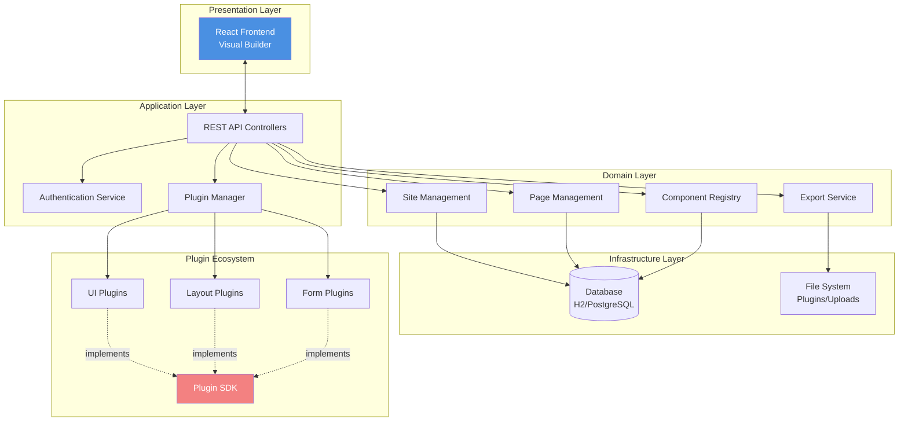
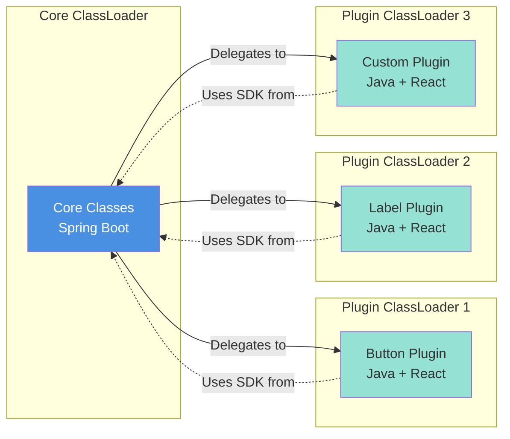
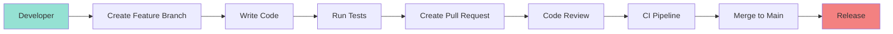
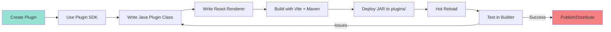

# 4. Solution Strategy

This section provides a high-level overview of the fundamental decisions and solution approaches that shape the VSD architecture.

---

## 4.1 Technology Decisions

### Backend Technology Stack

| Decision | Technology | Rationale |
|----------|-----------|-----------|
| **Programming Language** | Java 21 | Modern features (records, pattern matching), mature ecosystem, strong typing |
| **Framework** | Spring Boot 4.0.0 | De facto standard for enterprise Java, extensive ecosystem, auto-configuration |
| **Database** | H2 (dev), PostgreSQL (prod) | H2 for zero-config development, PostgreSQL for production reliability |
| **ORM** | JPA/Hibernate | Standard persistence API, database portability, automatic schema management |
| **Migration Tool** | Flyway | Version control for database schema, repeatable migrations |
| **Build Tool** | Maven | Standard Java build tool, multi-module support, dependency management |
| **Authentication** | Spring Security + JWT | Industry standard, OAuth2 support, stateless authentication |

### Frontend Technology Stack

| Decision | Technology | Rationale |
|----------|-----------|-----------|
| **Framework** | React 18.3.1 | Component-based architecture matches plugin model, large ecosystem |
| **Language** | TypeScript 5.6.2 | Type safety for large codebase, better IDE support, fewer runtime errors |
| **Build Tool** | Vite 6.0.5 | Fast HMR, modern ESM-based, better DX than Webpack |
| **State Management** | Zustand | Lightweight, no boilerplate, better performance than Redux |
| **Drag & Drop** | @dnd-kit | Accessible, performant, modern API |
| **HTTP Client** | Axios | Promise-based, interceptors for auth, widespread adoption |
| **Routing** | React Router v6 | Standard routing solution, nested routes, data loading |

### Plugin Technology

| Decision | Technology | Rationale |
|----------|-----------|-----------|
| **Plugin Discovery** | ClassLoader scanning | Java-native, no external dependencies, isolated execution |
| **Plugin Format** | JAR with embedded resources | Standard Java packaging, includes code + assets |
| **Frontend Bundling** | Vite (IIFE format) | Bundle React components into single file, global exports |
| **Type Generation** | IntelliJ Plugin | Auto-generate TypeScript types from Java manifests |

---

## 4.2 Top-Level Decomposition

### Architectural Style: Layered + Plugin-based



### Module Structure

| Module | Responsibility | Dependencies |
|--------|---------------|--------------|
| **core** | Main application, plugin runtime | vsd-cms-plugin-sdk, site-runtime |
| **vsd-cms-bom** | Dependency version management | (none - BOM only) |
| **flashcard-cms-plugin-sdk** | Plugin development interfaces | Spring Boot (provided) |
| **site-runtime** | Runtime library for exported sites | Spring Boot, data fetchers |
| **frontend** | Visual builder UI | Core REST API |
| **plugins/** | Plugin source code (development) | vsd-cms-plugin-sdk |

**Note**: Plugin source code is in root `plugins/` directory. Built plugin JARs are deployed to `core/plugins/` for runtime loading (configured in `application.properties`).

---

## 4.3 Achieving Quality Goals

### Quality Goal 1: Extensibility

**Approach: Plugin Architecture with Isolated ClassLoaders**



**Key Decisions**:
- Each plugin loads in isolated classloader → prevents conflicts
- SDK classes shared from parent → consistent API
- Hot-reload via classloader disposal → no restart needed
- Plugin registry in database → persistent registration

**Trade-offs**:
- ✅ Unlimited extensibility without core changes
- ✅ Plugin conflicts impossible
- ❌ Memory overhead (classloader per plugin)
- ❌ Complex debugging across classloaders

---

### Quality Goal 2: Usability

**Approach: Visual-First Interface with Real-time Feedback**

**Key Decisions**:
- Drag-and-drop using @dnd-kit → intuitive component placement
- Properties panel with type-aware editors → no syntax errors
- Real-time preview with BroadcastChannel → immediate feedback
- Component palette organized by category → easy discovery
- Undo/redo with command pattern → error recovery

**Validation Strategy**:
```
User Action → Client-side Validation → Server-side Validation → Feedback
              (Instant)                 (Authoritative)          (Visual)
```

**Trade-offs**:
- ✅ Low learning curve for non-developers
- ✅ Immediate feedback reduces errors
- ❌ Complex UI state management
- ❌ Potential client-server sync issues

---

### Quality Goal 3: Maintainability

**Approach: Modular Architecture + Comprehensive Documentation**

**Code Organization**:
```
dev.mainul35.cms/
├── plugin/          # Plugin system (isolated)
├── security/        # Authentication (isolated)
├── sitebuilder/     # Domain logic (isolated)
└── event/           # Cross-cutting (shared)
```

**Documentation Strategy**:
- arc42 for architecture (this document)
- README for quick start
- JavaDoc/JSDoc for API
- Plugin SDK reference guide
- Troubleshooting guide

**Development Conventions**:
- Bill of Materials → consistent dependencies across all modules
- Semantic versioning → clear backward compatibility
- Flyway migrations → database schema version control
- Feature branches + PR reviews → code quality

**Trade-offs**:
- ✅ Clear module boundaries
- ✅ Easy onboarding for new developers
- ❌ Documentation maintenance effort
- ❌ Multi-module coordination overhead

---

### Quality Goal 4: Performance

**Approach: Lazy Loading + Caching**

**Frontend Optimizations**:
- Plugin bundles loaded on-demand → faster initial load
- Component virtualization for large canvases → constant performance
- Debounced property updates → reduced API calls
- Memoized component rendering → fewer re-renders

**Backend Optimizations**:
- JPA query optimization with indexes → fast lookups
- Plugin metadata cached in memory → no repeated disk reads
- Lazy plugin loading → load only when first used
- Connection pooling → efficient database usage

**Caching Strategy**:
```
Component Registry → In-memory (refresh on plugin reload)
User Sessions → Stateless JWT (no server storage)
Page Data → Database with query optimization
Plugin Bundles → Browser cache (versioned URLs)
```

**Trade-offs**:
- ✅ Good performance for typical workloads
- ✅ Horizontal scaling possible (stateless)
- ❌ Cache invalidation complexity
- ❌ Memory usage scales with plugin count

---

### Quality Goal 5: Security

**Approach: Defense in Depth**

**Security Layers**:

1. **Authentication**
   - JWT with short expiration (15 min)
   - Refresh token rotation
   - OAuth2 for enterprise SSO
   - Dual mode (local + SSO) support

2. **Authorization**
   - Role-based access control (RBAC)
   - Endpoint-level permissions
   - Dynamic public API configuration

3. **Input Validation**
   - Client-side validation (UX)
   - Server-side validation (authoritative)
   - JPA prevents SQL injection
   - Plugin manifest validation

4. **Plugin Sandboxing**
   - Isolated classloaders (partial isolation)
   - No Java SecurityManager (deprecated in Java 17+)
   - Plugin validation on load

**Security Configuration**:
```java
http
  .authorizeHttpRequests(auth -> auth
    .requestMatchers("/api/auth/**").permitAll()
    .requestMatchers("/api/admin/**").hasRole("ADMIN")
    .requestMatchers("/api/**").authenticated()
  )
  .oauth2Login(oauth2 -> oauth2
    .successHandler(oauth2SuccessHandler)
  )
  .addFilterBefore(jwtAuthFilter, UsernamePasswordAuthenticationFilter.class);
```

**Trade-offs**:
- ✅ Multiple authentication options
- ✅ Industry-standard approaches
- ❌ Plugin sandboxing limited (no SecurityManager)
- ❌ Dual auth mode adds complexity

---

### Quality Goal 6: Portability

**Approach: Abstraction + Standard Formats**

**Export Formats**:
1. **Static HTML** → Runs on any web server (Nginx, Apache, S3, Netlify)
2. **Spring Boot** → Standard Java application, Docker-ready

**Site Runtime Abstraction**:
```java
interface DataFetcher {
  Object fetch(DataSourceConfig config);
}

// Implementations:
- JpaDataFetcher      → PostgreSQL, MySQL, H2
- MongoDataFetcher    → MongoDB
- RestApiDataFetcher  → Any REST API
- StaticDataFetcher   → Hardcoded data
```

**Database Portability**:
- JPA dialect abstraction → Switch databases via configuration
- Flyway migrations → Portable schema definitions

**Container Support**:
- Dockerfile with multi-stage build → Standardized deployment
- Docker Compose → Local orchestration
- Kubernetes manifests (optional) → Cloud deployment

**Trade-offs**:
- ✅ Exported sites run anywhere
- ✅ Database flexibility
- ❌ Static export loses dynamic features
- ❌ Abstraction complexity

---

## 4.4 Organizational Approach

### Development Workflow



### Release Strategy

- **Main Branch**: Always deployable
- **Feature Branches**: Short-lived, merged via PR
- **Versioning**: Semantic (MAJOR.MINOR.PATCH)
- **Releases**: Tagged commits, GitHub releases
- **Breaking Changes**: Only in major versions

### Plugin Development Workflow



---

## 4.5 Design Principles

### Separation of Concerns

- **Core Platform**: Plugin management, authentication, persistence
- **Plugins**: UI components, domain-specific logic
- **Frontend**: Visual editing, user interaction
- **Site Runtime**: Data fetching for exported sites

### Inversion of Control

- Plugins implement interfaces defined by SDK
- Core discovers and instantiates plugins
- Spring manages dependency injection

### Single Responsibility

- Each module has one clear purpose
- Components are small and focused
- Services handle one concern

### Open/Closed Principle

- Core is closed for modification (stable)
- System open for extension via plugins
- Plugin SDK is the extension point

### Dependency Inversion

- Core depends on SDK abstractions
- Plugins depend on SDK abstractions
- No circular dependencies

---

[← Previous: System Scope and Context](03-system-scope-and-context.md) | [Back to Index](README.md) | [Next: Building Block View →](05-building-block-view.md)
