# 5. Building Block View

This section shows the static decomposition of VSD into building blocks (modules, components, subsystems) and their relationships.

---

## 5.1 Whitebox Overall System (Level 1)

### System Context

VSD is decomposed into five primary subsystems that work together to provide a complete visual site building platform.

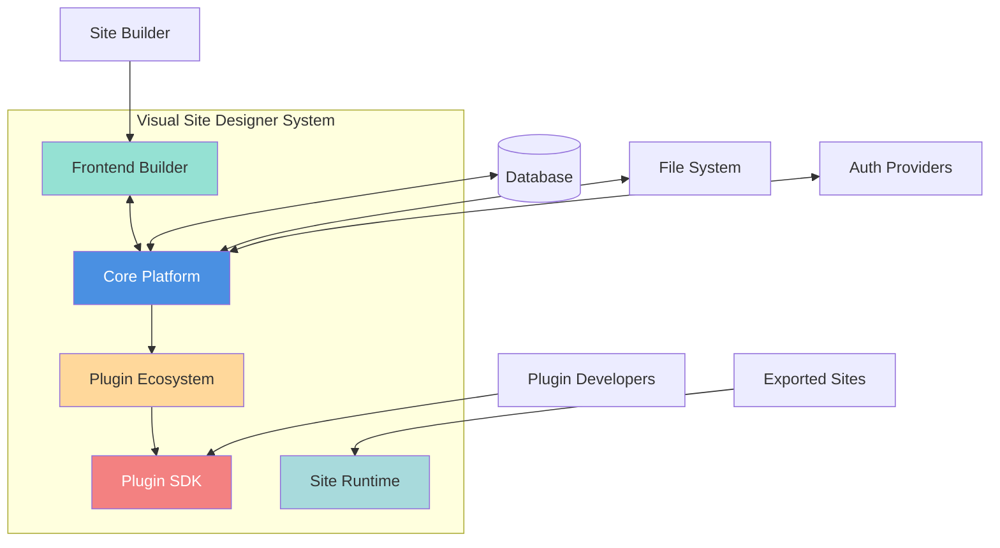

### Contained Building Blocks

| Building Block | Responsibility | Interface |
|---------------|----------------|-----------|
| **Core Platform** | Plugin management, authentication, persistence, REST API | HTTP REST API, Plugin API |
| **Frontend Builder** | Visual editor, drag-and-drop, component palette, properties panel | Web UI (React) |
| **Plugin SDK** | Interfaces and contracts for plugin development | Java API (`UIComponentPlugin`, `ComponentManifest`) |
| **Plugin Ecosystem** | Collection of UI component plugins (button, label, navbar, etc.) | Implements SDK interfaces |
| **Site Runtime** | Runtime library for exported sites, data fetching, caching | Java Library API |

### Important Interfaces

| Interface | Description |
|-----------|-------------|
| **REST API** | HTTP endpoints for authentication, sites, pages, components, plugins |
| **Plugin API** | `UIComponentPlugin` interface for component lifecycle and metadata |
| **Component Registry API** | Dynamic component registration and retrieval |
| **WebSocket API** | Real-time updates for preview window (BroadcastChannel) |
| **Export API** | Generate static HTML or Spring Boot projects |

---

## 5.2 Level 2: Core Platform (Whitebox)

The Core Platform is the heart of VSD, managing the plugin ecosystem and providing services to the frontend.

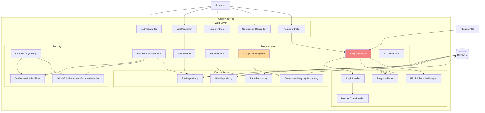

### Contained Building Blocks

#### Web Layer (Controllers)

| Component | Responsibility |
|-----------|----------------|
| **AuthController** | User login, registration, token refresh, OAuth2 callbacks |
| **SiteController** | CRUD operations for sites |
| **PageController** | Page management, versioning, rollback |
| **ComponentController** | List components, get manifests, serve plugin bundles |
| **PluginController** | Upload, activate, deactivate, uninstall plugins |

#### Service Layer

| Component | Responsibility |
|-----------|----------------|
| **AuthenticationService** | JWT generation, user validation, role mapping |
| **SiteService** | Site business logic, ownership validation |
| **PageService** | Page CRUD, version management, content validation |
| **ComponentRegistry** | Register and lookup components, cache manifests |
| **PluginManager** | Load, activate, deactivate plugins, hot-reload |
| **ExportService** | Generate static HTML or Spring Boot projects |

#### Plugin System

| Component | Responsibility |
|-----------|----------------|
| **PluginLoader** | Scan plugins directory, read `plugin.yml`, instantiate plugins |
| **PluginValidator** | Validate plugin structure, dependencies, manifest integrity |
| **IsolatedClassLoader** | Load plugin classes in isolated classloader to prevent conflicts |
| **PluginLifecycleManager** | Call lifecycle methods (`onLoad`, `onActivate`, `onDeactivate`, `onUninstall`) |

#### Security

| Component | Responsibility |
|-----------|----------------|
| **JwtAuthenticationFilter** | Intercept requests, validate JWT tokens (HS256 for local) |
| **OAuth2AuthenticationSuccessHandler** | Handle OAuth2 login success, create/link users, issue JWT |
| **CmsSecurityConfig** | Configure security filter chain, role mapping embedded in OAuth2 success handler |

#### Persistence

| Component | Responsibility |
|-----------|----------------|
| **SiteRepository** | JPA repository for sites |
| **PageRepository** | JPA repository for pages and versions |
| **UserRepository** | JPA repository for users |
| **ComponentRegistryRepository** | JPA repository for registered components |

---

## 5.3 Level 2: Frontend Builder (Whitebox)

The Frontend Builder provides the visual interface for creating and managing sites.

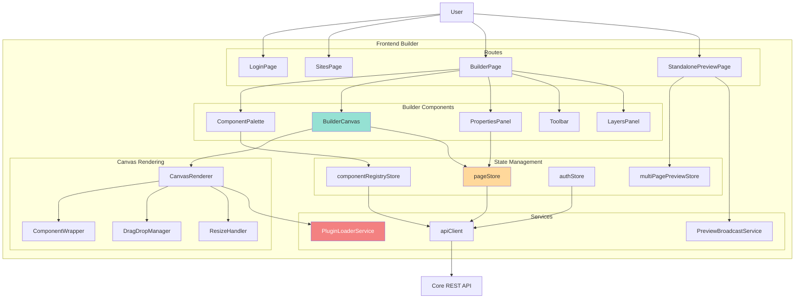

### Contained Building Blocks

#### Pages/Routes

| Component | Responsibility |
|-----------|----------------|
| **LoginPage** | User authentication (local + OAuth2) |
| **SitesPage** | List and manage sites |
| **BuilderPage** | Main visual editor with palette, canvas, properties |
| **StandalonePreviewPage** | Separate window for real-time preview |

#### Builder Components

| Component | Responsibility |
|-----------|----------------|
| **ComponentPalette** | Display available components by category, drag to canvas |
| **BuilderCanvas** | Drop zone for components, visual editing area |
| **PropertiesPanel** | Configure component props, styles, layout, events |
| **Toolbar** | Page actions (save, export, preview, undo/redo) |
| **LayersPanel** | Tree view of page components, hierarchy management |

#### Canvas Rendering

| Component | Responsibility |
|-----------|----------------|
| **CanvasRenderer** | Render page definition as interactive canvas |
| **ComponentWrapper** | Wrap each component with selection, resize handles |
| **DragDropManager** | Handle drag-and-drop using @dnd-kit |
| **ResizeHandler** | Handle component resizing with resize handles |

#### State Management (Zustand)

| Store | Responsibility |
|-------|----------------|
| **pageStore** | Current page definition, components tree, undo/redo history |
| **componentRegistryStore** | Registered components, manifests, loaded plugin bundles |
| **authStore** | User authentication state, JWT tokens |
| **multiPagePreviewStore** | Preview mode state, navigation history |

#### Services

| Service | Responsibility |
|---------|----------------|
| **apiClient** | Axios-based HTTP client with JWT interceptor |
| **PluginLoaderService** | Dynamically load plugin bundles from `/api/plugins/{pluginId}/bundle.js` |
| **PreviewBroadcastService** | Cross-window communication using BroadcastChannel API |

---

## 5.4 Level 2: Plugin SDK (Whitebox)

The Plugin SDK defines the contract between the core platform and plugins. It supports two plugin types: **UI Component Plugins** (provide visual components) and **Context Provider Plugins** (provide shared state/services for feature domains).

```mermaid
graph TB
    subgraph "Plugin SDK"
        subgraph "Interfaces"
            PLUGIN_IF[Plugin Interface]
            UI_COMP_IF[UIComponentPlugin Interface]
            CTX_PROV_IF[ContextProviderPlugin Interface]
            DATA_FETCHER_IF[DataFetcher Interface]
        end

        subgraph "Data Models"
            MANIFEST[ComponentManifest]
            CAPABILITIES[ComponentCapabilities]
            PROP_DEF[PropDefinition]
            STYLE_DEF[StyleDefinition]
            SIZE_CONST[SizeConstraints]
            VALIDATION[ValidationResult]
            CTX_DESC[ContextDescriptor]
        end

        subgraph "Annotations"
            UI_COMP_ANN["@UIComponent"]
        end

        subgraph "Context"
            PLUGIN_CTX[PluginContext]
        end

        UI_COMP_IF --|extends| PLUGIN_IF
        CTX_PROV_IF --|extends| PLUGIN_IF
        UI_COMP_IF --> MANIFEST
        MANIFEST --> CAPABILITIES
        MANIFEST --> PROP_DEF
        MANIFEST --> STYLE_DEF
        MANIFEST --> SIZE_CONST
        UI_COMP_IF --> VALIDATION
        UI_COMP_IF --> UI_COMP_ANN
        PLUGIN_IF --> PLUGIN_CTX
        CTX_PROV_IF --> CTX_DESC
    end

    PLUGIN_IMPL[UI Plugin Implementation] -.implements.-> UI_COMP_IF
    CTX_PLUGIN_IMPL[Context Plugin Implementation] -.implements.-> CTX_PROV_IF
    CORE[Core Platform] --> PLUGIN_IF

    style UI_COMP_IF fill:#f38181,color:#fff
    style CTX_PROV_IF fill:#a855f7,color:#fff
    style MANIFEST fill:#ffd89b
    style CTX_DESC fill:#c4b5fd
```

### Contained Building Blocks

#### Core Interfaces

```java
// Plugin Lifecycle Interface
public interface Plugin {
    void onLoad(PluginContext context) throws Exception;
    void onActivate(PluginContext context) throws Exception;
    void onDeactivate(PluginContext context) throws Exception;
    void onUninstall(PluginContext context) throws Exception;

    String getPluginId();
    String getName();
    String getVersion();
    String getDescription();
}

// UI Component Interface (extends Plugin)
public interface UIComponentPlugin extends Plugin {
    ComponentManifest getComponentManifest();
    List<ComponentManifest> getComponentManifests(); // Multi-component support
    String getReactComponentPath();
    byte[] getComponentThumbnail();
    ValidationResult validateProps(Map<String, Object> props);

    // Optional hooks
    default String renderToHTML(Map<String, Object> props, Map<String, String> styles);
    default void onComponentAdded(PluginContext context, Long pageId, String instanceId);
    default void onComponentRemoved(PluginContext context, Long pageId, String instanceId);
    default void onPropsUpdated(PluginContext context, String instanceId,
                               Map<String, Object> oldProps, Map<String, Object> newProps);
}

// Context Provider Interface (extends Plugin) — NEW
public interface ContextProviderPlugin extends Plugin {
    // Unique context identifier (e.g., "auth", "cart")
    String getContextId();

    // React context provider component path (e.g., "AuthProvider.js")
    String getProviderComponentPath();

    // API endpoints this context exposes
    List<ApiEndpoint> getApiEndpoints();

    // Dependencies on other contexts (e.g., cart needs auth)
    default List<String> getRequiredContexts() { return List.of(); }
}
```

#### Data Models

| Class | Purpose |
|-------|---------|
| **ComponentManifest** | Complete component metadata (id, name, props, styles, capabilities, constraints) |
| **ComponentCapabilities** | Behavioral flags driving builder behavior (canHaveChildren, isContainer, hasDataSource, autoHeight, isResizable, supportsIteration, supportsTemplateBindings) |
| **PropDefinition** | Define a configurable property (type, label, options, default, validation) |
| **StyleDefinition** | Define a configurable CSS style (property, type, category, units) |
| **SizeConstraints** | Define component sizing rules (resizable, min/max width/height) |
| **ValidationResult** | Result of prop validation (valid, errors, warnings) |
| **ContextDescriptor** | Context metadata: contextId, providerComponentPath, apiEndpoints, requiredContexts |

#### Annotations

```java
@UIComponent(
    componentId = "label",           // Unique component identifier
    displayName = "Label",            // Display name in palette
    category = "ui",                  // Category: ui, layout, form, navigation
    icon = "L",                       // Icon identifier
    resizable = true,                 // Whether component is resizable
    defaultWidth = "200px",           // Default width
    defaultHeight = "auto",           // Default height
    minWidth = "50px",                // Minimum width
    maxWidth = "100%",                // Maximum width
    minHeight = "20px",               // Minimum height
    maxHeight = "500px"               // Maximum height
)
public class LabelComponentPlugin implements UIComponentPlugin { ... }
```

---

## 5.5 Level 2: Plugin Ecosystem (Whitebox)

The Plugin Ecosystem consists of individual plugin modules that implement the SDK interfaces.

```mermaid
graph TB
    subgraph "Plugin Ecosystem"
        subgraph "UI Plugins"
            LABEL[label-component-plugin]
            BUTTON[button-component-plugin]
            IMAGE[image-component-plugin]
        end

        subgraph "Layout Plugins"
            CONTAINER[container-layout-plugin]
            SCROLLABLE[scrollable-container-plugin]
            PAGE_LAYOUT[page-layout-plugin]
            HROW[horizontal-row-plugin]
        end

        subgraph "Form Plugins"
            TEXTBOX[textbox-component-plugin]
            NEWSLETTER[newsletter-form-plugin]
        end

        subgraph "Navigation Plugins"
            NAVBAR[navbar-component-plugin]
        end

        subgraph "Auth Plugins"
            AUTH_COMP[auth-component-plugin]
        end
    end

    SDK[Plugin SDK] <-- LABEL
    SDK <-- BUTTON
    SDK <-- IMAGE
    SDK <-- CONTAINER
    SDK <-- SCROLLABLE
    SDK <-- PAGE_LAYOUT
    SDK <-- HROW
    SDK <-- TEXTBOX
    SDK <-- NEWSLETTER
    SDK <-- NAVBAR
    SDK <-- AUTH_COMP

    style SDK fill:#f38181,color:#fff
    style LABEL fill:#95e1d3
    style BUTTON fill:#95e1d3
    style CONTAINER fill:#ffd89b
    style NEWSLETTER fill:#a8dadc
```

### Plugin Structure (Example: label-component-plugin)

Each plugin follows a standard structure:

```
label-component-plugin/
├── pom.xml                                  # Maven build configuration
├── src/main/
│   ├── java/dev/mainul35/plugins/ui/
│   │   └── LabelComponentPlugin.java       # Plugin implementation
│   └── resources/
│       ├── plugin.yml                       # Plugin metadata
│       └── frontend/
│           └── bundle.js                    # React component (built)
└── frontend/
    ├── package.json                         # npm dependencies
    ├── vite.config.ts                       # Vite build config
    ├── tsconfig.json                        # TypeScript config
    └── src/
        ├── index.ts                         # Entry point
        ├── types.ts                         # TypeScript interfaces
        └── renderers/
            └── LabelRenderer.tsx            # React component
```

### Plugin Types

#### Simple Plugin (Label Component)

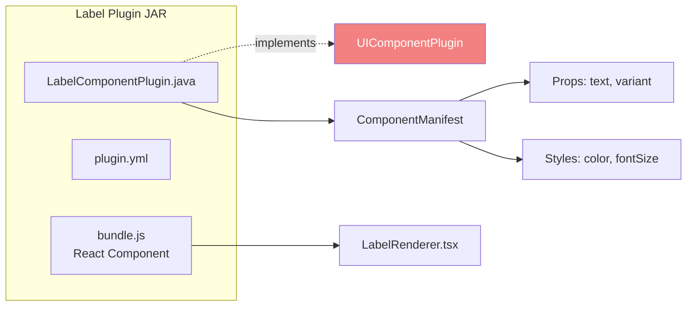

#### Compound Plugin (Newsletter Form)

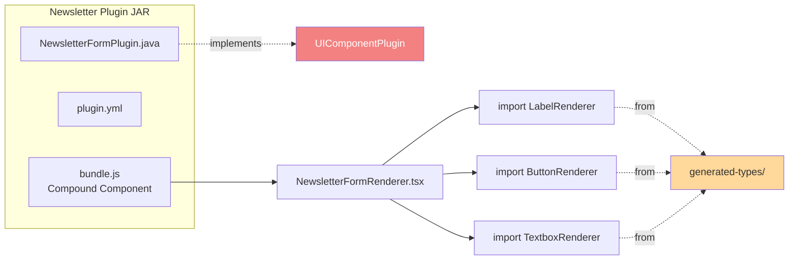

### Contained Plugins

| Plugin | Type | Description |
|--------|------|-------------|
| **label-component-plugin** | Simple | Text label with variants (h1-h6, p, span) |
| **button-component-plugin** | Simple | Button with variants, sizes, states |
| **image-component-plugin** | Simple | Image display with alt text, lazy loading |
| **container-layout-plugin** | Simple | Layout container with flex/grid |
| **scrollable-container-plugin** | Simple | Container with overflow scroll |
| **page-layout-plugin** | Simple | Page-level layout with header/footer/sidebar slots |
| **horizontal-row-plugin** | Simple | Horizontal flex row container |
| **textbox-component-plugin** | Simple | Text input with validation |
| **newsletter-form-plugin** | Compound | Newsletter form (composes label, textbox, button) |
| **navbar-component-plugin** | Simple | Navigation bar with logo, links |
| **auth-component-plugin** | Simple | Login/register forms, social login buttons |

---

## 5.6 Level 2: Context Provider Plugins (Whitebox) — Planned

Context Provider Plugins are a new plugin type that provides **shared state and services** for feature domains. Unlike UI Component Plugins (which render visual components), Context Provider Plugins supply React context providers and backend API endpoints that multiple UI component plugins can consume.

### Architecture Overview

```mermaid
graph TB
    subgraph "Context Provider Plugins"
        subgraph "Auth Domain"
            AUTH_CTX[auth-context-plugin<br/>Provides: AuthContext]
        end

        subgraph "E-commerce Domain (Future)"
            CART_CTX[cart-context-plugin<br/>Provides: CartContext]
            ORDER_CTX[order-context-plugin<br/>Provides: OrderContext]
        end
    end

    subgraph "UI Component Plugins (Consumers)"
        LOGIN[login-form-plugin]
        REGISTER[register-form-plugin]
        PROFILE[user-profile-plugin]
        PRODUCT[product-card-plugin]
        CART_WIDGET[cart-widget-plugin]
        CHECKOUT[checkout-form-plugin]
    end

    LOGIN -->|consumes| AUTH_CTX
    REGISTER -->|consumes| AUTH_CTX
    PROFILE -->|consumes| AUTH_CTX

    PRODUCT -->|consumes| CART_CTX
    CART_WIDGET -->|consumes| CART_CTX
    CHECKOUT -->|consumes| CART_CTX

    CART_CTX -.depends on.-> AUTH_CTX
    ORDER_CTX -.depends on.-> AUTH_CTX

    SDK[Plugin SDK] <-- AUTH_CTX
    SDK <-- CART_CTX
    SDK <-- ORDER_CTX

    style AUTH_CTX fill:#a855f7,color:#fff
    style CART_CTX fill:#a855f7,color:#fff
    style ORDER_CTX fill:#a855f7,color:#fff
    style SDK fill:#f38181,color:#fff
    style LOGIN fill:#95e1d3
    style PRODUCT fill:#95e1d3
```

### Context Provider vs UI Component Plugin

| Aspect | UI Component Plugin | Context Provider Plugin |
|--------|-------------------|----------------------|
| **Purpose** | Render visual UI on the canvas | Provide shared state/services for a feature domain |
| **Interface** | `UIComponentPlugin` | `ContextProviderPlugin` |
| **Frontend output** | React renderer component | React context provider |
| **Backend output** | ComponentManifest (props, styles) | API endpoints + ContextDescriptor |
| **Canvas visibility** | Yes (appears in palette) | No (invisible infrastructure) |
| **Example** | `label-component-plugin` | `auth-context-plugin` |

### Context Provider Plugin Structure

```
auth-context-plugin/
├── pom.xml
├── src/main/
│   ├── java/dev/mainul35/plugins/context/auth/
│   │   ├── AuthContextPlugin.java        # implements ContextProviderPlugin
│   │   ├── AuthController.java           # REST endpoints (/api/ctx/auth/*)
│   │   └── AuthService.java              # Session, token, user state logic
│   └── resources/
│       ├── plugin.yml
│       └── frontend/
│           └── provider-bundle.js        # React AuthProvider + useAuth hook
└── frontend/
    └── src/
        ├── AuthProvider.tsx              # React context provider
        ├── useAuth.ts                    # useAuth() hook
        └── types.ts                      # AuthState, AuthActions types
```

### Context Dependency Graph

Context plugins can declare dependencies on other contexts. The runtime resolves the dependency graph to determine provider wrapping order.

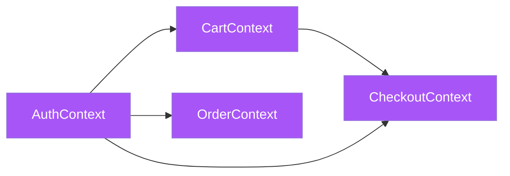

**Resolution Order** (inner to outer): `AuthProvider → CartProvider → OrderProvider → CheckoutProvider → Page`

### UI Component Context Dependencies

UI component manifests declare which contexts they require via `requiredContexts`:

```java
ComponentManifest.builder()
    .componentId("loginForm")
    .pluginId("login-form-plugin")
    .requiredContexts(List.of("auth"))  // Needs AuthContext
    .capabilities(ComponentCapabilities.builder()
        .canHaveChildren(false)
        .build())
    .build();
```

The builder verifies that all required contexts are provided by active context plugins before allowing the component to be used.

### Frontend Context Provider Tree

At page render time, the runtime wraps the component tree with all active context providers:

```tsx
// Automatically assembled by ContextProviderTree
<AuthProvider>           {/* from auth-context-plugin */}
  <CartProvider>         {/* from cart-context-plugin */}
    <Page>
      <LoginForm />      {/* uses usePluginContext('auth') */}
      <CartWidget />     {/* uses usePluginContext('cart') */}
      <ProductCard />    {/* uses usePluginContext('cart') */}
    </Page>
  </CartProvider>
</AuthProvider>
```

### Planned Context Provider Plugins

| Plugin | Context ID | Provides | Required Contexts | Status |
|--------|-----------|----------|-------------------|--------|
| **auth-context-plugin** | `auth` | AuthContext (session, tokens, user info, login/logout) | — | Planned |
| **cart-context-plugin** | `cart` | CartContext (items, add/remove, totals) | `auth` | Future |
| **order-context-plugin** | `order` | OrderContext (order history, tracking) | `auth` | Future |

---

## 5.7 Level 2: Site Runtime (Whitebox)

The Site Runtime library provides runtime functionality for exported sites.

```mermaid
graph TB
    subgraph "Site Runtime Library"
        subgraph "Configuration"
            PROPS[SiteRuntimeProperties]
            AUTO_CONFIG[SiteRuntimeAutoConfiguration]
            SEC_CONFIG[SecurityAutoConfiguration]
        end

        subgraph "Data Layer"
            DF_IF[DataFetcher Interface]
            REST_DF[RestApiDataFetcher]
            JPA_DF[JpaDataFetcher]
            MONGO_DF[MongoDataFetcher]
            STATIC_DF[StaticDataFetcher]
            CONTEXT_DF[ContextDataFetcher]
            DS_REG[DataSourceRegistry]
        end

        subgraph "Services"
            PAGE_DATA_SVC[PageDataService]
            CACHE[InMemoryCacheProvider]
        end

        DF_IF <|-- REST_DF
        DF_IF <|-- JPA_DF
        DF_IF <|-- MONGO_DF
        DF_IF <|-- STATIC_DF
        DF_IF <|-- CONTEXT_DF

        DS_REG --> REST_DF
        DS_REG --> JPA_DF
        DS_REG --> MONGO_DF
        DS_REG --> STATIC_DF
        DS_REG --> CONTEXT_DF

        PAGE_DATA_SVC --> DS_REG
        PAGE_DATA_SVC --> CACHE

        AUTO_CONFIG --> DS_REG
        AUTO_CONFIG --> PAGE_DATA_SVC
        SEC_CONFIG --> PROPS
    end

    EXPORTED[Exported Site] --> AUTO_CONFIG

    style DS_REG fill:#ffd89b
    style PAGE_DATA_SVC fill:#95e1d3
```

### Contained Building Blocks

#### Configuration

| Component | Responsibility |
|-----------|----------------|
| **SiteRuntimeProperties** | Configuration properties for runtime (database, cache, auth) |
| **SiteRuntimeAutoConfiguration** | Spring Boot auto-configuration for data fetchers, cache |
| **SecurityAutoConfiguration** | Auto-configure authentication (social login, SSO) |

#### Data Fetchers

| Component | Responsibility |
|-----------|----------------|
| **DataFetcher (Interface)** | Abstract data fetching strategy |
| **RestApiDataFetcher** | Fetch data from REST APIs (HTTP GET/POST) |
| **JpaDataFetcher** | Fetch data from SQL databases (JPA queries) |
| **MongoDataFetcher** | Fetch data from MongoDB (Mongo queries) |
| **StaticDataFetcher** | Return static/hardcoded data |
| **ContextDataFetcher** | Extract data from request context (user, session) |
| **DataSourceRegistry** | Register and lookup data fetchers by type |

#### Services

| Component | Responsibility |
|-----------|----------------|
| **PageDataService** | Aggregate data from multiple sources for page rendering |
| **InMemoryCacheProvider** | In-memory cache with TTL for fetched data |

---

## 5.8 Level 3: Plugin Lifecycle (Deep Dive)

This section provides a detailed look at the plugin loading and registration process.

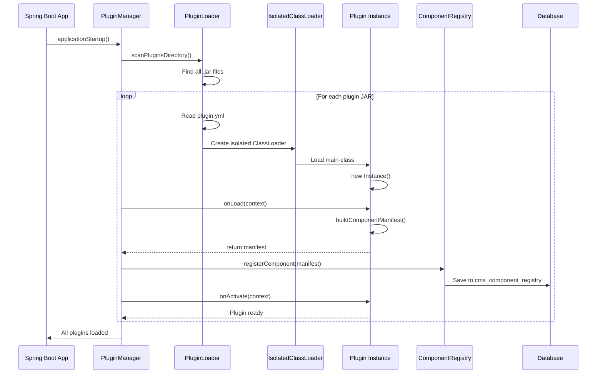

### Plugin Loading Steps

1. **Discovery**: Scan `plugins/` directory for `.jar` files
2. **Validation**: Read `plugin.yml`, validate structure and dependencies
3. **ClassLoader Creation**: Create `IsolatedClassLoader` with parent=system classloader
4. **Instantiation**: Load plugin main class, call no-arg constructor
5. **Load Phase**: Call `onLoad(context)`, plugin builds manifest
6. **Registration**: Register component in `ComponentRegistry`, persist to database
7. **Activation**: Call `onActivate(context)`, plugin is ready for use

### Hot Reload Process

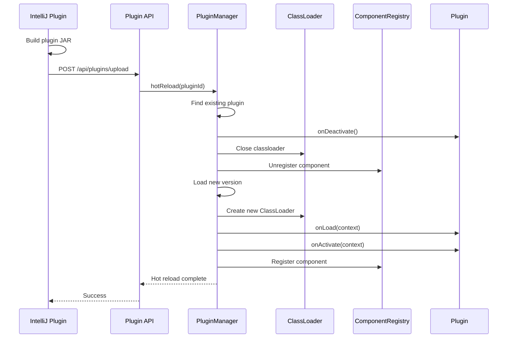

---

## 5.9 Level 3: Authentication Flow (Deep Dive)

This section details the authentication system with local and OAuth2 support.

### Local Authentication Flow

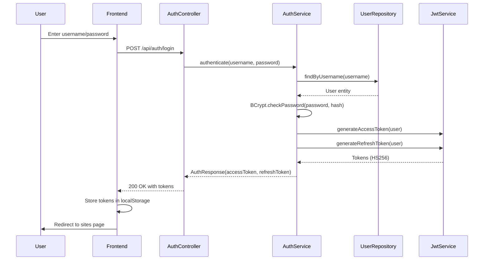

### OAuth2 SSO Flow

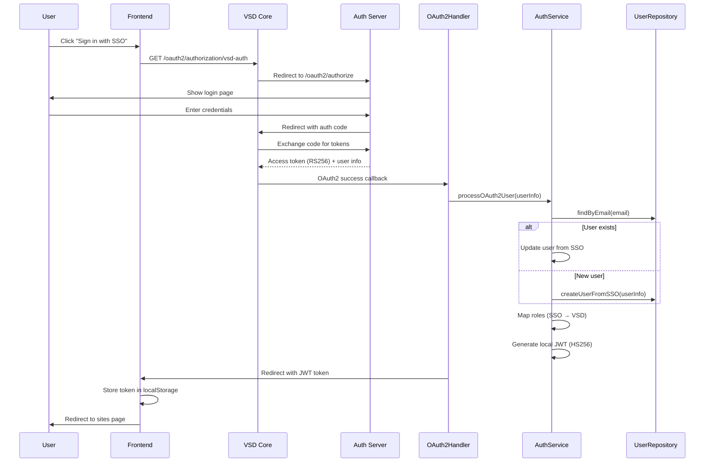

### Dual Authentication Mode

VSD supports both local JWT (HS256) and SSO tokens (RS256) simultaneously:

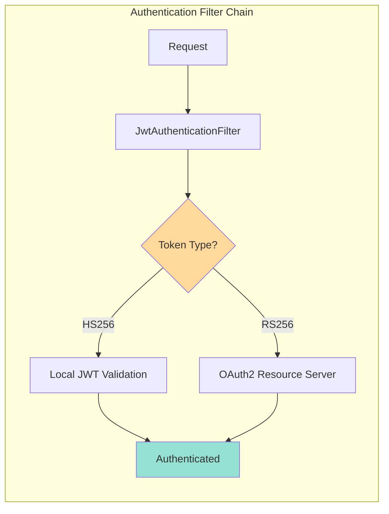

---

## 5.10 Level 3: Export Process (Deep Dive)

This section details how sites are exported to standalone applications.

### Static HTML Export

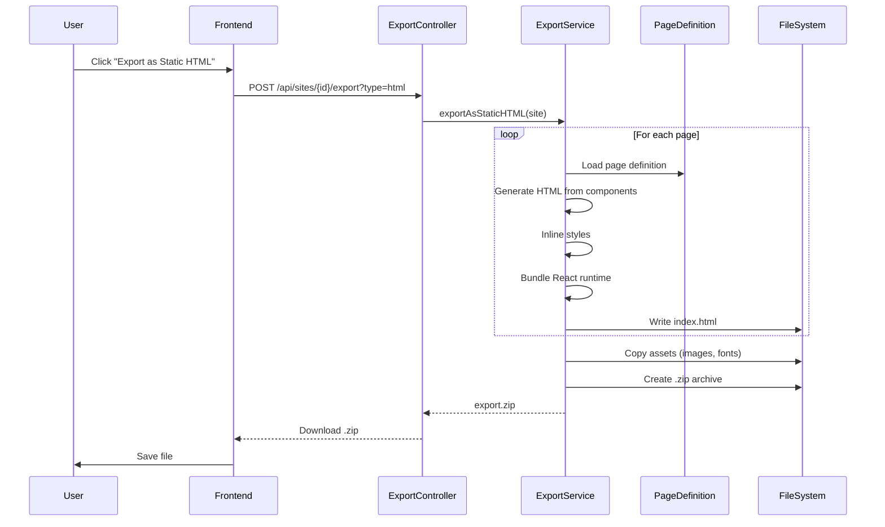

### Spring Boot Export

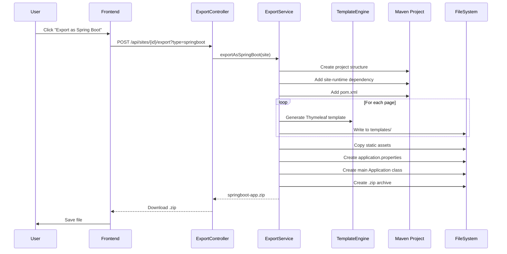

---

## 5.11 Cross-Cutting Concepts

### Plugin Isolation

Each plugin runs in an isolated classloader to prevent conflicts:

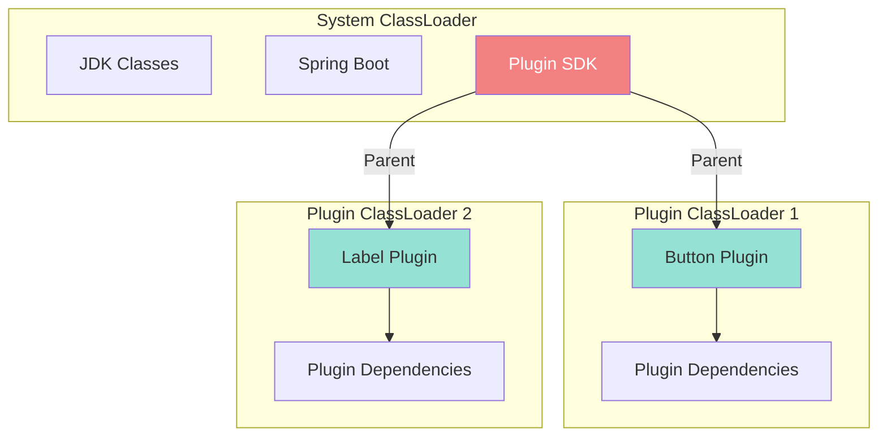

**Benefits**:
- Plugins can use different versions of same library
- Plugin conflicts impossible
- Hot-reload via classloader disposal

**Trade-offs**:
- Memory overhead (one classloader per plugin)
- Debugging complexity across classloaders

### Component Registration

Components are registered in database for fast lookup:

```
cms_component_registry
├── id (PK)
├── plugin_id
├── component_id
├── display_name
├── category
├── manifest_json (JSONB)
└── created_at
```

**Benefits**:
- Fast component lookup without loading JARs
- Persistent across restarts
- Query by category, plugin, etc.

---

[← Previous: Solution Strategy](04-solution-strategy.md) | [Back to Index](README.md) | [Next: Runtime View →](06-runtime-view.md)
