# 6. Runtime View

This section describes the behavior and interaction of VSD's building blocks at runtime through important scenarios and workflows.

---

## 6.1 Plugin Lifecycle

### 6.1.1 Plugin Load and Activation

This scenario shows how a plugin is discovered, loaded, and activated when VSD starts.

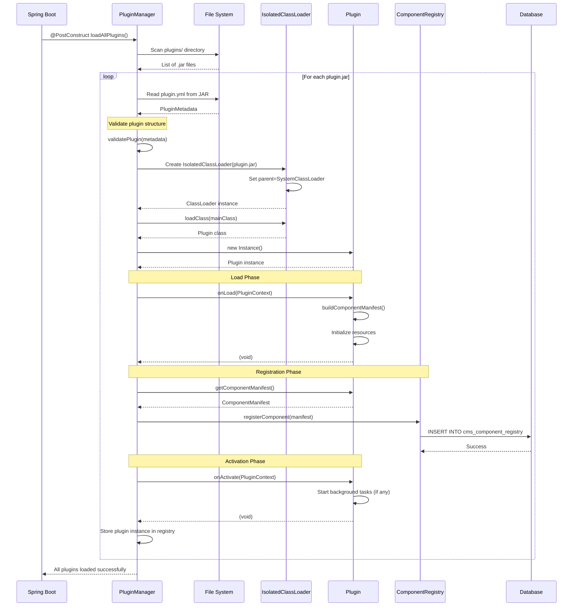

**Key Steps**:
1. **Discovery**: Scan `plugins/` directory for `.jar` files
2. **Validation**: Read `plugin.yml`, validate required fields (`plugin-id`, `main-class`, `version`)
3. **ClassLoader Creation**: Create isolated classloader to prevent conflicts
4. **Instantiation**: Load plugin class, call no-arg constructor
5. **Load**: Call `onLoad(context)`, plugin builds manifest and initializes
6. **Registration**: Register component in database for fast lookup
7. **Activation**: Call `onActivate(context)`, plugin is ready for use

**Preconditions**:
- Plugin JAR exists in `plugins/` directory
- Plugin has valid `plugin.yml` with all required fields
- Main class implements `UIComponentPlugin` interface

**Postconditions**:
- Plugin instance stored in memory
- Component registered in database
- Frontend can fetch component metadata and bundle

---

### 6.1.2 Plugin Hot Reload

This scenario shows how a plugin can be reloaded without restarting VSD.

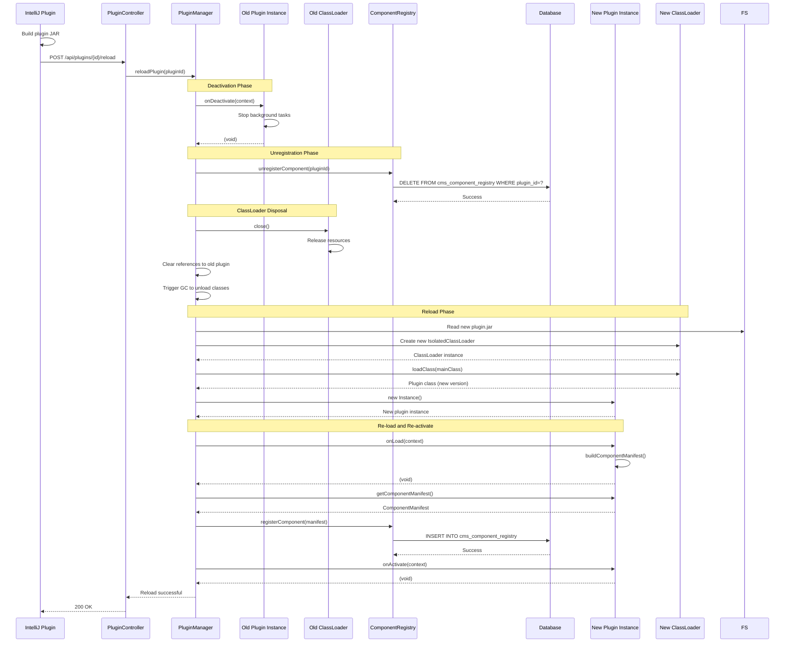

**Key Steps**:
1. **Deactivation**: Call `onDeactivate()` on old plugin instance
2. **Unregistration**: Remove component from database
3. **ClassLoader Disposal**: Close old classloader, release resources, trigger GC
4. **Reload**: Create new classloader, load new version of plugin
5. **Re-activation**: Call `onLoad()` and `onActivate()` on new instance

**Benefits**:
- No server restart required
- Faster development cycle
- Zero downtime for plugin updates

**Limitations**:
- Cannot change plugin ID (would be treated as different plugin)
- Cannot change package structure (breaks classloading)
- Memory leaks possible if plugin holds static references

---

### 6.1.3 Plugin Deactivation and Uninstall

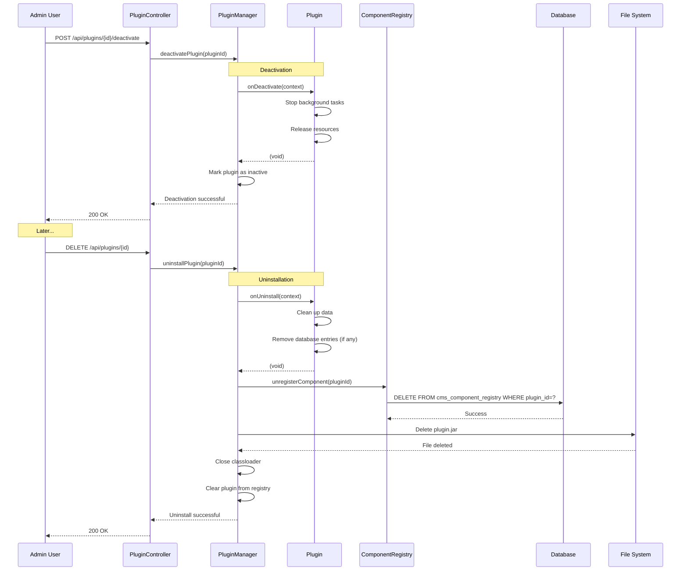

**Key Steps**:
1. **Deactivation**: Call `onDeactivate()`, plugin stops but remains installed
2. **Uninstallation**: Call `onUninstall()`, plugin performs cleanup
3. **Unregistration**: Remove from component registry
4. **File Deletion**: Delete JAR file from plugins directory
5. **Cleanup**: Close classloader, clear references

---

## 6.2 Authentication Flows

### 6.2.1 Local JWT Authentication

This scenario shows how a user logs in with username and password.

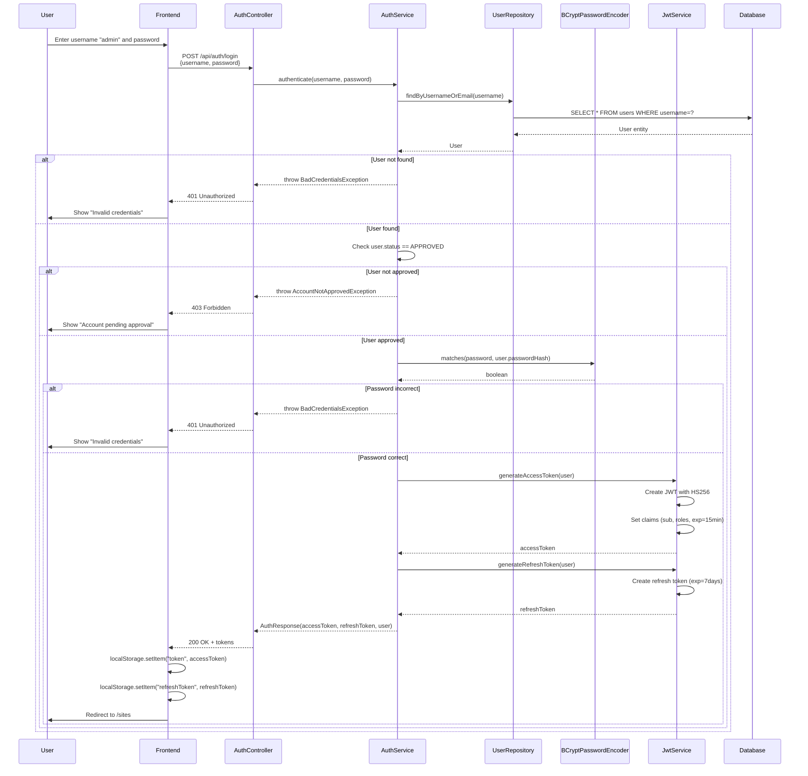

**JWT Token Structure (HS256)**:
```json
{
  "header": {
    "alg": "HS256",
    "typ": "JWT"
  },
  "payload": {
    "sub": "1",
    "username": "admin",
    "email": "admin@localhost",
    "roles": ["ADMIN"],
    "iat": 1709217600,
    "exp": 1709218500
  },
  "signature": "..."
}
```

**Key Steps**:
1. User submits credentials
2. Backend looks up user by username/email
3. Validates user status (must be APPROVED)
4. Compares password hash using BCrypt
5. Generates JWT access token (HS256, 15 min expiry)
6. Generates refresh token (7 day expiry)
7. Returns tokens to frontend
8. Frontend stores in localStorage

---

### 6.2.2 OAuth2 SSO Authentication

This scenario shows how a user logs in via VSD Auth Server (or other OAuth2 provider).

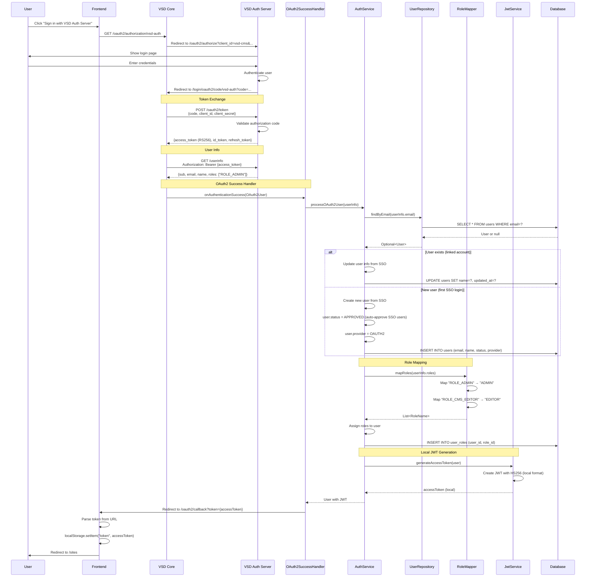

**Role Mapping Table**:

| Auth Server Role | VSD Role | Description |
|-----------------|----------|-------------|
| `ROLE_ADMIN` or `ROLE_CMS_ADMIN` | `ADMIN` | Full system access |
| `ROLE_EDITOR` or `ROLE_CMS_EDITOR` | `EDITOR` | Content editing |
| `ROLE_VIEWER` or `ROLE_CMS_VIEWER` | `VIEWER` | Read-only access |
| `ROLE_DESIGNER` or `ROLE_CMS_DESIGNER` | `DESIGNER` | Design permissions |
| (default) | `USER` | Basic user |

**Key Steps**:
1. User initiates OAuth2 flow
2. Redirect to auth server login page
3. Auth server authenticates user
4. Redirect back with authorization code
5. Exchange code for access token (RS256)
6. Fetch user info from auth server
7. Create or update local user account
8. Map external roles to VSD roles
9. Auto-approve SSO users (status = APPROVED)
10. Generate local JWT token (HS256)
11. Redirect to frontend with token

**Dual Auth Mode**: After SSO login, users receive a local HS256 JWT token for subsequent requests. This allows VSD to work seamlessly whether the user logged in locally or via SSO.

---

### 6.2.3 Authenticated API Request

This scenario shows how JWT tokens are validated on each API request.

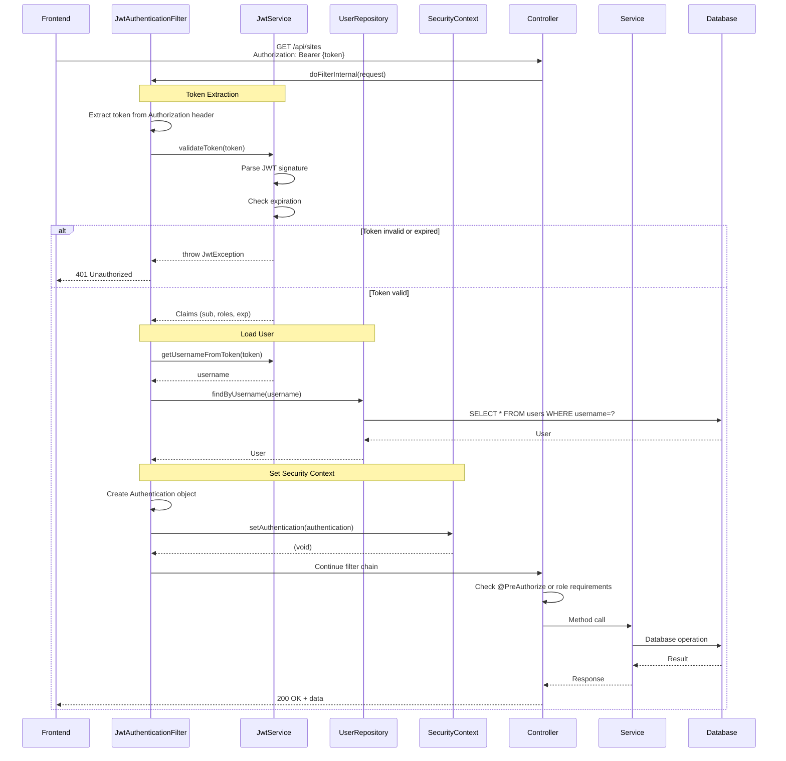

**Key Steps**:
1. Frontend sends request with JWT token in `Authorization: Bearer {token}` header
2. `JwtAuthenticationFilter` intercepts request
3. Extract and validate token signature and expiration
4. Load user from database by username claim
5. Create `Authentication` object and set in `SecurityContext`
6. Controller checks role requirements (`@PreAuthorize`, `@Secured`)
7. Process request if authorized

---

## 6.3 Page Rendering Pipeline

### 6.3.1 Builder Canvas Rendering

This scenario shows how the builder canvas renders a page definition.

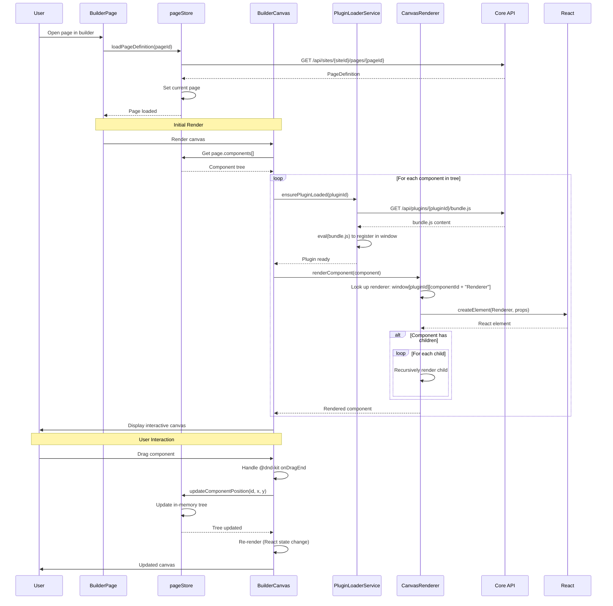

**Component Tree Example**:
```json
{
  "components": [
    {
      "id": "comp-1",
      "pluginId": "page-layout-plugin",
      "componentId": "pageLayout",
      "children": {
        "header": [
          {
            "id": "comp-2",
            "pluginId": "navbar-component-plugin",
            "componentId": "navbar",
            "props": { "variant": "sticky" }
          }
        ],
        "center": [
          {
            "id": "comp-3",
            "pluginId": "label-component-plugin",
            "componentId": "label",
            "props": { "text": "Welcome", "variant": "h1" }
          }
        ]
      }
    }
  ]
}
```

**Key Steps**:
1. Load page definition from API
2. Store in Zustand `pageStore`
3. For each component, load plugin bundle if not already loaded
4. Look up renderer function in `window[pluginId][componentId + "Renderer"]`
5. Create React element with component props
6. Recursively render children
7. Handle user interactions (drag, resize, select)
8. Update store, trigger re-render

---

### 6.3.2 Standalone Preview Window Synchronization

This scenario shows how the standalone preview window stays synchronized with the builder.

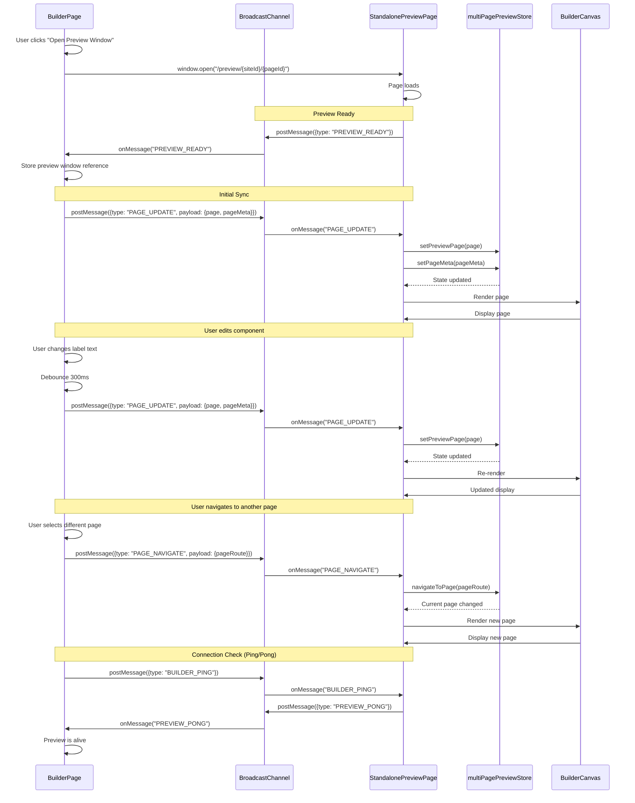

**BroadcastChannel Messages**:

| Message Type | Direction | Payload | Description |
|-------------|-----------|---------|-------------|
| `PREVIEW_READY` | Preview → Builder | (none) | Preview window loaded and ready |
| `PAGE_UPDATE` | Builder → Preview | `{page, pageMeta}` | Page content updated |
| `PAGE_NAVIGATE` | Builder → Preview | `{pageRoute}` | Navigate to different page |
| `PAGES_LIST` | Builder → Preview | `{pages, currentPageId, siteId}` | List of all pages updated |
| `BUILDER_PING` | Builder → Preview | (none) | Check if preview is alive |
| `PREVIEW_PONG` | Preview → Builder | (none) | Response to ping |
| `CLOSE_PREVIEW` | Builder → Preview | (none) | Close preview window |

**Key Features**:
- **BroadcastChannel API**: Cross-window communication without WebSocket
- **localStorage Fallback**: For browsers without BroadcastChannel support
- **Debounced Updates**: 300ms debounce to prevent excessive messages
- **Ping/Pong**: Periodic health check to detect closed windows
- **Same-Origin Only**: Works only when both windows on same origin

**Benefits**:
- No server infrastructure required
- Works through proxies (Cloudflare Tunnel)
- Real-time synchronization
- Low latency

---

## 6.4 Export Process

### 6.4.1 Static HTML Export

This scenario shows how a site is exported to static HTML files.

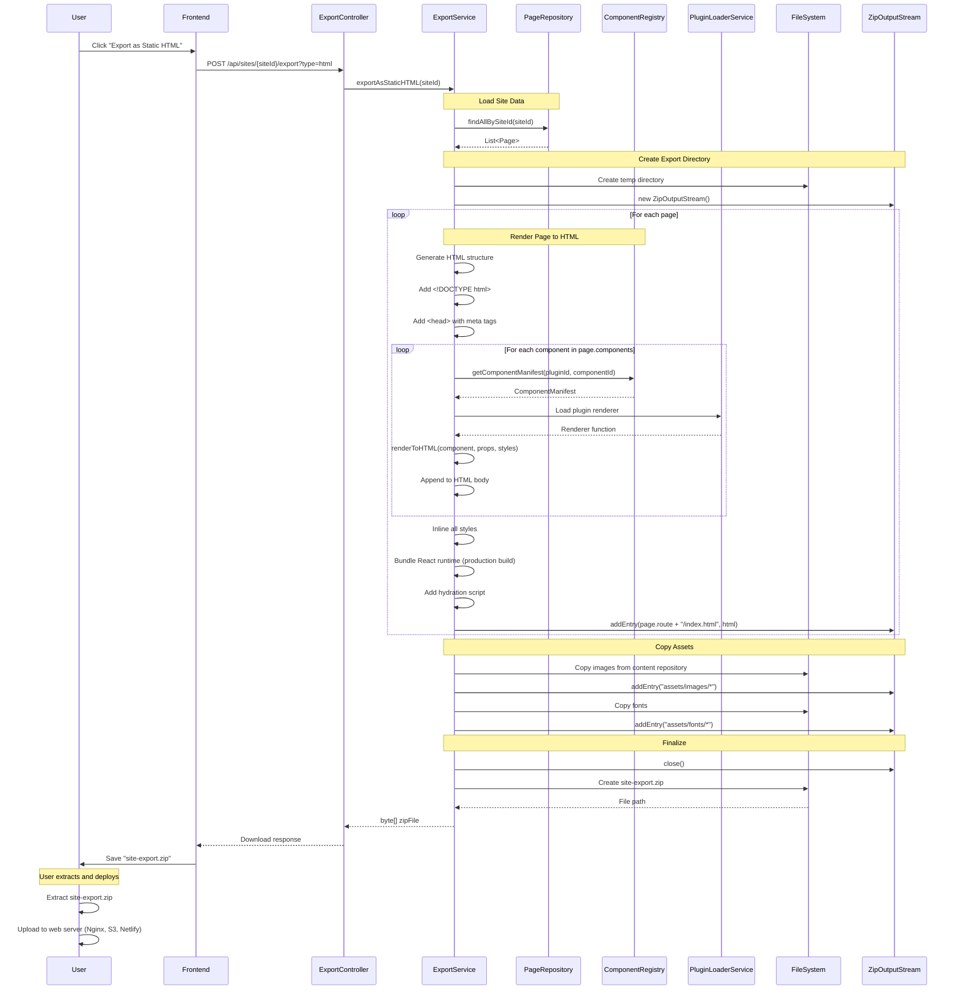

**Generated File Structure**:
```
site-export.zip
├── index.html           (homepage, route="/")
├── about/
│   └── index.html       (route="/about")
├── contact/
│   └── index.html       (route="/contact")
├── assets/
│   ├── images/
│   │   ├── logo.png
│   │   └── hero.jpg
│   ├── fonts/
│   │   └── roboto.woff2
│   └── js/
│       ├── react.production.min.js
│       └── runtime.js
└── README.txt
```

**Key Steps**:
1. Load all pages for site
2. For each page, render component tree to HTML
3. Inline all styles (no external CSS)
4. Bundle React runtime (production build)
5. Copy assets (images, fonts)
6. Create ZIP archive
7. Return as download

---

### 6.4.2 Spring Boot Export

This scenario shows how a site is exported as a Spring Boot application.

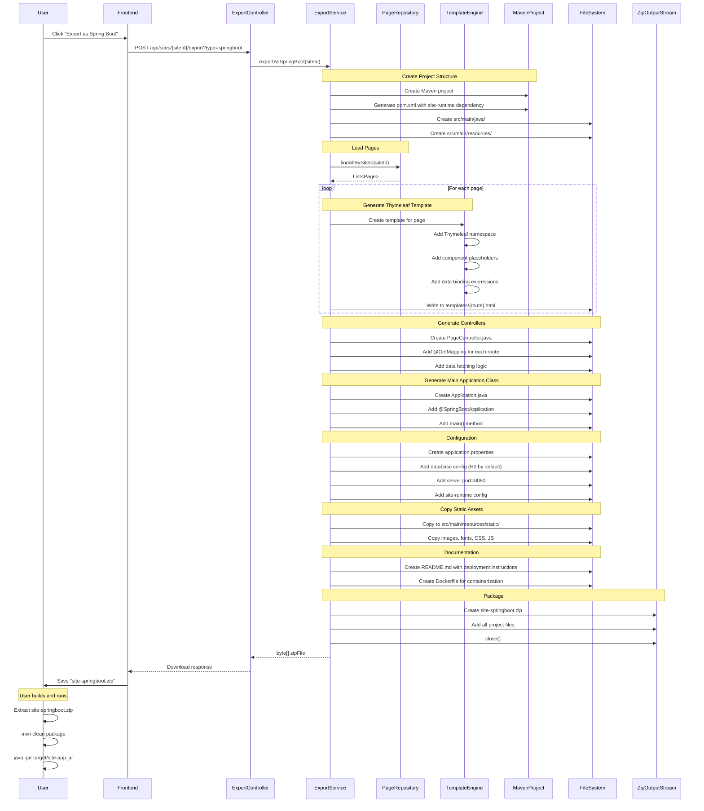

**Generated Project Structure**:
```
site-springboot/
├── pom.xml
├── Dockerfile
├── README.md
└── src/main/
    ├── java/com/example/site/
    │   ├── Application.java
    │   ├── controller/
    │   │   └── PageController.java
    │   └── config/
    │       └── SiteRuntimeConfig.java
    └── resources/
        ├── application.properties
        ├── templates/
        │   ├── index.html (Thymeleaf)
        │   ├── about.html
        │   └── contact.html
        └── static/
            ├── css/
            ├── js/
            └── images/
```

**Generated pom.xml Dependencies**:
```xml
<dependencies>
    <!-- Site Runtime -->
    <dependency>
        <groupId>dev.mainul35</groupId>
        <artifactId>site-runtime</artifactId>
        <version>1.0.0-SNAPSHOT</version>
    </dependency>

    <!-- Spring Boot Web -->
    <dependency>
        <groupId>org.springframework.boot</groupId>
        <artifactId>spring-boot-starter-web</artifactId>
    </dependency>

    <!-- Thymeleaf -->
    <dependency>
        <groupId>org.springframework.boot</groupId>
        <artifactId>spring-boot-starter-thymeleaf</artifactId>
    </dependency>

    <!-- H2 Database (can be changed) -->
    <dependency>
        <groupId>com.h2database</groupId>
        <artifactId>h2</artifactId>
        <scope>runtime</scope>
    </dependency>
</dependencies>
```

**Key Steps**:
1. Create Maven project structure
2. Generate pom.xml with site-runtime dependency
3. For each page, generate Thymeleaf template
4. Generate Spring Boot controllers with route mappings
5. Generate main application class
6. Create application.properties with configuration
7. Copy static assets
8. Create README with deployment instructions
9. Package as ZIP

**Deployment Options for Exported Site**:
- Run locally: `mvn spring-boot:run`
- Build JAR: `mvn clean package`, then `java -jar target/site-app.jar`
- Docker: `docker build -t my-site .`, then `docker run -p 8080:8080 my-site`
- Cloud: Deploy to Heroku, AWS Elastic Beanstalk, Google App Engine

---

## 6.5 Page Versioning and Rollback

This scenario shows how page versions are saved and restored.

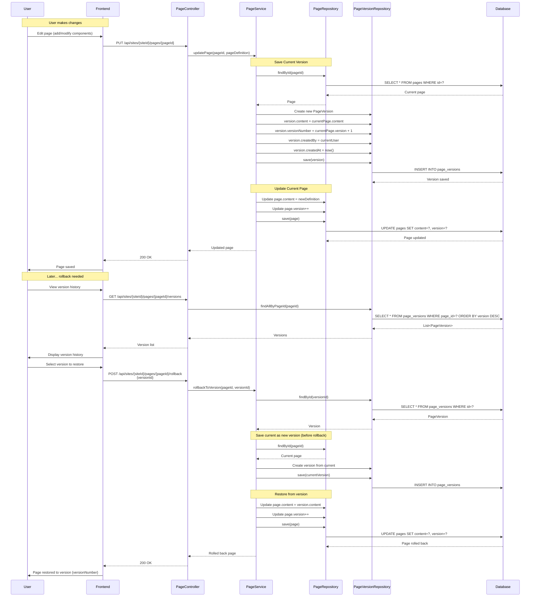

**Database Schema**:
```sql
-- pages table
CREATE TABLE pages (
    id BIGSERIAL PRIMARY KEY,
    site_id BIGINT NOT NULL,
    name VARCHAR(255),
    route VARCHAR(255),
    content JSONB,  -- Page definition
    version INT DEFAULT 1,
    created_at TIMESTAMP,
    updated_at TIMESTAMP
);

-- page_versions table
CREATE TABLE page_versions (
    id BIGSERIAL PRIMARY KEY,
    page_id BIGINT NOT NULL,
    version_number INT,
    content JSONB,  -- Snapshot of page definition
    created_by BIGINT,
    created_at TIMESTAMP,
    FOREIGN KEY (page_id) REFERENCES pages(id) ON DELETE CASCADE
);
```

**Key Steps**:
1. Before updating page, save current version to `page_versions` table
2. Increment version number
3. Update page with new content
4. On rollback, save current state as new version first (safety)
5. Restore content from selected version
6. Increment version number again

**Benefits**:
- Full version history
- Safe rollback (always creates version before rollback)
- Audit trail (who changed what when)
- No data loss

---

## 6.6 Real-time Preview Synchronization (Technical Deep Dive)

This section provides additional technical details on the preview synchronization mechanism.

### BroadcastChannel API vs WebSocket

| Feature | BroadcastChannel | WebSocket |
|---------|-----------------|-----------|
| **Communication** | Browser-local (same origin) | Server-mediated |
| **Setup** | No server infrastructure | Requires server |
| **Latency** | Very low (in-process) | Network latency |
| **Proxy Compatibility** | Always works | May require proxy config |
| **Cross-tab** | ✅ Yes | ❌ No (without server) |
| **Browser Support** | Modern browsers | All browsers |

### localStorage Fallback

When `BroadcastChannel` is not available:

```typescript
// Fallback to localStorage events
if (!('BroadcastChannel' in window)) {
  // Sender
  const sendMessage = (message: Message) => {
    localStorage.setItem('vsd-preview-message', JSON.stringify(message));
    localStorage.removeItem('vsd-preview-message'); // Trigger event
  };

  // Receiver
  window.addEventListener('storage', (event) => {
    if (event.key === 'vsd-preview-message' && event.newValue) {
      const message = JSON.parse(event.newValue);
      handleMessage(message);
    }
  });
}
```

### Message Flow Timing

```
Builder                             Preview
  |                                    |
  |--- PAGE_UPDATE (t=0) ------------->|
  |                                    | (Render starts)
  |                                    | (Load plugins: 50-200ms)
  |                                    | (React render: 10-50ms)
  |<-- Preview visible (t=60-250ms) ---|
  |                                    |
  |--- PAGE_UPDATE (t=500) ----------->|  (Debounced)
  |                                    | (Re-render: 5-20ms)
  |<-- Updated (t=505-520ms) ----------|
```

**Performance Optimizations**:
- Debounce updates: 300ms
- Only send changed properties
- Plugins cached after first load
- React reconciliation minimizes DOM updates

---

[← Previous: Building Block View](05-building-block-view.md) | [Back to Index](README.md) | [Next: Deployment View →](07-deployment-view.md)
