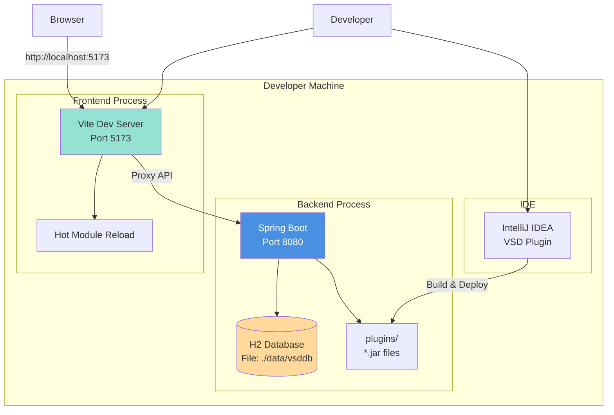
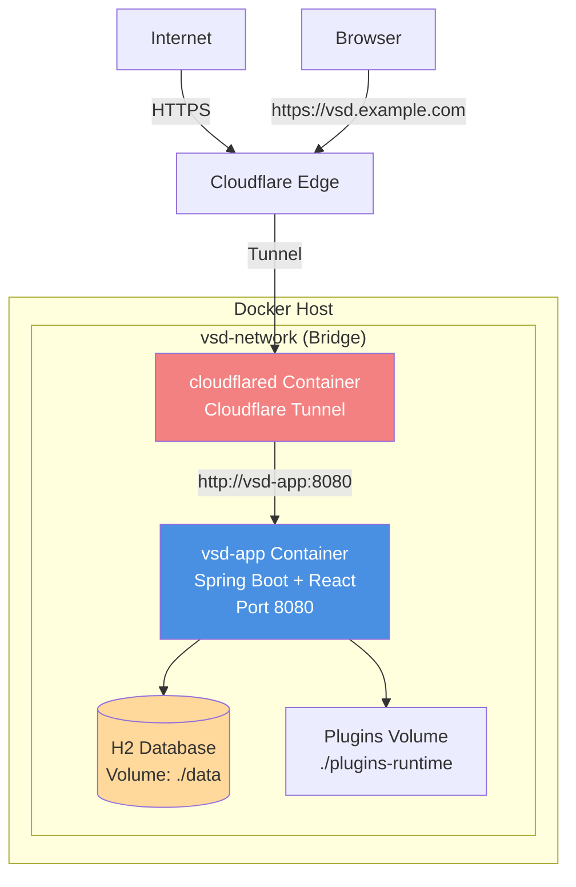
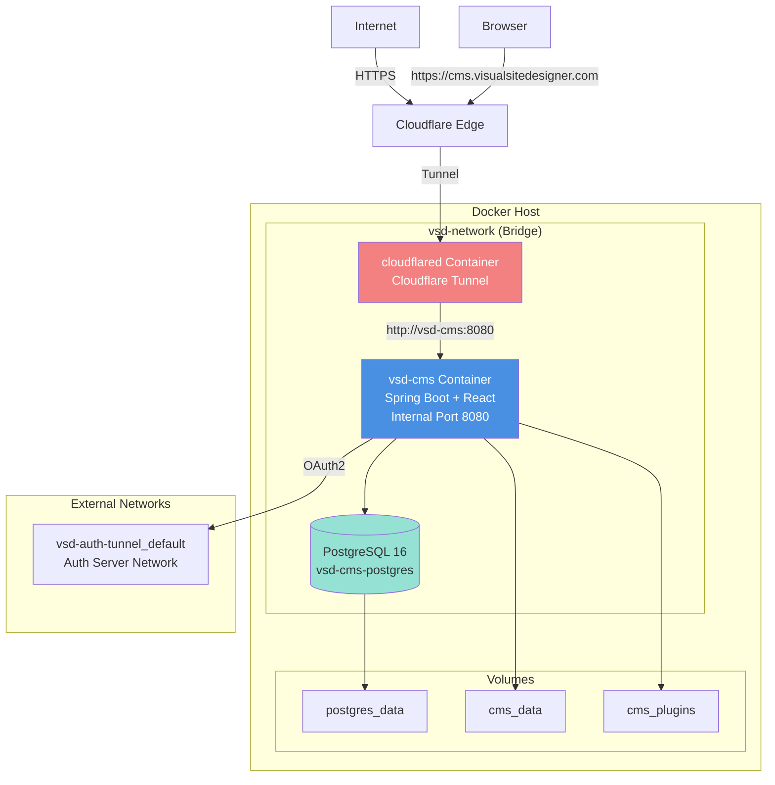
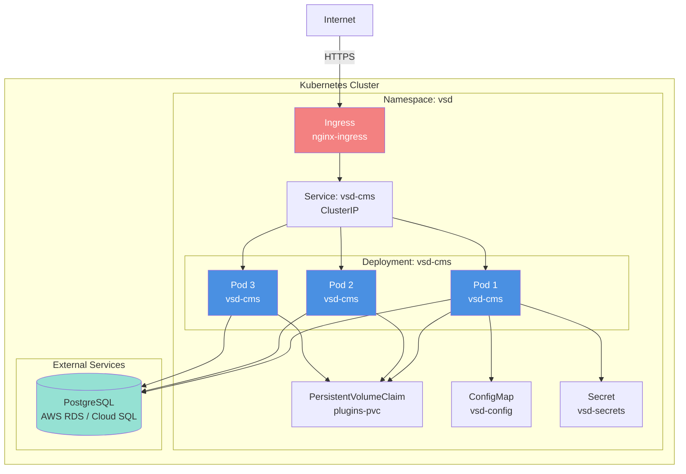
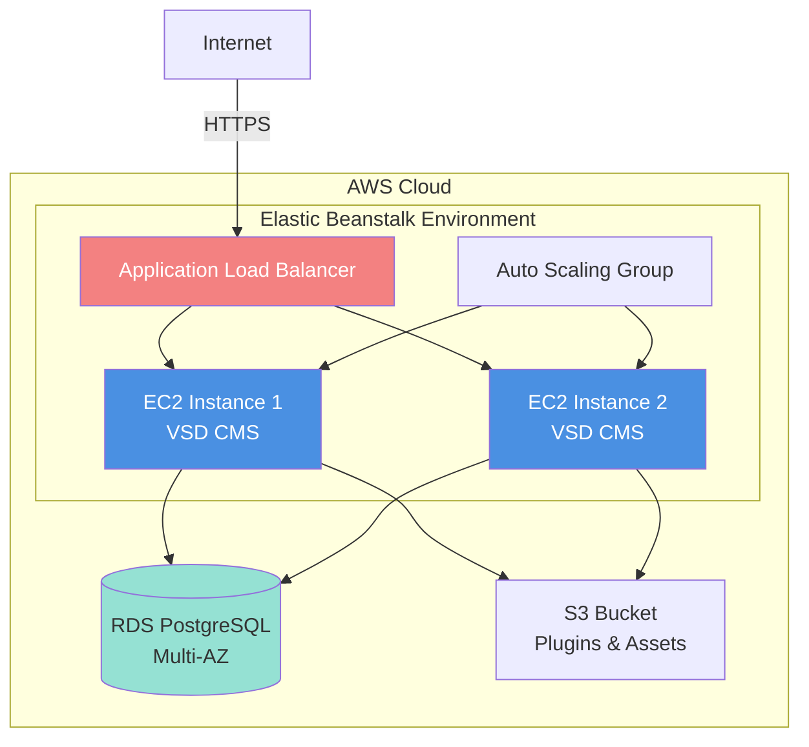
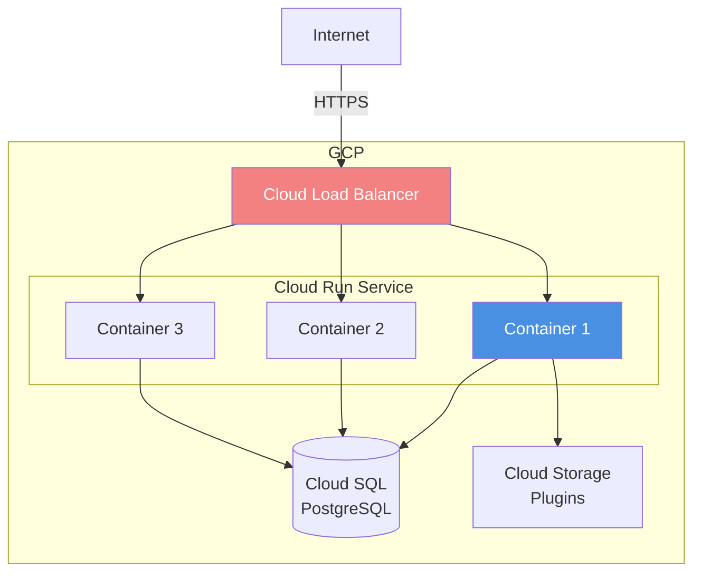

# 7. Deployment View

This section describes the infrastructure and deployment options for Visual Site Designer, from local development to production environments.

---

## 7.1 Overview of Deployment Scenarios

VSD supports multiple deployment scenarios based on different needs:

| Scenario | Use Case | Database | Reverse Proxy | Containerization |
|----------|----------|----------|---------------|------------------|
| **Local Development** | Plugin development, testing | H2 (file-based) | None | Optional |
| **Docker Compose (Dev)** | Multi-service local testing | H2 (in container) | Cloudflare Tunnel | Yes |
| **Docker Compose (Prod)** | Production deployment | PostgreSQL | Cloudflare Tunnel | Yes |
| **Kubernetes** | Cloud-native, scalable | PostgreSQL (external) | Ingress Controller | Yes |
| **Cloud Platform** | Managed infrastructure | Cloud DB (RDS, Cloud SQL) | Cloud Load Balancer | Yes |

---

## 7.2 Local Development Deployment

### Infrastructure Diagram



### Components

| Component | Technology | Port | Purpose |
|-----------|-----------|------|---------|
| **Backend** | Spring Boot 3.4.1 | 8080 | Core API, plugin runtime |
| **Frontend** | Vite 6.0.5 + React 18.3.1 | 5173 | Visual builder UI with HMR |
| **Database** | H2 (embedded) | - | Development database (file-based) |
| **IDE Plugin** | IntelliJ Plugin | - | Plugin development tooling |

### Configuration

**Backend: `core/src/main/resources/application.properties`**
```properties
# Server
server.port=8080

# Database (H2 embedded)
spring.datasource.url=jdbc:h2:file:./data/vsddb
spring.datasource.driver-class-name=org.h2.Driver
spring.datasource.username=sa
spring.datasource.password=
spring.jpa.database-platform=org.hibernate.dialect.H2Dialect

# H2 Console (for debugging)
spring.h2.console.enabled=true
spring.h2.console.path=/h2-console

# JPA
spring.jpa.hibernate.ddl-auto=update
spring.jpa.show-sql=false

# Plugin System
app.plugin.directory=plugins
app.plugin.hot-reload.enabled=true
app.plugin.validation.enabled=true

# Authentication (Local JWT)
app.jwt.secret=your-256-bit-secret-key-change-this-in-production
app.jwt.access-token-expiration-ms=900000  # 15 minutes
app.jwt.refresh-token-expiration-ms=604800000  # 7 days

# Disable OAuth2 for local dev
app.auth-server.enabled=false
```

**Frontend: `frontend/vite.config.ts`**
```typescript
export default defineConfig({
  plugins: [react()],
  server: {
    port: 5173,
    proxy: {
      '/api': {
        target: 'http://localhost:8080',
        changeOrigin: true,
      },
    },
  },
});
```

### Running Locally

**Terminal 1: Backend**
```bash
cd core
mvn spring-boot:run
```

**Terminal 2: Frontend**
```bash
cd frontend
npm install
npm run dev
```

**Access**:
- Frontend: http://localhost:5173
- Backend API: http://localhost:8080/api
- H2 Console: http://localhost:8080/h2-console

### Benefits
- ✅ Fast startup (< 30 seconds)
- ✅ Hot module reload (frontend)
- ✅ Hot plugin reload (backend)
- ✅ No external dependencies
- ✅ Easy debugging

### Limitations
- ❌ Single user (no real concurrency)
- ❌ H2 database (not production-ready)
- ❌ No reverse proxy
- ❌ Manual coordination of two processes

---

## 7.3 Docker Compose Deployment (Development)

### Infrastructure Diagram



### docker-compose.yml

```yaml
version: '3.8'

services:
  # VSD Application
  vsd-app:
    build:
      context: .
      dockerfile: Dockerfile
    container_name: vsd-app
    ports:
      - "8080:8080"  # Exposed for Cloudflare Tunnel
    volumes:
      # Persist H2 database data
      - ./data:/app/data
      # Mount plugins directory for hot-reload support
      - ./plugins-runtime:/app/plugins
    environment:
      - SPRING_DATASOURCE_URL=jdbc:h2:file:/app/data/vsd-db
      - SERVER_PORT=8080
      # Plugin configuration
      - PLUGIN_DIRECTORY=/app/plugins
      # Trust Cloudflare proxy headers
      - SERVER_FORWARD_HEADERS_STRATEGY=FRAMEWORK
      - SERVER_TOMCAT_REMOTEIP_REMOTE_IP_HEADER=CF-Connecting-IP
      - SERVER_TOMCAT_REMOTEIP_PROTOCOL_HEADER=X-Forwarded-Proto
    restart: unless-stopped
    networks:
      - vsd-network
    healthcheck:
      test: ["CMD", "curl", "-f", "http://localhost:8080/actuator/health"]
      interval: 30s
      timeout: 10s
      retries: 3
      start_period: 60s

  # Cloudflare Tunnel
  cloudflared:
    image: cloudflare/cloudflared:latest
    container_name: vsd-cloudflared
    command: tunnel --no-autoupdate run
    environment:
      - TUNNEL_TOKEN=${CLOUDFLARE_TUNNEL_TOKEN}
    depends_on:
      - vsd-app
    restart: unless-stopped
    networks:
      - vsd-network

networks:
  vsd-network:
    driver: bridge
```

### Dockerfile

```dockerfile
# Stage 1: Build frontend
FROM node:20-alpine AS frontend-build
WORKDIR /frontend
COPY frontend/package*.json ./
RUN npm ci
COPY frontend/ ./
RUN npm run build

# Stage 2: Build backend
FROM maven:3.9-eclipse-temurin-21 AS backend-build
WORKDIR /app

# Copy BOM and SDK first (for layer caching)
COPY vsd-cms-bom/ ./vsd-cms-bom/
COPY flashcard-cms-plugin-sdk/ ./flashcard-cms-plugin-sdk/

# Install BOM and SDK
WORKDIR /app/vsd-cms-bom
RUN mvn clean install -DskipTests

WORKDIR /app/flashcard-cms-plugin-sdk
RUN mvn clean install -DskipTests

# Copy and build core
WORKDIR /app
COPY core/pom.xml ./core/
COPY core/src ./core/src/

# Copy pre-built frontend into core static resources
COPY --from=frontend-build /frontend/dist ./core/src/main/resources/static/

# Build core with skip-frontend profile (frontend already built)
WORKDIR /app/core
RUN mvn clean package -DskipTests -Pskip-frontend

# Stage 3: Runtime
FROM eclipse-temurin:21-jre-alpine
WORKDIR /app

# Copy JAR
COPY --from=backend-build /app/core/target/core-*.jar app.jar

# Copy plugins directory
COPY core/plugins ./plugins

# Create data directory for H2
RUN mkdir -p /app/data

# Expose port
EXPOSE 8080

# Health check
HEALTHCHECK --interval=30s --timeout=10s --retries=3 --start-period=60s \
  CMD wget --no-verbose --tries=1 --spider http://localhost:8080/actuator/health || exit 1

# Run application
ENTRYPOINT ["java", "-jar", "app.jar"]
```

### Deployment Steps

1. **Setup Cloudflare Tunnel** (one-time):
   ```bash
   # Install cloudflared
   wget https://github.com/cloudflare/cloudflared/releases/latest/download/cloudflared-linux-amd64
   chmod +x cloudflared-linux-amd64
   sudo mv cloudflared-linux-amd64 /usr/local/bin/cloudflared

   # Login and create tunnel
   cloudflared tunnel login
   cloudflared tunnel create vsd-tunnel
   cloudflared tunnel route dns vsd-tunnel vsd.yourdomain.com

   # Get tunnel token
   cloudflared tunnel token vsd-tunnel
   ```

2. **Configure Environment**:
   ```bash
   # Create .env file
   cat > .env <<EOF
   CLOUDFLARE_TUNNEL_TOKEN=your-tunnel-token-here
   EOF
   ```

3. **Build and Run**:
   ```bash
   # Build and start services
   docker-compose up -d

   # View logs
   docker-compose logs -f

   # Check status
   docker-compose ps
   ```

4. **Access Application**:
   - https://vsd.yourdomain.com

### Benefits
- ✅ Production-like environment
- ✅ HTTPS via Cloudflare (no cert management)
- ✅ Volume persistence for data and plugins
- ✅ Easy to start/stop
- ✅ Works behind firewalls (Cloudflare Tunnel)

### Limitations
- ❌ H2 database (single file, not scalable)
- ❌ Single container (no horizontal scaling)
- ❌ No database backups (manual)

---

## 7.4 Docker Compose Deployment (Production)

### Infrastructure Diagram



### docker-compose.prod.yml

```yaml
version: '3.8'

services:
  # PostgreSQL Database
  vsd-cms-postgres:
    image: postgres:16-alpine
    container_name: vsd-cms-postgres
    restart: unless-stopped
    environment:
      - POSTGRES_USER=vsdcms
      - POSTGRES_PASSWORD=${DB_CMS_PASSWORD}
      - POSTGRES_DB=vsd_cms
    volumes:
      - cms_postgres_data:/var/lib/postgresql/data
    networks:
      - vsd-network
    healthcheck:
      test: ["CMD-SHELL", "pg_isready -U vsdcms"]
      interval: 10s
      timeout: 5s
      retries: 5

  # VSD CMS Application
  vsd-cms:
    image: mainul35/vsd:cmsV1
    container_name: vsd-cms
    restart: unless-stopped
    environment:
      - SPRING_PROFILES_ACTIVE=prod
      - DATABASE_URL=jdbc:postgresql://vsd-cms-postgres:5432/vsd_cms
      - DATABASE_USERNAME=vsdcms
      - DATABASE_PASSWORD=${DB_CMS_PASSWORD}
      - JWT_SECRET=${JWT_SECRET}
      - AUTH_SERVER_ENABLED=true
      - AUTH_SERVER_ISSUER_URI=https://vsdauthserver.visualsitedesigner.com
      - AUTH_SERVER_JWK_URI=http://vsd-auth-server:9001/oauth2/jwks
      - AUTH_SERVER_INTERNAL_URL=http://vsd-auth-server:9001
      - VSD_CMS_CLIENT_ID=vsd-cms-client
      - VSD_CMS_CLIENT_SECRET=${VSD_CMS_CLIENT_SECRET}
      - FRONTEND_URL=https://cms.visualsitedesigner.com
      - CORS_ALLOWED_ORIGINS=https://cms.visualsitedesigner.com
      - JAVA_OPTS=-Xmx512m -Xms256m
    expose:
      - "8080"
    volumes:
      - cms_data:/app/data
      - cms_plugins:/app/plugins
    depends_on:
      vsd-cms-postgres:
        condition: service_healthy
    networks:
      - vsd-network
      - vsd-auth-tunnel_default  # Connect to auth server network
    healthcheck:
      test: ["CMD", "wget", "--no-verbose", "--tries=1", "--spider", "http://localhost:8080/actuator/health"]
      interval: 30s
      timeout: 10s
      retries: 3
      start_period: 60s

  # Cloudflare Tunnel
  cloudflared:
    image: cloudflare/cloudflared:latest
    container_name: vsd-cms-cloudflared
    command: tunnel --no-autoupdate run
    environment:
      - TUNNEL_TOKEN=${CLOUDFLARE_TUNNEL_TOKEN}
    depends_on:
      vsd-cms:
        condition: service_healthy
    restart: unless-stopped
    networks:
      - vsd-network

networks:
  vsd-network:
    driver: bridge
  vsd-auth-tunnel_default:
    external: true  # Connect to existing auth server network

volumes:
  cms_postgres_data:
  cms_data:
  cms_plugins:
```

### Production Configuration

**application-prod.properties**:
```properties
# Server
server.port=8080
server.forward-headers-strategy=framework
server.tomcat.remoteip.remote-ip-header=CF-Connecting-IP
server.tomcat.remoteip.protocol-header=X-Forwarded-Proto

# Database (PostgreSQL)
spring.datasource.url=${DATABASE_URL}
spring.datasource.username=${DATABASE_USERNAME}
spring.datasource.password=${DATABASE_PASSWORD}
spring.datasource.driver-class-name=org.postgresql.Driver
spring.jpa.database-platform=org.hibernate.dialect.PostgreSQLDialect

# JPA
spring.jpa.hibernate.ddl-auto=validate  # Use Flyway for migrations
spring.jpa.show-sql=false

# Flyway
spring.flyway.enabled=true
spring.flyway.baseline-on-migrate=true
spring.flyway.locations=classpath:db/migration

# Logging
logging.level.root=INFO
logging.level.dev.mainul35=INFO
logging.pattern.console=%d{yyyy-MM-dd HH:mm:ss} - %msg%n

# Plugin System
app.plugin.directory=/app/plugins
app.plugin.hot-reload.enabled=false  # Disable in production
app.plugin.validation.enabled=true

# JWT
app.jwt.secret=${JWT_SECRET}
app.jwt.access-token-expiration-ms=900000  # 15 minutes
app.jwt.refresh-token-expiration-ms=604800000  # 7 days

# OAuth2 (VSD Auth Server)
app.auth-server.enabled=${AUTH_SERVER_ENABLED:true}
app.auth-server.issuer-uri=${AUTH_SERVER_ISSUER_URI}
app.auth-server.jwk-set-uri=${AUTH_SERVER_JWK_URI}

spring.security.oauth2.client.registration.vsd-auth.client-id=${VSD_CMS_CLIENT_ID}
spring.security.oauth2.client.registration.vsd-auth.client-secret=${VSD_CMS_CLIENT_SECRET}
spring.security.oauth2.client.registration.vsd-auth.scope=openid,profile,email
spring.security.oauth2.client.registration.vsd-auth.authorization-grant-type=authorization_code
spring.security.oauth2.client.registration.vsd-auth.redirect-uri={baseUrl}/login/oauth2/code/{registrationId}

spring.security.oauth2.client.provider.vsd-auth.issuer-uri=${AUTH_SERVER_ISSUER_URI}

# CORS
app.cors.allowed-origins=${CORS_ALLOWED_ORIGINS}
app.cors.allowed-methods=GET,POST,PUT,DELETE,OPTIONS
app.cors.allowed-headers=*
app.cors.allow-credentials=true

# Actuator
management.endpoints.web.exposure.include=health,info,metrics
management.endpoint.health.show-details=when-authorized
```

### Environment Variables (.env)

```bash
# Database
DB_CMS_PASSWORD=strong-password-here

# JWT
JWT_SECRET=your-256-bit-secret-key-change-this

# OAuth2 (VSD Auth Server)
AUTH_SERVER_ENABLED=true
VSD_CMS_CLIENT_ID=vsd-cms-client
VSD_CMS_CLIENT_SECRET=client-secret-here

# Cloudflare Tunnel
CLOUDFLARE_TUNNEL_TOKEN=your-tunnel-token

# CORS
CORS_ALLOWED_ORIGINS=https://cms.visualsitedesigner.com

# Java Options
JAVA_OPTS=-Xmx512m -Xms256m
```

### Deployment Steps

1. **Prepare Environment**:
   ```bash
   # Create .env file with production values
   cp .env.example .env
   nano .env  # Edit with production values
   ```

2. **Initialize Database** (first time):
   ```bash
   # Start only PostgreSQL
   docker-compose -f docker-compose.prod.yml up -d vsd-cms-postgres

   # Wait for PostgreSQL to be ready
   docker-compose -f docker-compose.prod.yml logs -f vsd-cms-postgres

   # Database will be auto-created by Flyway migrations
   ```

3. **Deploy Application**:
   ```bash
   # Pull latest image
   docker pull mainul35/vsd:cmsV1

   # Start all services
   docker-compose -f docker-compose.prod.yml up -d

   # View logs
   docker-compose -f docker-compose.prod.yml logs -f vsd-cms
   ```

4. **Verify Deployment**:
   ```bash
   # Check health
   docker-compose -f docker-compose.prod.yml ps

   # Test health endpoint
   curl -f http://localhost:8080/actuator/health

   # Access via Cloudflare Tunnel
   curl -f https://cms.visualsitedesigner.com/actuator/health
   ```

### Backup Strategy

**Database Backup**:
```bash
# Manual backup
docker exec vsd-cms-postgres pg_dump -U vsdcms vsd_cms > backup.sql

# Restore
docker exec -i vsd-cms-postgres psql -U vsdcms vsd_cms < backup.sql

# Automated daily backup (cron)
0 2 * * * docker exec vsd-cms-postgres pg_dump -U vsdcms vsd_cms | gzip > /backups/vsd-cms-$(date +\%Y\%m\%d).sql.gz
```

**Plugin Backup**:
```bash
# Backup plugins
tar -czf plugins-backup.tar.gz /var/lib/docker/volumes/vsd_cms_plugins

# Restore plugins
tar -xzf plugins-backup.tar.gz -C /var/lib/docker/volumes/vsd_cms_plugins
```

### Monitoring

**Docker Compose Monitoring**:
```bash
# View resource usage
docker stats vsd-cms vsd-cms-postgres

# View logs with tail
docker-compose -f docker-compose.prod.yml logs -f --tail=100

# Check container health
docker-compose -f docker-compose.prod.yml ps
```

**Application Monitoring** (via Spring Boot Actuator):
- Health: https://cms.visualsitedesigner.com/actuator/health
- Metrics: https://cms.visualsitedesigner.com/actuator/metrics
- Info: https://cms.visualsitedesigner.com/actuator/info

### Scaling Considerations

**Current Limitations** (single container):
- ❌ No horizontal scaling
- ❌ Single point of failure
- ❌ Limited to single host resources

**Future Enhancements** (Kubernetes):
- ✅ Multiple replicas
- ✅ Auto-scaling
- ✅ Load balancing
- ✅ Zero-downtime deployments

---

## 7.5 Kubernetes Deployment (Optional)

### Infrastructure Diagram



### Kubernetes Manifests

**Namespace**:
```yaml
apiVersion: v1
kind: Namespace
metadata:
  name: vsd
```

**ConfigMap**:
```yaml
apiVersion: v1
kind: ConfigMap
metadata:
  name: vsd-config
  namespace: vsd
data:
  SPRING_PROFILES_ACTIVE: "prod"
  DATABASE_URL: "jdbc:postgresql://postgres-service.vsd.svc.cluster.local:5432/vsd_cms"
  DATABASE_USERNAME: "vsdcms"
  AUTH_SERVER_ENABLED: "true"
  AUTH_SERVER_ISSUER_URI: "https://vsdauthserver.visualsitedesigner.com"
  FRONTEND_URL: "https://cms.visualsitedesigner.com"
  CORS_ALLOWED_ORIGINS: "https://cms.visualsitedesigner.com"
  JAVA_OPTS: "-Xmx512m -Xms256m"
```

**Secret**:
```yaml
apiVersion: v1
kind: Secret
metadata:
  name: vsd-secrets
  namespace: vsd
type: Opaque
stringData:
  DATABASE_PASSWORD: "strong-password"
  JWT_SECRET: "your-256-bit-secret"
  VSD_CMS_CLIENT_SECRET: "client-secret"
```

**PersistentVolumeClaim** (for plugins):
```yaml
apiVersion: v1
kind: PersistentVolumeClaim
metadata:
  name: plugins-pvc
  namespace: vsd
spec:
  accessModes:
    - ReadWriteMany  # Shared across pods
  resources:
    requests:
      storage: 10Gi
  storageClassName: standard  # Use your cluster's storage class
```

**Deployment**:
```yaml
apiVersion: apps/v1
kind: Deployment
metadata:
  name: vsd-cms
  namespace: vsd
spec:
  replicas: 3
  selector:
    matchLabels:
      app: vsd-cms
  template:
    metadata:
      labels:
        app: vsd-cms
    spec:
      containers:
      - name: vsd-cms
        image: mainul35/vsd:cmsV1
        ports:
        - containerPort: 8080
          name: http
        env:
        - name: SPRING_PROFILES_ACTIVE
          valueFrom:
            configMapKeyRef:
              name: vsd-config
              key: SPRING_PROFILES_ACTIVE
        - name: DATABASE_URL
          valueFrom:
            configMapKeyRef:
              name: vsd-config
              key: DATABASE_URL
        - name: DATABASE_USERNAME
          valueFrom:
            configMapKeyRef:
              name: vsd-config
              key: DATABASE_USERNAME
        - name: DATABASE_PASSWORD
          valueFrom:
            secretKeyRef:
              name: vsd-secrets
              key: DATABASE_PASSWORD
        - name: JWT_SECRET
          valueFrom:
            secretKeyRef:
              name: vsd-secrets
              key: JWT_SECRET
        - name: JAVA_OPTS
          valueFrom:
            configMapKeyRef:
              name: vsd-config
              key: JAVA_OPTS
        volumeMounts:
        - name: plugins
          mountPath: /app/plugins
        resources:
          requests:
            memory: "256Mi"
            cpu: "250m"
          limits:
            memory: "512Mi"
            cpu: "500m"
        livenessProbe:
          httpGet:
            path: /actuator/health/liveness
            port: 8080
          initialDelaySeconds: 60
          periodSeconds: 10
          failureThreshold: 3
        readinessProbe:
          httpGet:
            path: /actuator/health/readiness
            port: 8080
          initialDelaySeconds: 30
          periodSeconds: 5
          failureThreshold: 3
      volumes:
      - name: plugins
        persistentVolumeClaim:
          claimName: plugins-pvc
```

**Service**:
```yaml
apiVersion: v1
kind: Service
metadata:
  name: vsd-cms
  namespace: vsd
spec:
  selector:
    app: vsd-cms
  ports:
  - protocol: TCP
    port: 80
    targetPort: 8080
  type: ClusterIP
```

**Ingress**:
```yaml
apiVersion: networking.k8s.io/v1
kind: Ingress
metadata:
  name: vsd-ingress
  namespace: vsd
  annotations:
    cert-manager.io/cluster-issuer: letsencrypt-prod
    nginx.ingress.kubernetes.io/ssl-redirect: "true"
spec:
  ingressClassName: nginx
  tls:
  - hosts:
    - cms.visualsitedesigner.com
    secretName: vsd-tls
  rules:
  - host: cms.visualsitedesigner.com
    http:
      paths:
      - path: /
        pathType: Prefix
        backend:
          service:
            name: vsd-cms
            port:
              number: 80
```

**HorizontalPodAutoscaler**:
```yaml
apiVersion: autoscaling/v2
kind: HorizontalPodAutoscaler
metadata:
  name: vsd-cms-hpa
  namespace: vsd
spec:
  scaleTargetRef:
    apiVersion: apps/v1
    kind: Deployment
    name: vsd-cms
  minReplicas: 3
  maxReplicas: 10
  metrics:
  - type: Resource
    resource:
      name: cpu
      target:
        type: Utilization
        averageUtilization: 70
  - type: Resource
    resource:
      name: memory
      target:
        type: Utilization
        averageUtilization: 80
```

### Deployment Commands

```bash
# Create namespace
kubectl apply -f namespace.yaml

# Create config and secrets
kubectl apply -f configmap.yaml
kubectl apply -f secret.yaml

# Create PVC
kubectl apply -f pvc.yaml

# Deploy application
kubectl apply -f deployment.yaml
kubectl apply -f service.yaml
kubectl apply -f ingress.yaml
kubectl apply -f hpa.yaml

# Check status
kubectl get pods -n vsd
kubectl get svc -n vsd
kubectl get ingress -n vsd

# View logs
kubectl logs -f deployment/vsd-cms -n vsd

# Scale manually
kubectl scale deployment vsd-cms --replicas=5 -n vsd
```

### Benefits
- ✅ Horizontal scaling (3-10 replicas)
- ✅ Auto-healing (restart failed pods)
- ✅ Zero-downtime deployments (rolling updates)
- ✅ Load balancing
- ✅ Resource limits and requests
- ✅ Health checks (liveness, readiness)

### Considerations
- Plugin hot-reload not recommended (use CI/CD)
- Shared plugin storage (ReadWriteMany PVC)
- External database required (RDS, Cloud SQL)
- Ingress controller needed (nginx, Traefik)
- TLS certificate management (cert-manager)

---

## 7.6 Cloud Platform Deployment

### AWS Elastic Beanstalk



**Deployment**:
1. Package application as JAR
2. Create Elastic Beanstalk application
3. Configure RDS database
4. Set environment variables
5. Deploy JAR via EB CLI or console

### Google Cloud Platform (Cloud Run)



**Deployment**:
1. Build Docker image
2. Push to Google Container Registry
3. Deploy to Cloud Run
4. Connect to Cloud SQL
5. Use Cloud Storage for plugins

---

## 7.7 Deployment Comparison

| Factor | Local Dev | Docker Compose (Dev) | Docker Compose (Prod) | Kubernetes | Cloud Platform |
|--------|-----------|---------------------|----------------------|------------|----------------|
| **Setup Complexity** | Low | Medium | Medium | High | Medium |
| **Cost** | Free | Low (single server) | Medium | High (cluster) | Medium-High |
| **Scalability** | Single user | Single container | Single container | Auto-scaling | Auto-scaling |
| **High Availability** | ❌ | ❌ | ❌ | ✅ | ✅ |
| **Zero-Downtime Deploy** | ❌ | ❌ | ❌ | ✅ | ✅ |
| **Database** | H2 (file) | H2 (volume) | PostgreSQL | External DB | Managed DB |
| **HTTPS/SSL** | ❌ | ✅ (Cloudflare) | ✅ (Cloudflare) | ✅ (Ingress) | ✅ (Managed) |
| **Monitoring** | Manual | Docker stats | Docker stats | Prometheus/Grafana | Cloud Monitoring |
| **Backup** | Manual | Manual volume backup | Manual volume backup | Velero / Cloud snapshots | Managed backups |
| **Best For** | Development | Testing, small sites | Production (small-medium) | Production (large) | Production (any size) |

---

## 7.8 Network and Security

### Firewall Rules

**Docker Compose**:
```bash
# Allow SSH (for management)
ufw allow 22/tcp

# Block direct access to 8080 (only via Cloudflare Tunnel)
ufw deny 8080/tcp

# Enable firewall
ufw enable
```

**Kubernetes**:
- Ingress controller handles external traffic
- Network policies restrict pod-to-pod communication
- External DB accessible only from cluster

### TLS/SSL Certificates

**Cloudflare Tunnel** (Docker Compose):
- Cloudflare manages TLS certificates
- Automatic renewal
- No cert-manager needed

**Kubernetes** (cert-manager):
```bash
# Install cert-manager
kubectl apply -f https://github.com/cert-manager/cert-manager/releases/download/v1.13.0/cert-manager.yaml

# Create ClusterIssuer
kubectl apply -f cluster-issuer.yaml
```

**ClusterIssuer** (Let's Encrypt):
```yaml
apiVersion: cert-manager.io/v1
kind: ClusterIssuer
metadata:
  name: letsencrypt-prod
spec:
  acme:
    server: https://acme-v02.api.letsencrypt.org/directory
    email: admin@visualsitedesigner.com
    privateKeySecretRef:
      name: letsencrypt-prod
    solvers:
    - http01:
        ingress:
          class: nginx
```

### Reverse Proxy Configuration

**Cloudflare Tunnel** benefits:
- No inbound firewall rules needed
- Works behind NAT/firewalls
- DDoS protection
- Global CDN
- Web Application Firewall (WAF)

---

## 7.9 Operational Procedures

### Rolling Updates (Kubernetes)

```bash
# Update image
kubectl set image deployment/vsd-cms vsd-cms=mainul35/vsd:cmsV2 -n vsd

# Monitor rollout
kubectl rollout status deployment/vsd-cms -n vsd

# Rollback if needed
kubectl rollout undo deployment/vsd-cms -n vsd
```

### Blue-Green Deployment (Kubernetes)

1. Deploy new version as separate deployment (green)
2. Test green deployment
3. Switch service selector to green
4. Delete blue deployment

### Database Migrations

**Flyway** handles migrations automatically on startup:
```sql
-- V1__initial_schema.sql
CREATE TABLE sites (...);
CREATE TABLE pages (...);

-- V2__add_versioning.sql
ALTER TABLE pages ADD COLUMN version INT DEFAULT 1;
CREATE TABLE page_versions (...);
```

**Manual migration** (if needed):
```bash
# Backup first
docker exec vsd-cms-postgres pg_dump -U vsdcms vsd_cms > backup.sql

# Apply migration
docker exec -i vsd-cms-postgres psql -U vsdcms vsd_cms < migration.sql
```

---

[← Previous: Runtime View](06-runtime-view.md) | [Back to Index](README.md)
