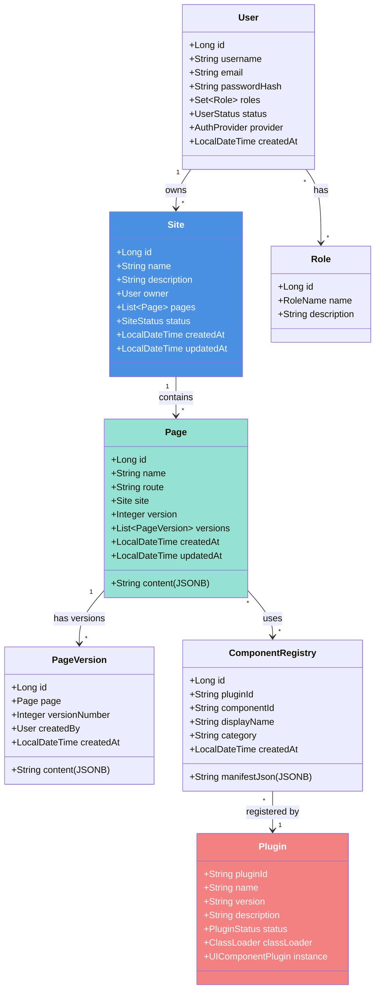
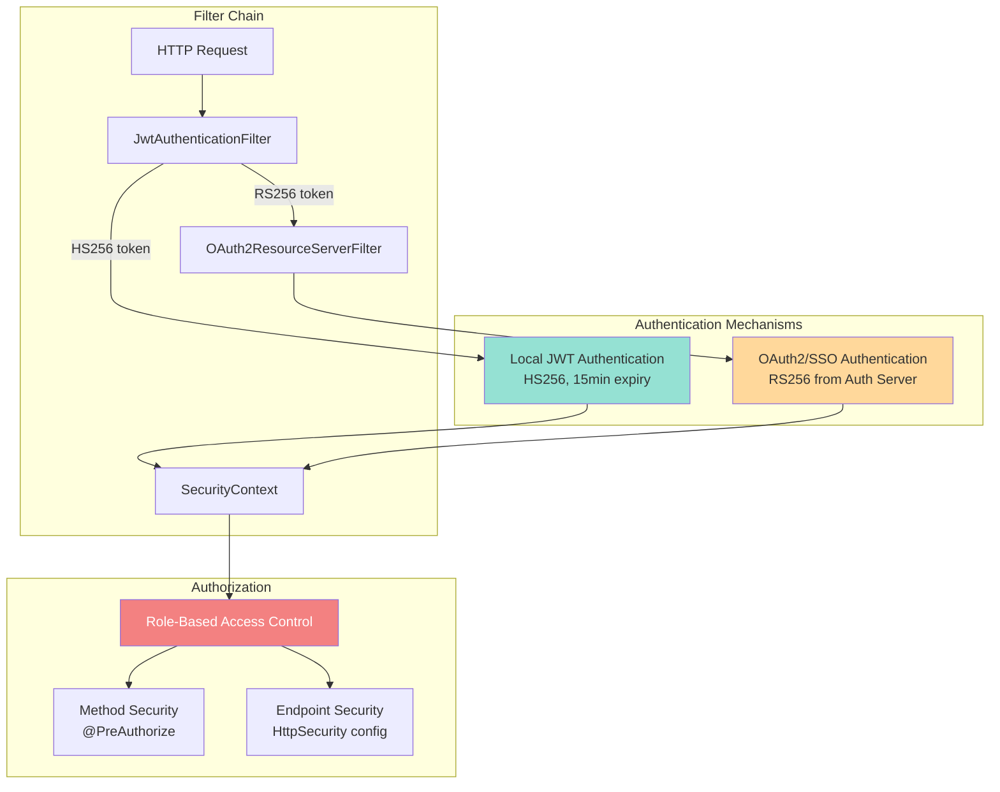
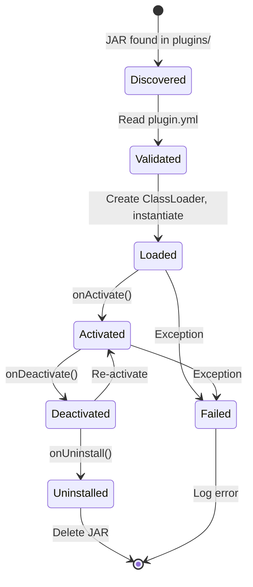
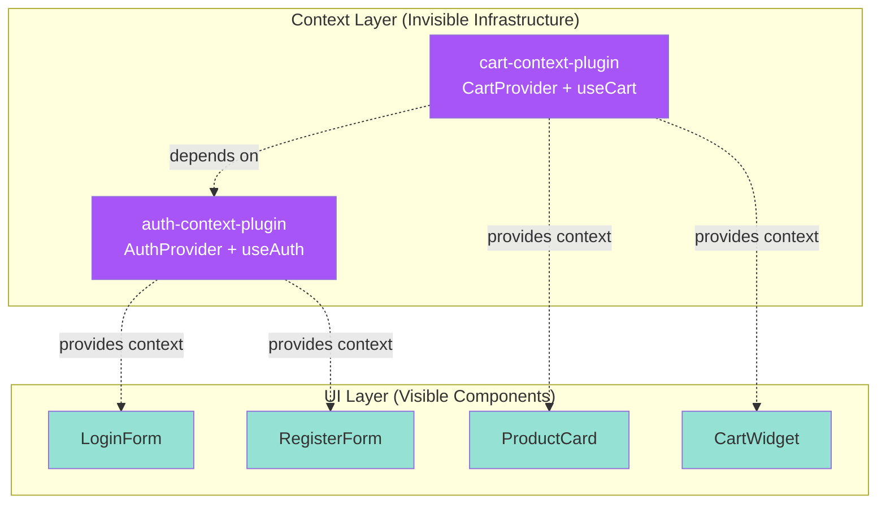
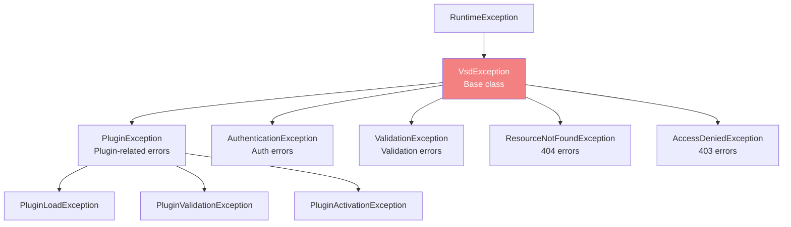
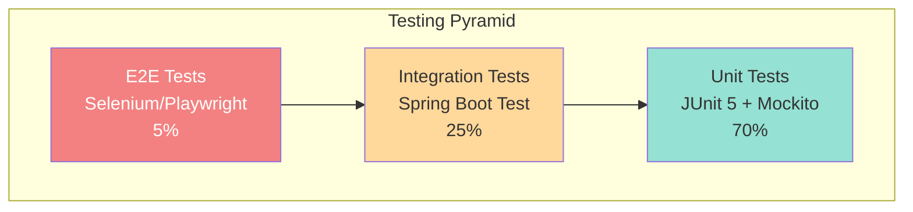

# 8. Cross-cutting Concepts

This section describes overarching, system-wide concepts and design approaches that affect multiple components across the VSD architecture.

---

## 8.1 Domain Model

The domain model represents the core business entities and their relationships in Visual Site Designer.

### 8.1.1 Core Domain Entities



### 8.1.2 Entity Descriptions

| Entity | Description | Key Relationships |
|--------|-------------|-------------------|
| **Site** | Top-level container for a website project | Owned by User, contains multiple Pages |
| **Page** | Individual page within a site with route and content | Belongs to Site, has PageVersions, references Components |
| **PageVersion** | Historical snapshot of a page's content | Belongs to Page, created by User |
| **User** | System user with authentication credentials | Owns Sites, has Roles |
| **Role** | Authorization role (ADMIN, DESIGNER, EDITOR, VIEWER, USER) | Assigned to Users |
| **ComponentRegistry** | Metadata for registered UI components | Linked to Plugin |
| **Plugin** | Runtime representation of a plugin JAR | Registers Components |

### 8.1.3 Page Content Structure

Pages store their content as JSON (JSONB in PostgreSQL) with the following structure:

```json
{
  "components": [
    {
      "id": "comp-1",
      "pluginId": "container-layout-plugin",
      "componentId": "container",
      "props": {
        "layout": "flex",
        "direction": "column",
        "gap": "20px"
      },
      "styles": {
        "width": "100%",
        "padding": "40px",
        "backgroundColor": "#ffffff"
      },
      "children": [
        {
          "id": "comp-2",
          "pluginId": "label-component-plugin",
          "componentId": "label",
          "props": {
            "text": "Welcome to My Site",
            "variant": "h1"
          },
          "styles": {
            "color": "#333333",
            "fontSize": "48px"
          }
        }
      ]
    }
  ],
  "metadata": {
    "title": "Home",
    "description": "Homepage for my site",
    "keywords": ["website", "homepage"]
  }
}
```

### 8.1.4 Component Manifest Structure

Each plugin provides a component manifest describing its capabilities:

```json
{
  "componentId": "label",
  "displayName": "Label",
  "category": "ui",
  "icon": "L",
  "description": "Text label with various heading and paragraph variants",
  "version": "1.0.0",
  "props": [
    {
      "name": "text",
      "type": "string",
      "label": "Text Content",
      "defaultValue": "Label",
      "required": true,
      "validation": {
        "maxLength": 500
      }
    },
    {
      "name": "variant",
      "type": "enum",
      "label": "Variant",
      "options": ["h1", "h2", "h3", "h4", "h5", "h6", "p", "span"],
      "defaultValue": "p",
      "required": true
    }
  ],
  "styles": [
    {
      "property": "color",
      "type": "color",
      "label": "Text Color",
      "defaultValue": "#000000",
      "category": "appearance"
    },
    {
      "property": "fontSize",
      "type": "size",
      "label": "Font Size",
      "defaultValue": "16px",
      "units": ["px", "em", "rem"],
      "category": "typography"
    }
  ],
  "sizeConstraints": {
    "resizable": true,
    "defaultWidth": "200px",
    "defaultHeight": "auto",
    "minWidth": "50px",
    "maxWidth": "100%",
    "minHeight": "20px",
    "maxHeight": "500px"
  }
}
```

---

## 8.2 Security Concepts

### 8.2.1 Authentication Architecture

VSD implements a dual authentication strategy supporting both local JWT and OAuth2/SSO.



### 8.2.2 Role-Based Access Control (RBAC)

VSD implements a role hierarchy with distinct permissions:

| Role | Permissions | Use Case |
|------|-------------|----------|
| **ADMIN** | Full system access, user management, plugin management | System administrators |
| **DESIGNER** | Create/edit sites, manage pages, configure components | Web designers |
| **EDITOR** | Edit existing pages, modify content | Content editors |
| **VIEWER** | View sites and pages (read-only) | Reviewers, clients |
| **USER** | Basic authenticated user | General users |

**Permission Matrix**:

| Operation | ADMIN | DESIGNER | EDITOR | VIEWER | USER |
|-----------|-------|----------|--------|--------|------|
| Create Site | ✅ | ✅ | ❌ | ❌ | ❌ |
| Edit Site | ✅ | ✅ (own) | ✅ (own) | ❌ | ❌ |
| Delete Site | ✅ | ✅ (own) | ❌ | ❌ | ❌ |
| Create Page | ✅ | ✅ | ✅ | ❌ | ❌ |
| Edit Page | ✅ | ✅ | ✅ | ❌ | ❌ |
| View Page | ✅ | ✅ | ✅ | ✅ | ❌ |
| Export Site | ✅ | ✅ | ✅ | ❌ | ❌ |
| Manage Plugins | ✅ | ❌ | ❌ | ❌ | ❌ |
| Manage Users | ✅ | ❌ | ❌ | ❌ | ❌ |

### 8.2.3 JWT Token Strategy

**Local JWT (HS256)**:
```java
// Token generation
String accessToken = Jwts.builder()
    .setSubject(user.getId().toString())
    .claim("username", user.getUsername())
    .claim("email", user.getEmail())
    .claim("roles", user.getRoles().stream()
        .map(role -> role.getName().name())
        .collect(Collectors.toList()))
    .setIssuedAt(new Date())
    .setExpiration(new Date(System.currentTimeMillis() + 900000)) // 15 min
    .signWith(SignatureAlgorithm.HS256, secretKey)
    .compact();
```

**Token Refresh Flow**:
1. Access token expires after 15 minutes
2. Client uses refresh token (7 day expiry) to request new access token
3. Backend validates refresh token and issues new access token
4. Refresh token rotation: New refresh token issued on refresh

**Security Considerations**:
- Tokens stored in localStorage (XSS risk mitigation via CSP)
- HttpOnly cookies considered but rejected (CSRF complexity)
- Short access token expiry minimizes exposure window
- Refresh token rotation prevents replay attacks

### 8.2.4 OAuth2 Integration

**Supported Providers**:
- VSD Auth Server (custom authorization server)
- Google OAuth2
- Okta
- Keycloak
- Any OIDC-compliant provider

**OAuth2 Flow**:
1. User clicks "Sign in with SSO"
2. Redirect to authorization server
3. User authenticates with provider
4. Authorization code returned to VSD
5. VSD exchanges code for access token (RS256)
6. VSD fetches user info
7. Create/update local user account
8. Map external roles to VSD roles
9. Issue local JWT token (HS256)
10. User authenticated with local token for subsequent requests

**Role Mapping Configuration**:
```yaml
app:
  oauth2:
    role-mapping:
      ROLE_ADMIN: ADMIN
      ROLE_CMS_ADMIN: ADMIN
      ROLE_EDITOR: EDITOR
      ROLE_CMS_EDITOR: EDITOR
      ROLE_DESIGNER: DESIGNER
      ROLE_CMS_DESIGNER: DESIGNER
      ROLE_VIEWER: VIEWER
      ROLE_CMS_VIEWER: VIEWER
      default: USER
```

### 8.2.5 Input Validation

**Multi-layer Validation**:

1. **Client-side Validation** (Frontend):
   - Immediate user feedback
   - Type checking via TypeScript
   - Prop validation based on component manifest
   - Form validation using React Hook Form

2. **Server-side Validation** (Backend):
   - Bean Validation annotations (`@Valid`, `@NotNull`, `@Size`)
   - Custom validators for business rules
   - SQL injection prevention via JPA/Hibernate
   - Plugin manifest validation on load

**Example - Page Creation Validation**:
```java
@PostMapping("/api/sites/{siteId}/pages")
public ResponseEntity<Page> createPage(
    @PathVariable Long siteId,
    @Valid @RequestBody PageDto pageDto, // Bean validation
    @AuthenticationPrincipal User user) {

    // Business validation
    if (!siteService.canUserEditSite(siteId, user)) {
        throw new AccessDeniedException("User cannot edit this site");
    }

    // Content validation
    if (!pageService.validatePageContent(pageDto.getContent())) {
        throw new ValidationException("Invalid page content structure");
    }

    return ResponseEntity.ok(pageService.createPage(siteId, pageDto, user));
}
```

### 8.2.6 Plugin Sandboxing

**Isolation Strategy**:
- Each plugin loads in isolated ClassLoader
- Parent classloader: System ClassLoader (JDK + Spring)
- Plugin SDK classes shared from parent
- Plugin dependency classes isolated

**Limitations**:
- No Java SecurityManager (deprecated in Java 17+)
- Plugins can access file system (limited by OS permissions)
- Plugins can make network requests
- Plugins run with same JVM permissions as core

**Validation on Plugin Load**:
1. Verify plugin.yml structure
2. Check plugin signature (future enhancement)
3. Validate main class implements UIComponentPlugin
4. Verify no conflicting plugin IDs
5. Check for malicious patterns (basic heuristics)

**Risk Mitigation**:
- Only ADMIN users can upload plugins
- Plugin validation before activation
- Audit log for plugin operations
- Regular security reviews of bundled plugins

---

## 8.3 Plugin Architecture Patterns

### 8.3.1 Plugin Lifecycle Pattern



**Lifecycle Methods**:

```java
public interface Plugin {
    // Called once when plugin JAR is loaded
    void onLoad(PluginContext context) throws Exception;

    // Called when plugin is activated (ready for use)
    void onActivate(PluginContext context) throws Exception;

    // Called when plugin is deactivated (still installed)
    void onDeactivate(PluginContext context) throws Exception;

    // Called before plugin is uninstalled
    void onUninstall(PluginContext context) throws Exception;
}
```

### 8.3.2 Component Registry Pattern

**Registration Flow**:
```
Plugin Load
    → Plugin.onLoad()
    → Plugin.getComponentManifest()
    → ComponentRegistry.register(manifest)
    → Save to database (cms_component_registry)
    → Cache in memory
```

**Lookup Flow**:
```
Frontend Request
    → GET /api/components
    → ComponentRegistry.getAll()
    → Load from memory cache
    → Return manifest list
```

**Benefits**:
- Fast component lookup without loading plugin JARs
- Persistent registration across restarts
- Queryable by category, plugin, etc.

### 8.3.3 Isolated ClassLoader Pattern

```mermaid
graph TB
    subgraph "Bootstrap ClassLoader"
        JDK[JDK Core Classes<br/>java.*, javax.*]
    end

    subgraph "System ClassLoader"
        SPRING[Spring Boot Classes]
        SDK[Plugin SDK Interfaces]
        VSD_CORE[VSD Core Classes]
    end

    subgraph "Plugin ClassLoader 1"
        P1_MAIN[ButtonPlugin.class]
        P1_DEP[Plugin Dependencies<br/>commons-lang3]
    end

    subgraph "Plugin ClassLoader 2"
        P2_MAIN[LabelPlugin.class]
        P2_DEP[Plugin Dependencies<br/>commons-lang3 (different version)]
    end

    JDK --> SPRING
    JDK --> SDK
    SPRING --> SDK
    SDK --> P1_MAIN
    SDK --> P2_MAIN
    P1_MAIN --> P1_DEP
    P2_MAIN --> P2_DEP

    style SDK fill:#f38181,color:#fff
    style P1_MAIN fill:#95e1d3
    style P2_MAIN fill:#95e1d3
```

**Implementation**:
```java
public class IsolatedClassLoader extends URLClassLoader {
    private final Set<String> sharedPackages;

    public IsolatedClassLoader(URL[] urls, ClassLoader parent) {
        super(urls, parent);
        this.sharedPackages = Set.of(
            "dev.mainul35.cms.plugin.api",  // SDK package
            "org.springframework",           // Spring (optional)
            "java", "javax"                  // JDK
        );
    }

    @Override
    protected Class<?> loadClass(String name, boolean resolve)
            throws ClassNotFoundException {
        // Check if class is in shared packages
        if (sharedPackages.stream().anyMatch(name::startsWith)) {
            return super.loadClass(name, resolve); // Delegate to parent
        }

        // Load from plugin JAR (isolation)
        synchronized (getClassLoadingLock(name)) {
            Class<?> c = findLoadedClass(name);
            if (c == null) {
                c = findClass(name); // Load from plugin
            }
            if (resolve) {
                resolveClass(c);
            }
            return c;
        }
    }
}
```

### 8.3.4 Frontend Bundle Loading Pattern

**Dynamic Import Strategy**:
```typescript
// PluginLoaderService.ts
class PluginLoaderService {
  private loadedPlugins = new Map<string, any>();

  async loadPlugin(pluginId: string): Promise<void> {
    if (this.loadedPlugins.has(pluginId)) {
      return; // Already loaded
    }

    // Fetch plugin bundle from backend
    const response = await fetch(`/api/plugins/${pluginId}/bundle.js`);
    const code = await response.text();

    // Execute bundle (registers in window[pluginId])
    const script = document.createElement('script');
    script.textContent = code;
    document.body.appendChild(script);
    document.body.removeChild(script);

    // Cache plugin
    this.loadedPlugins.set(pluginId, window[pluginId]);
  }

  getRenderer(pluginId: string, componentId: string): React.ComponentType {
    const plugin = this.loadedPlugins.get(pluginId);
    if (!plugin) {
      throw new Error(`Plugin ${pluginId} not loaded`);
    }

    const rendererName = `${componentId}Renderer`;
    const renderer = plugin[rendererName];

    if (!renderer) {
      throw new Error(`Renderer ${rendererName} not found in plugin ${pluginId}`);
    }

    return renderer;
  }
}
```

### 8.3.5 Cross-Plugin Shared Context Pattern (Planned)

**Problem**: Feature domains like authentication and e-commerce require shared state across multiple independent UI component plugins. For example, a login form, registration form, and user profile all need access to auth session state. In an e-commerce scenario, product cards, cart widgets, checkout forms, and shipping forms all need access to cart state.

**Solution**: The **Context Provider Plugin** pattern introduces a new plugin type that provides shared state and services without rendering UI.



**Architecture Layers**:

1. **SDK Layer** (`ContextProviderPlugin` interface):
   - Declares `getContextId()` — unique context name (e.g., `"auth"`, `"cart"`)
   - Declares `getProviderComponentPath()` — path to React context provider
   - Declares `getApiEndpoints()` — backend REST endpoints the context exposes
   - Declares `getRequiredContexts()` — dependencies on other contexts

2. **Backend Layer** (PluginManager + ContextRegistry):
   - New `ContextRegistry` alongside existing `ComponentRegistry`
   - Context plugins loaded **before** UI plugins (dependency order)
   - Validates context dependencies form a DAG (no cycles)
   - Exposes `GET /api/contexts` for frontend discovery

3. **Frontend Layer** (ContextProviderTree + `usePluginContext` hook):
   - Fetches active contexts from backend on app startup
   - Topological sort by dependencies to determine wrapping order
   - Wraps page component tree with all active context providers
   - `usePluginContext(contextId)` hook for UI components to consume context

**UI Component → Context Binding**:

UI component manifests declare context dependencies via `requiredContexts`:

```json
{
  "componentId": "loginForm",
  "pluginId": "login-form-plugin",
  "requiredContexts": ["auth"],
  "capabilities": {
    "canHaveChildren": false,
    "isResizable": true
  }
}
```

The builder validates that required contexts are satisfied before allowing component placement.

**Frontend `usePluginContext` Hook**:

```typescript
// Any UI component plugin can access any registered context
function LoginForm(props) {
  const { user, login, logout, isAuthenticated } = usePluginContext('auth');

  const handleSubmit = async (credentials) => {
    await login(credentials);
  };

  return isAuthenticated
    ? <UserGreeting user={user} onLogout={logout} />
    : <LoginFormUI onSubmit={handleSubmit} />;
}
```

**E-commerce Example** (future):

```
Installed Plugins:
├── auth-context-plugin/        (provides: "auth")
├── cart-context-plugin/        (provides: "cart", requires: "auth")
├── order-context-plugin/       (provides: "order", requires: "auth")
├── login-form-plugin/          (requires: "auth")
├── product-card-plugin/        (requires: "cart")
├── cart-widget-plugin/         (requires: "cart")
├── checkout-form-plugin/       (requires: "cart", "auth")
└── order-history-plugin/       (requires: "order")

Runtime Provider Tree:
  AuthProvider → CartProvider → OrderProvider → Page Components
```

**Design Principles**:

| Principle | Application |
|-----------|-------------|
| **Separation of Concerns** | State management (context plugins) separated from UI rendering (UI plugins) |
| **Dependency Inversion** | UI plugins depend on abstract context IDs, not concrete implementations |
| **Open/Closed** | New feature domains (analytics, notifications) added without core changes |
| **Single Responsibility** | Each context plugin manages exactly one domain's shared state |

---

## 8.4 Error Handling and Logging

### 8.4.1 Error Handling Strategy

**Exception Hierarchy**:



**Global Exception Handler**:
```java
@RestControllerAdvice
public class GlobalExceptionHandler {

    @ExceptionHandler(ResourceNotFoundException.class)
    public ResponseEntity<ErrorResponse> handleNotFound(
            ResourceNotFoundException ex, WebRequest request) {
        ErrorResponse error = ErrorResponse.builder()
            .timestamp(LocalDateTime.now())
            .status(HttpStatus.NOT_FOUND.value())
            .error("Not Found")
            .message(ex.getMessage())
            .path(request.getDescription(false))
            .build();
        return ResponseEntity.status(HttpStatus.NOT_FOUND).body(error);
    }

    @ExceptionHandler(ValidationException.class)
    public ResponseEntity<ErrorResponse> handleValidation(
            ValidationException ex, WebRequest request) {
        ErrorResponse error = ErrorResponse.builder()
            .timestamp(LocalDateTime.now())
            .status(HttpStatus.BAD_REQUEST.value())
            .error("Validation Failed")
            .message(ex.getMessage())
            .errors(ex.getErrors()) // Field-specific errors
            .path(request.getDescription(false))
            .build();
        return ResponseEntity.status(HttpStatus.BAD_REQUEST).body(error);
    }

    @ExceptionHandler(PluginException.class)
    public ResponseEntity<ErrorResponse> handlePluginError(
            PluginException ex, WebRequest request) {
        log.error("Plugin error: {}", ex.getMessage(), ex);
        ErrorResponse error = ErrorResponse.builder()
            .timestamp(LocalDateTime.now())
            .status(HttpStatus.INTERNAL_SERVER_ERROR.value())
            .error("Plugin Error")
            .message("Failed to load or execute plugin: " + ex.getPluginId())
            .path(request.getDescription(false))
            .build();
        return ResponseEntity.status(HttpStatus.INTERNAL_SERVER_ERROR).body(error);
    }

    @ExceptionHandler(Exception.class)
    public ResponseEntity<ErrorResponse> handleGeneral(
            Exception ex, WebRequest request) {
        log.error("Unexpected error", ex);
        ErrorResponse error = ErrorResponse.builder()
            .timestamp(LocalDateTime.now())
            .status(HttpStatus.INTERNAL_SERVER_ERROR.value())
            .error("Internal Server Error")
            .message("An unexpected error occurred")
            .path(request.getDescription(false))
            .build();
        return ResponseEntity.status(HttpStatus.INTERNAL_SERVER_ERROR).body(error);
    }
}
```

**Error Response Format**:
```json
{
  "timestamp": "2026-03-11T10:30:00",
  "status": 400,
  "error": "Validation Failed",
  "message": "Page name is required",
  "errors": [
    {
      "field": "name",
      "message": "must not be blank",
      "rejectedValue": ""
    }
  ],
  "path": "/api/sites/1/pages"
}
```

### 8.4.2 Frontend Error Handling

**Error Boundary Pattern**:
```typescript
// ErrorBoundary.tsx
class ErrorBoundary extends React.Component<Props, State> {
  constructor(props: Props) {
    super(props);
    this.state = { hasError: false, error: null };
  }

  static getDerivedStateFromError(error: Error) {
    return { hasError: true, error };
  }

  componentDidCatch(error: Error, errorInfo: React.ErrorInfo) {
    console.error('Error caught by boundary:', error, errorInfo);
    // Send to error tracking service (e.g., Sentry)
  }

  render() {
    if (this.state.hasError) {
      return (
        <ErrorFallback
          error={this.state.error}
          resetError={() => this.setState({ hasError: false, error: null })}
        />
      );
    }
    return this.props.children;
  }
}
```

**API Error Handling**:
```typescript
// apiClient.ts
axios.interceptors.response.use(
  response => response,
  error => {
    if (error.response?.status === 401) {
      // Token expired, attempt refresh
      return refreshTokenAndRetry(error.config);
    }

    if (error.response?.status === 403) {
      // Access denied
      toast.error('You do not have permission to perform this action');
    }

    if (error.response?.status >= 500) {
      // Server error
      toast.error('Server error. Please try again later.');
    }

    return Promise.reject(error);
  }
);
```

### 8.4.3 Logging Strategy

**Log Levels**:

| Level | Use Case | Environment |
|-------|----------|-------------|
| **TRACE** | Detailed execution flow | Development only |
| **DEBUG** | Debug information, SQL queries | Development |
| **INFO** | Important events (startup, plugin load, user login) | All |
| **WARN** | Recoverable errors, deprecated API usage | All |
| **ERROR** | Errors requiring attention | All |

**Logging Configuration** (Logback):
```xml
<configuration>
    <appender name="CONSOLE" class="ch.qos.logback.core.ConsoleAppender">
        <encoder>
            <pattern>%d{yyyy-MM-dd HH:mm:ss} [%thread] %-5level %logger{36} - %msg%n</pattern>
        </encoder>
    </appender>

    <appender name="FILE" class="ch.qos.logback.core.rolling.RollingFileAppender">
        <file>logs/vsd.log</file>
        <rollingPolicy class="ch.qos.logback.core.rolling.TimeBasedRollingPolicy">
            <fileNamePattern>logs/vsd.%d{yyyy-MM-dd}.log</fileNamePattern>
            <maxHistory>30</maxHistory>
        </rollingPolicy>
        <encoder>
            <pattern>%d{yyyy-MM-dd HH:mm:ss} [%thread] %-5level %logger{36} - %msg%n</pattern>
        </encoder>
    </appender>

    <logger name="dev.mainul35" level="INFO"/>
    <logger name="dev.mainul35.cms.plugin" level="DEBUG"/>

    <root level="INFO">
        <appender-ref ref="CONSOLE"/>
        <appender-ref ref="FILE"/>
    </root>
</configuration>
```

**Structured Logging Examples**:
```java
// Plugin lifecycle logging
log.info("Loading plugin: {} (version: {})", pluginId, version);
log.debug("Plugin manifest: {}", manifest);
log.info("Plugin activated: {}", pluginId);
log.error("Failed to load plugin: {}", pluginId, exception);

// Authentication logging
log.info("User login successful: {}", username);
log.warn("Failed login attempt for user: {}", username);
log.info("OAuth2 login successful: {} (provider: {})", email, provider);

// API request logging
log.info("API request: {} {} by user {}", method, path, username);
log.warn("Access denied: User {} attempted {} {}", username, method, path);
```

---

## 8.5 Testing Strategy

### 8.5.1 Testing Pyramid



### 8.5.2 Backend Testing

**Unit Testing**:
```java
@ExtendWith(MockitoExtension.class)
class PluginManagerTest {

    @Mock
    private PluginLoader pluginLoader;

    @Mock
    private ComponentRegistry componentRegistry;

    @InjectMocks
    private PluginManager pluginManager;

    @Test
    void testLoadPlugin_Success() {
        // Given
        Plugin mockPlugin = mock(UIComponentPlugin.class);
        when(pluginLoader.loadPlugin(any())).thenReturn(mockPlugin);
        when(mockPlugin.getPluginId()).thenReturn("test-plugin");

        // When
        pluginManager.loadPlugin(Path.of("test-plugin.jar"));

        // Then
        verify(pluginLoader).loadPlugin(any());
        verify(componentRegistry).registerComponent(any());
        assertTrue(pluginManager.isPluginLoaded("test-plugin"));
    }

    @Test
    void testLoadPlugin_InvalidManifest_ThrowsException() {
        // Given
        when(pluginLoader.loadPlugin(any()))
            .thenThrow(new PluginValidationException("Invalid manifest"));

        // When/Then
        assertThrows(PluginException.class,
            () -> pluginManager.loadPlugin(Path.of("invalid.jar")));
    }
}
```

**Integration Testing**:
```java
@SpringBootTest
@AutoConfigureMockMvc
@TestPropertySource(locations = "classpath:application-test.properties")
class SiteControllerIntegrationTest {

    @Autowired
    private MockMvc mockMvc;

    @Autowired
    private ObjectMapper objectMapper;

    @MockBean
    private JwtService jwtService;

    @Test
    @WithMockUser(roles = "DESIGNER")
    void testCreateSite_Success() throws Exception {
        SiteDto siteDto = new SiteDto("My Site", "A test site");

        mockMvc.perform(post("/api/sites")
                .contentType(MediaType.APPLICATION_JSON)
                .content(objectMapper.writeValueAsString(siteDto)))
            .andExpect(status().isCreated())
            .andExpect(jsonPath("$.name").value("My Site"))
            .andExpect(jsonPath("$.id").exists());
    }

    @Test
    @WithMockUser(roles = "VIEWER")
    void testCreateSite_InsufficientPermissions_Returns403() throws Exception {
        SiteDto siteDto = new SiteDto("My Site", "A test site");

        mockMvc.perform(post("/api/sites")
                .contentType(MediaType.APPLICATION_JSON)
                .content(objectMapper.writeValueAsString(siteDto)))
            .andExpect(status().isForbidden());
    }
}
```

**Plugin Testing**:
```java
@ExtendWith(MockitoExtension.class)
class LabelComponentPluginTest {

    private LabelComponentPlugin plugin;

    @Mock
    private PluginContext context;

    @BeforeEach
    void setUp() {
        plugin = new LabelComponentPlugin();
    }

    @Test
    void testGetComponentManifest() {
        ComponentManifest manifest = plugin.getComponentManifest();

        assertEquals("label", manifest.getComponentId());
        assertEquals("Label", manifest.getDisplayName());
        assertTrue(manifest.getProps().stream()
            .anyMatch(p -> p.getName().equals("text")));
    }

    @Test
    void testValidateProps_ValidProps_ReturnsSuccess() {
        Map<String, Object> props = Map.of(
            "text", "Hello World",
            "variant", "h1"
        );

        ValidationResult result = plugin.validateProps(props);

        assertTrue(result.isValid());
        assertTrue(result.getErrors().isEmpty());
    }

    @Test
    void testValidateProps_MissingRequiredProp_ReturnsError() {
        Map<String, Object> props = Map.of(
            "variant", "h1"
            // Missing "text" prop
        );

        ValidationResult result = plugin.validateProps(props);

        assertFalse(result.isValid());
        assertTrue(result.getErrors().contains("text is required"));
    }
}
```

### 8.5.3 Frontend Testing

**Component Testing (React Testing Library)**:
```typescript
import { render, screen, fireEvent } from '@testing-library/react';
import { BuilderCanvas } from './BuilderCanvas';

describe('BuilderCanvas', () => {
  it('renders page components', () => {
    const page = {
      components: [
        {
          id: 'comp-1',
          pluginId: 'label-component-plugin',
          componentId: 'label',
          props: { text: 'Hello' }
        }
      ]
    };

    render(<BuilderCanvas page={page} />);

    expect(screen.getByText('Hello')).toBeInTheDocument();
  });

  it('handles component selection', () => {
    const onSelect = jest.fn();
    const page = { components: [/* ... */] };

    render(<BuilderCanvas page={page} onSelectComponent={onSelect} />);

    fireEvent.click(screen.getByTestId('component-1'));

    expect(onSelect).toHaveBeenCalledWith('comp-1');
  });
});
```

**Integration Testing (Cypress/Playwright)**:
```typescript
describe('Site Builder Flow', () => {
  beforeEach(() => {
    cy.login('designer@example.com', 'password');
  });

  it('creates a new site with a page', () => {
    cy.visit('/sites');
    cy.contains('Create Site').click();

    cy.get('input[name="name"]').type('My Test Site');
    cy.get('textarea[name="description"]').type('Test description');
    cy.contains('Create').click();

    cy.url().should('include', '/builder/');
    cy.contains('Untitled Page').should('be.visible');
  });

  it('adds a label component to the canvas', () => {
    cy.visit('/builder/1/page/1');

    cy.get('[data-testid="component-palette"]').contains('Label').click();
    cy.get('[data-testid="builder-canvas"]').click(100, 100);

    cy.get('[data-testid="properties-panel"]')
      .find('input[name="text"]')
      .type('Hello World');

    cy.get('[data-testid="builder-canvas"]').should('contain', 'Hello World');
  });
});
```

### 8.5.4 Test Coverage Goals

| Layer | Target Coverage | Priority |
|-------|----------------|----------|
| Domain Logic | 80%+ | High |
| Service Layer | 75%+ | High |
| Controllers | 70%+ | Medium |
| Plugin SDK | 90%+ | High |
| Frontend Components | 60%+ | Medium |
| Integration Tests | Key flows | High |

---

## 8.6 API Design Patterns

### 8.6.1 RESTful API Design

**Resource Naming Conventions**:
```
GET    /api/sites                  # List all sites
POST   /api/sites                  # Create site
GET    /api/sites/{id}             # Get site by ID
PUT    /api/sites/{id}             # Update site
DELETE /api/sites/{id}             # Delete site

GET    /api/sites/{id}/pages       # List pages for site
POST   /api/sites/{id}/pages       # Create page in site
GET    /api/sites/{id}/pages/{pageId}    # Get page
PUT    /api/sites/{id}/pages/{pageId}    # Update page
DELETE /api/sites/{id}/pages/{pageId}    # Delete page

GET    /api/sites/{id}/pages/{pageId}/versions    # Get page versions
POST   /api/sites/{id}/pages/{pageId}/rollback    # Rollback to version

GET    /api/plugins                # List plugins
POST   /api/plugins/upload         # Upload plugin
POST   /api/plugins/{id}/reload    # Hot reload plugin
DELETE /api/plugins/{id}           # Uninstall plugin

GET    /api/components             # List available components
GET    /api/plugins/{pluginId}/bundle.js  # Get plugin bundle
```

**HTTP Status Codes**:

| Code | Usage |
|------|-------|
| 200 OK | Successful GET, PUT, DELETE |
| 201 Created | Successful POST (resource created) |
| 204 No Content | Successful DELETE (no response body) |
| 400 Bad Request | Validation error, malformed request |
| 401 Unauthorized | Missing or invalid authentication |
| 403 Forbidden | Insufficient permissions |
| 404 Not Found | Resource does not exist |
| 409 Conflict | Duplicate resource (e.g., plugin ID exists) |
| 500 Internal Server Error | Unexpected server error |

### 8.6.2 API Versioning Strategy

**Current Approach**: No versioning (v1 implicit)

**Future Strategy**: URL versioning when breaking changes introduced
```
/api/v1/sites
/api/v2/sites  (breaking changes)
```

**Backward Compatibility**:
- Additive changes (new fields) are non-breaking
- Deprecation warnings for 2 versions before removal
- SDK versioning matches API version

### 8.6.3 Pagination and Filtering

**Pagination**:
```
GET /api/sites?page=0&size=20&sort=createdAt,desc

Response:
{
  "content": [...],
  "page": 0,
  "size": 20,
  "totalElements": 150,
  "totalPages": 8
}
```

**Filtering**:
```
GET /api/sites?status=ACTIVE&owner=admin

GET /api/components?category=ui&pluginId=label-component-plugin
```

---

## 8.7 Configuration Management

### 8.7.1 Configuration Sources

**Hierarchy** (Spring Boot precedence):
1. Command-line arguments
2. Environment variables
3. `application-{profile}.properties`
4. `application.properties`
5. Default values

### 8.7.2 Environment Profiles

| Profile | Use Case | Database | Auth |
|---------|----------|----------|------|
| `default` | Local development | H2 (file) | Local JWT only |
| `dev` | Development server | H2 (file) | Local JWT + OAuth2 |
| `prod` | Production | PostgreSQL | OAuth2 SSO |
| `test` | Automated testing | H2 (in-memory) | Mock |

### 8.7.3 Configuration Properties

**Custom Configuration**:
```java
@ConfigurationProperties(prefix = "app")
@Validated
public class VsdProperties {

    @NotNull
    private PluginConfig plugin;

    @NotNull
    private JwtConfig jwt;

    private OAuthConfig oauth;

    public static class PluginConfig {
        private String directory = "plugins";
        private boolean hotReloadEnabled = false;
        private boolean validationEnabled = true;
    }

    public static class JwtConfig {
        @NotBlank
        private String secret;

        @Min(60000)
        private long accessTokenExpirationMs = 900000; // 15 min

        @Min(3600000)
        private long refreshTokenExpirationMs = 604800000; // 7 days
    }
}
```

**Usage**:
```java
@Service
public class PluginManager {

    private final VsdProperties properties;

    public PluginManager(VsdProperties properties) {
        this.properties = properties;
    }

    public void loadPlugins() {
        Path pluginDir = Path.of(properties.getPlugin().getDirectory());
        // ...
    }
}
```

---

## 8.8 Transaction Management

### 8.8.1 Transaction Boundaries

**Service Layer Transactions**:
```java
@Service
@Transactional(readOnly = true) // Default: read-only
public class PageService {

    @Transactional // Read-write for modifications
    public Page createPage(Long siteId, PageDto dto, User user) {
        Site site = siteRepository.findById(siteId)
            .orElseThrow(() -> new ResourceNotFoundException("Site not found"));

        Page page = new Page();
        page.setSite(site);
        page.setName(dto.getName());
        page.setRoute(dto.getRoute());
        page.setContent(dto.getContent());

        return pageRepository.save(page);
    }

    @Transactional
    public Page updatePage(Long pageId, PageDto dto, User user) {
        Page page = pageRepository.findById(pageId)
            .orElseThrow(() -> new ResourceNotFoundException("Page not found"));

        // Save version before update
        PageVersion version = new PageVersion();
        version.setPage(page);
        version.setVersionNumber(page.getVersion());
        version.setContent(page.getContent());
        version.setCreatedBy(user);
        pageVersionRepository.save(version);

        // Update page
        page.setContent(dto.getContent());
        page.setVersion(page.getVersion() + 1);

        return pageRepository.save(page);
    }

    public Page getPage(Long pageId) {
        // Read-only (no @Transactional needed, uses class-level)
        return pageRepository.findById(pageId)
            .orElseThrow(() -> new ResourceNotFoundException("Page not found"));
    }
}
```

### 8.8.2 Transaction Isolation

**Default**: `READ_COMMITTED` (PostgreSQL default)

**Custom Isolation** (when needed):
```java
@Transactional(isolation = Isolation.SERIALIZABLE)
public void criticalOperation() {
    // Prevent concurrent modifications
}
```

---

## 8.9 Internationalization (i18n)

**Current Status**: English only

**Future Enhancement**: Multi-language support
- Backend: `MessageSource` with resource bundles
- Frontend: `react-i18next`
- Plugin manifests: Localized strings

---

## 8.10 Accessibility (a11y)

**Frontend Guidelines**:
- Semantic HTML elements
- ARIA labels for custom components
- Keyboard navigation support
- Screen reader compatibility
- Color contrast compliance (WCAG AA)

**Example**:
```tsx
<button
  aria-label="Add Label Component"
  onClick={handleAddComponent}
  onKeyPress={handleKeyPress}
  tabIndex={0}
>
  <LabelIcon aria-hidden="true" />
  Label
</button>
```

---

[← Previous: Deployment View](07-deployment-view.md) | [Back to Index](README.md) | [Next: Architecture Decisions →](09-architecture-decisions.md)
