# 10. Quality Requirements

This section specifies the quality goals, scenarios, and requirements for Visual Site Designer based on the ISO 25010 quality model.

---

## 10.1 Quality Tree

The quality tree provides a hierarchical overview of quality attributes with specific metrics and scenarios.

```mermaid
graph TB
    ROOT[VSD Quality Goals]

    ROOT --> PERF[Performance]
    ROOT --> SEC[Security]
    ROOT --> MAINT[Maintainability]
    ROOT --> USAB[Usability]
    ROOT --> EXT[Extensibility]
    ROOT --> REL[Reliability]

    PERF --> PERF1[Response Time]
    PERF --> PERF2[Resource Usage]
    PERF --> PERF3[Throughput]

    SEC --> SEC1[Authentication]
    SEC --> SEC2[Authorization]
    SEC --> SEC3[Data Protection]

    MAINT --> MAINT1[Modularity]
    MAINT --> MAINT2[Testability]
    MAINT --> MAINT3[Documentation]

    USAB --> USAB1[Learnability]
    USAB --> USAB2[Operability]
    USAB --> USAB3[Accessibility]

    EXT --> EXT1[Plugin System]
    EXT --> EXT2[API Stability]
    EXT --> EXT3[Backward Compatibility]

    REL --> REL1[Availability]
    REL --> REL2[Fault Tolerance]
    REL --> REL3[Recoverability]

    style ROOT fill:#4a90e2,color:#fff
    style PERF fill:#95e1d3
    style SEC fill:#f38181,color:#fff
    style MAINT fill:#ffd89b
    style USAB fill:#a8dadc
    style EXT fill:#f38181,color:#fff
```

---

## 10.2 Quality Scenarios

Quality scenarios describe specific situations demonstrating quality attributes.

### 10.2.1 Performance Scenarios

#### Scenario P-1: Page Load Time
| Property | Value |
|----------|-------|
| **Scenario ID** | P-1 |
| **Quality Attribute** | Performance - Response Time |
| **Stimulus** | User opens a page in the builder |
| **Source** | End user (designer) |
| **Environment** | Normal operation, 100 components on page |
| **Artifact** | Frontend builder application |
| **Response** | Page definition loaded, components rendered on canvas |
| **Measure** | Initial load < 2 seconds, interactive < 3 seconds |
| **Priority** | High |

**Acceptance Criteria**:
- Backend API responds with page definition in < 200ms
- Plugin bundles loaded in < 500ms per plugin (parallel)
- Canvas renders all components in < 1 second
- Total time to interactive < 3 seconds

---

#### Scenario P-2: Component Drag Performance
| Property | Value |
|----------|-------|
| **Scenario ID** | P-2 |
| **Quality Attribute** | Performance - Response Time |
| **Stimulus** | User drags a component on the canvas |
| **Source** | End user (designer) |
| **Environment** | Normal operation, 50 components on canvas |
| **Artifact** | Frontend builder canvas |
| **Response** | Component follows cursor smoothly |
| **Measure** | Frame rate ≥ 30 FPS (< 33ms per frame) |
| **Priority** | High |

**Acceptance Criteria**:
- Drag event handled in < 16ms (60 FPS target)
- Visual feedback instantaneous (< 50ms perceived)
- No dropped frames during drag
- Canvas remains responsive

---

#### Scenario P-3: Plugin Hot Reload Time
| Property | Value |
|----------|-------|
| **Scenario ID** | P-3 |
| **Quality Attribute** | Performance - Response Time |
| **Stimulus** | Developer triggers plugin hot reload |
| **Source** | Plugin developer |
| **Environment** | Development mode, IntelliJ plugin |
| **Artifact** | Backend plugin manager |
| **Response** | Plugin reloaded, new version active |
| **Measure** | Hot reload completes in < 2 seconds |
| **Priority** | Medium |

**Acceptance Criteria**:
- Plugin deactivation < 100ms
- ClassLoader disposal < 200ms
- New plugin loading < 1 second
- Total hot reload time < 2 seconds

---

#### Scenario P-4: Concurrent User Load
| Property | Value |
|----------|-------|
| **Scenario ID** | P-4 |
| **Quality Attribute** | Performance - Throughput |
| **Stimulus** | 50 concurrent users editing sites |
| **Source** | Multiple end users |
| **Environment** | Normal operation, production deployment |
| **Artifact** | Backend REST API |
| **Response** | All API requests handled successfully |
| **Measure** | 95th percentile response time < 500ms |
| **Priority** | Medium |

**Acceptance Criteria**:
- API throughput ≥ 500 requests/second
- Database connection pool handles load (< 80% utilization)
- No request timeouts
- CPU usage < 70% on 2-core container

---

### 10.2.2 Security Scenarios

#### Scenario S-1: Unauthorized Access Prevention
| Property | Value |
|----------|-------|
| **Scenario ID** | S-1 |
| **Quality Attribute** | Security - Authorization |
| **Stimulus** | User without DESIGNER role attempts to create a site |
| **Source** | Authenticated user with VIEWER role |
| **Environment** | Normal operation, user logged in |
| **Artifact** | Backend REST API, security filter |
| **Response** | Request denied with 403 Forbidden |
| **Measure** | 100% of unauthorized attempts blocked |
| **Priority** | High |

**Acceptance Criteria**:
- Role check performed before processing request
- 403 Forbidden returned immediately
- Audit log entry created
- No data modified

---

#### Scenario S-2: JWT Token Expiration
| Property | Value |
|----------|-------|
| **Scenario ID** | S-2 |
| **Quality Attribute** | Security - Authentication |
| **Stimulus** | API request with expired JWT token |
| **Source** | Frontend application |
| **Environment** | Normal operation, token > 15 minutes old |
| **Artifact** | JwtAuthenticationFilter |
| **Response** | Request rejected, client redirects to token refresh |
| **Measure** | 100% of expired tokens rejected |
| **Priority** | High |

**Acceptance Criteria**:
- Token expiration validated on every request
- 401 Unauthorized returned
- Frontend attempts token refresh with refresh token
- User session seamless if refresh succeeds

---

#### Scenario S-3: Malicious Plugin Upload
| Property | Value |
|----------|-------|
| **Scenario ID** | S-3 |
| **Quality Attribute** | Security - Plugin Validation |
| **Stimulus** | Admin uploads a plugin with malicious code |
| **Source** | System administrator |
| **Environment** | Normal operation, plugin upload |
| **Artifact** | Plugin validation module |
| **Response** | Plugin rejected or flagged for review |
| **Measure** | Known malicious patterns detected with 95% accuracy |
| **Priority** | Medium |

**Acceptance Criteria**:
- Plugin structure validated (plugin.yml, main class)
- Basic heuristic checks for suspicious patterns
- Plugin signed by trusted developer (future)
- Audit log for all plugin uploads

---

#### Scenario S-4: SQL Injection Prevention
| Property | Value |
|----------|-------|
| **Scenario ID** | S-4 |
| **Quality Attribute** | Security - Data Protection |
| **Stimulus** | Attacker submits SQL injection in page name field |
| **Source** | Malicious user |
| **Environment** | Normal operation, page creation |
| **Artifact** | JPA/Hibernate, input validation |
| **Response** | Input sanitized, SQL injection prevented |
| **Measure** | 100% of SQL injection attempts blocked |
| **Priority** | High |

**Acceptance Criteria**:
- JPA uses parameterized queries (no string concatenation)
- Input validation rejects malicious patterns
- No direct SQL execution from user input
- Database user has minimal privileges

---

### 10.2.3 Maintainability Scenarios

#### Scenario M-1: New Plugin Development Time
| Property | Value |
|----------|-------|
| **Scenario ID** | M-1 |
| **Quality Attribute** | Maintainability - Modularity |
| **Stimulus** | Developer creates a new UI component plugin |
| **Source** | Plugin developer (experienced Java/React) |
| **Environment** | Development environment, SDK available |
| **Artifact** | Plugin SDK, documentation |
| **Response** | Plugin developed, tested, and deployed |
| **Measure** | Simple plugin (like Label) completed in < 4 hours |
| **Priority** | High |

**Acceptance Criteria**:
- SDK documentation clear and complete
- IntelliJ plugin provides templates
- TypeScript types auto-generated
- Hot reload works for fast iteration

---

#### Scenario M-2: Understanding Architecture
| Property | Value |
|----------|-------|
| **Scenario ID** | M-2 |
| **Quality Attribute** | Maintainability - Documentation |
| **Stimulus** | New developer joins team |
| **Source** | New team member (experienced Java developer) |
| **Environment** | Onboarding, architecture documentation available |
| **Artifact** | arc42 documentation, README |
| **Response** | Developer understands architecture and makes first commit |
| **Measure** | First meaningful code contribution within 3 days |
| **Priority** | Medium |

**Acceptance Criteria**:
- Architecture documentation (arc42) complete
- Setup instructions in README work without issues
- Code structure intuitive (package organization)
- First contribution requires minimal guidance

---

#### Scenario M-3: Bug Fix Time
| Property | Value |
|----------|-------|
| **Scenario ID** | M-3 |
| **Quality Attribute** | Maintainability - Testability |
| **Stimulus** | Bug reported in page saving logic |
| **Source** | End user via bug report |
| **Environment** | Production issue, developer has access to logs |
| **Artifact** | Backend code, test suite |
| **Response** | Bug identified, fixed, tested, and deployed |
| **Measure** | Bug fixed and deployed within 1 day (8 hours) |
| **Priority** | Medium |

**Acceptance Criteria**:
- Logs provide sufficient information to diagnose
- Unit tests exist for affected module
- New test added to prevent regression
- Fix deployed without breaking changes

---

### 10.2.4 Usability Scenarios

#### Scenario U-1: First Site Creation
| Property | Value |
|----------|-------|
| **Scenario ID** | U-1 |
| **Quality Attribute** | Usability - Learnability |
| **Stimulus** | Non-technical user creates their first site |
| **Source** | New user (no coding experience) |
| **Environment** | Normal operation, user logged in |
| **Artifact** | Frontend builder UI |
| **Response** | User successfully creates a site with 2 pages |
| **Measure** | Task completed within 15 minutes without help |
| **Priority** | High |

**Acceptance Criteria**:
- Intuitive UI with clear CTAs ("Create Site", "Add Page")
- Drag-and-drop component palette visible
- Component properties editable via visual panel
- Real-time preview shows changes immediately

---

#### Scenario U-2: Error Recovery
| Property | Value |
|----------|-------|
| **Scenario ID** | U-2 |
| **Quality Attribute** | Usability - Operability |
| **Stimulus** | User accidentally deletes a component |
| **Source** | End user (designer) |
| **Environment** | Normal operation, editing page |
| **Artifact** | Frontend builder, undo/redo system |
| **Response** | User presses Ctrl+Z to undo deletion |
| **Measure** | Component restored within 1 second |
| **Priority** | Medium |

**Acceptance Criteria**:
- Undo/redo implemented with keyboard shortcuts (Ctrl+Z/Ctrl+Y)
- Undo stack holds 50 operations
- Clear visual feedback (toast notification)
- No data loss

---

#### Scenario U-3: Keyboard Navigation
| Property | Value |
|----------|-------|
| **Scenario ID** | U-3 |
| **Quality Attribute** | Usability - Accessibility |
| **Stimulus** | User with mobility impairment navigates builder using keyboard only |
| **Source** | End user (keyboard-only user) |
| **Environment** | Normal operation, assistive technology |
| **Artifact** | Frontend builder UI |
| **Response** | User completes full editing workflow without mouse |
| **Measure** | All features accessible via keyboard |
| **Priority** | Low |

**Acceptance Criteria**:
- Tab navigation works across all UI elements
- Focus indicators visible (outline)
- ARIA labels present on custom components
- Keyboard shortcuts documented

---

### 10.2.5 Extensibility Scenarios

#### Scenario E-1: Plugin API Stability
| Property | Value |
|----------|-------|
| **Scenario ID** | E-1 |
| **Quality Attribute** | Extensibility - API Stability |
| **Stimulus** | VSD core updated to version 2.0 |
| **Source** | Core development team |
| **Environment** | New version released |
| **Artifact** | Plugin SDK interfaces |
| **Response** | Existing plugins continue to work without modification |
| **Measure** | 90% of plugins compatible with new version |
| **Priority** | High |

**Acceptance Criteria**:
- SDK follows semantic versioning
- Deprecated methods supported for 2 major versions
- Migration guide provided for breaking changes
- Plugins tested against new version before release

---

#### Scenario E-2: Third-party Plugin Installation
| Property | Value |
|----------|-------|
| **Scenario ID** | E-2 |
| **Quality Attribute** | Extensibility - Plugin System |
| **Stimulus** | User downloads third-party plugin from community |
| **Source** | End user (admin) |
| **Environment** | Normal operation, production deployment |
| **Artifact** | Plugin upload interface |
| **Response** | Plugin uploaded, validated, and activated |
| **Measure** | Plugin functional within 1 minute of upload |
| **Priority** | High |

**Acceptance Criteria**:
- Plugin upload via UI (drag-and-drop JAR file)
- Validation completes in < 5 seconds
- Plugin activated without system restart
- Component appears in palette immediately

---

### 10.2.6 Reliability Scenarios

#### Scenario R-1: Plugin Failure Isolation
| Property | Value |
|----------|-------|
| **Scenario ID** | R-1 |
| **Quality Attribute** | Reliability - Fault Tolerance |
| **Stimulus** | Plugin throws exception during component rendering |
| **Source** | Buggy plugin |
| **Environment** | Normal operation, user editing page |
| **Artifact** | Plugin execution, error boundary |
| **Response** | Error contained, system remains operational |
| **Measure** | Other components continue to work, user notified |
| **Priority** | High |

**Acceptance Criteria**:
- Exception caught by error boundary
- Component shows fallback UI (error message)
- Other components unaffected
- Error logged for debugging
- User can continue editing

---

#### Scenario R-2: Database Connection Loss Recovery
| Property | Value |
|----------|-------|
| **Scenario ID** | R-2 |
| **Quality Attribute** | Reliability - Recoverability |
| **Stimulus** | Database connection lost during operation |
| **Source** | Network failure, database restart |
| **Environment** | Production, database temporarily unavailable |
| **Artifact** | Backend data access layer |
| **Response** | System retries connection, recovers automatically |
| **Measure** | Service restored within 30 seconds |
| **Priority** | Medium |

**Acceptance Criteria**:
- Connection pool detects failure
- Automatic retry with exponential backoff
- Health check endpoint reports "DOWN"
- Service resumes when database available

---

## 10.3 Performance Requirements

### 10.3.1 Response Time Requirements

| Operation | Target Response Time | Maximum Acceptable | Priority |
|-----------|---------------------|-------------------|----------|
| **API: Get page definition** | 200ms | 500ms | High |
| **API: Save page** | 300ms | 1s | High |
| **API: List sites** | 150ms | 400ms | Medium |
| **API: Create site** | 250ms | 800ms | Medium |
| **API: Upload plugin** | 1s | 3s | Low |
| **Frontend: Initial load** | 2s | 4s | High |
| **Frontend: Page render** | 500ms | 1.5s | High |
| **Frontend: Component drag** | 16ms (60 FPS) | 33ms (30 FPS) | High |
| **Frontend: Property update** | 100ms | 300ms | Medium |
| **Plugin hot reload** | 1.5s | 3s | Medium |
| **Site export (HTML)** | 5s | 15s | Low |
| **Site export (Spring Boot)** | 8s | 20s | Low |

**Measurement Method**:
- Backend: Spring Boot Actuator metrics
- Frontend: Chrome DevTools Performance tab
- Real User Monitoring (RUM) in production

### 10.3.2 Resource Usage Requirements

| Resource | Target | Maximum | Environment |
|----------|--------|---------|-------------|
| **Backend Memory (JVM)** | 256MB | 512MB | Development (single user) |
| **Backend Memory (JVM)** | 512MB | 1GB | Production (50 users) |
| **Backend CPU** | 30% | 70% | Production (50 users, 2 cores) |
| **Database Storage** | 100MB | 1GB | Per 1000 pages |
| **Plugin Storage** | 5MB | 20MB | Per plugin JAR |
| **Frontend Bundle Size** | 800KB | 2MB | Gzipped |
| **Plugin Bundle Size** | 50KB | 200KB | Per plugin, gzipped |

**Optimization Targets**:
- Code splitting: Vendor bundle, UI bundle, route-based chunks
- Tree shaking: Remove unused code
- Plugin lazy loading: Load only when used
- Image optimization: WebP format, lazy loading

### 10.3.3 Scalability Requirements

| Metric | Development | Production (Current) | Production (Future) |
|--------|-------------|---------------------|---------------------|
| **Concurrent Users** | 1 | 50 | 500 |
| **Sites per Instance** | Unlimited | 1,000 | 10,000 |
| **Pages per Site** | 100 | 100 | 1,000 |
| **Components per Page** | 200 | 100 | 200 |
| **Plugins Installed** | 20 | 20 | 100 |
| **Database Size** | 100MB | 1GB | 10GB |

**Horizontal Scaling** (Future):
- Stateless architecture (JWT tokens)
- Shared plugin storage (NFS, S3)
- Database replication (PostgreSQL read replicas)
- Load balancer (Kubernetes Ingress, AWS ALB)

---

## 10.4 Security Requirements

### 10.4.1 Authentication Requirements

| Requirement | Description | Priority |
|-------------|-------------|----------|
| **Password Complexity** | Minimum 8 characters, 1 uppercase, 1 lowercase, 1 number | High |
| **Password Storage** | BCrypt hashing with salt (cost factor 12) | High |
| **Token Expiration** | Access token: 15 min, Refresh token: 7 days | High |
| **Token Signature** | HS256 (local), RS256 (OAuth2) | High |
| **OAuth2 Support** | Google, Okta, Keycloak, custom OIDC | Medium |
| **Multi-Factor Auth** | TOTP-based 2FA (future) | Low |
| **Session Management** | Stateless JWT (no server-side sessions) | High |
| **Account Lockout** | 5 failed attempts = 15 min lockout | Medium |

### 10.4.2 Authorization Requirements

| Requirement | Description | Priority |
|-------------|-------------|----------|
| **Role-Based Access Control** | ADMIN, DESIGNER, EDITOR, VIEWER, USER | High |
| **Resource Ownership** | Users can only edit their own sites | High |
| **Permission Checks** | Every API endpoint checks permissions | High |
| **Plugin Upload** | ADMIN role required | High |
| **Plugin Validation** | Structure and manifest validation | High |
| **API Rate Limiting** | 100 requests/min per user (future) | Medium |
| **CORS Configuration** | Whitelist allowed origins | High |

### 10.4.3 Data Protection Requirements

| Requirement | Description | Priority |
|-------------|-------------|----------|
| **HTTPS Enforcement** | All production traffic over HTTPS | High |
| **SQL Injection Prevention** | JPA parameterized queries only | High |
| **XSS Prevention** | React escapes by default, CSP header | High |
| **CSRF Protection** | Not needed (stateless JWT) | N/A |
| **Sensitive Data** | Passwords hashed, JWT secrets in env vars | High |
| **Audit Logging** | Log authentication, authorization, plugin operations | Medium |
| **Data Encryption** | Database encryption at rest (future) | Low |
| **Backup Encryption** | Encrypted database backups (future) | Low |

---

## 10.5 Testability Requirements

### 10.5.1 Test Coverage Goals

| Layer | Target Coverage | Current Coverage | Priority |
|-------|----------------|------------------|----------|
| **Domain Logic** | 80% | TBD | High |
| **Service Layer** | 75% | TBD | High |
| **Controllers** | 70% | TBD | Medium |
| **Plugin SDK** | 90% | TBD | High |
| **Frontend Components** | 60% | TBD | Medium |
| **Integration Tests** | Key flows | TBD | High |

### 10.5.2 Testing Strategy

| Test Type | Tool | Frequency | Priority |
|-----------|------|-----------|----------|
| **Unit Tests** | JUnit 5, Mockito, React Testing Library | Every commit | High |
| **Integration Tests** | Spring Boot Test, TestContainers | Every PR | High |
| **E2E Tests** | Cypress/Playwright | Nightly | Medium |
| **Plugin Tests** | Custom test harness | Per plugin | High |
| **Performance Tests** | JMeter, Lighthouse | Weekly | Medium |
| **Security Tests** | OWASP ZAP, Snyk | Weekly | Medium |

### 10.5.3 Test Environment Requirements

| Environment | Purpose | Database | Plugins |
|-------------|---------|----------|---------|
| **Local** | Developer testing | H2 (in-memory) | Test plugins |
| **CI/CD** | Automated tests | H2 (in-memory) | Test plugins |
| **Staging** | Pre-production testing | PostgreSQL | Production plugins |
| **Production** | Live system | PostgreSQL | Production plugins |

---

## 10.6 Reliability Requirements

### 10.6.1 Availability Requirements

| Environment | Target Availability | Downtime per Month | Priority |
|-------------|--------------------|--------------------|----------|
| **Development** | 95% | ~36 hours | Low |
| **Production** | 99.5% | ~3.6 hours | High |
| **Future (SLA)** | 99.9% | ~43 minutes | High |

**Strategies**:
- Health checks (Spring Boot Actuator)
- Automatic restart on failure (Docker, Kubernetes)
- Database replication (PostgreSQL standby)
- Load balancing (Kubernetes)

### 10.6.2 Fault Tolerance Requirements

| Fault Type | Expected Behavior | Recovery Time | Priority |
|------------|------------------|---------------|----------|
| **Plugin Exception** | Contained, system continues | Immediate | High |
| **Database Connection Loss** | Automatic retry | < 30s | High |
| **Memory Leak** | Health check detects, restart | < 5 min | Medium |
| **Disk Full** | Error logged, operations fail gracefully | Manual | Medium |
| **Network Partition** | OAuth2 fails, local auth continues | N/A | Low |

### 10.6.3 Backup and Recovery Requirements

| Data Type | Backup Frequency | Retention Period | Recovery Time Objective (RTO) |
|-----------|-----------------|------------------|-------------------------------|
| **Database** | Daily | 30 days | < 1 hour |
| **Plugins** | On change | 30 days | < 30 minutes |
| **Configuration** | Version controlled | Unlimited (Git) | < 15 minutes |
| **User Uploads** | Daily | 30 days | < 1 hour |

---

## 10.7 Compatibility Requirements

### 10.7.1 Browser Compatibility

| Browser | Version | Support Level |
|---------|---------|---------------|
| **Chrome** | Latest 2 versions | Full |
| **Firefox** | Latest 2 versions | Full |
| **Safari** | Latest 2 versions | Full |
| **Edge** | Latest 2 versions | Full |
| **Opera** | Latest version | Best effort |
| **IE11** | N/A | Not supported |

**Features Requiring Modern Browsers**:
- BroadcastChannel API (fallback to localStorage)
- ES2020 features (optional chaining, nullish coalescing)
- CSS Grid and Flexbox

### 10.7.2 Database Compatibility

| Database | Version | Support Level |
|----------|---------|---------------|
| **PostgreSQL** | 14+ | Full |
| **H2** | 2.1+ | Development only |
| **MySQL** | 8.0+ | Future |
| **MongoDB** | 5.0+ | Via site-runtime |

### 10.7.3 JVM Compatibility

| JVM | Version | Support Level |
|-----|---------|---------------|
| **OpenJDK** | 21+ | Full |
| **Oracle JDK** | 21+ | Full |
| **Amazon Corretto** | 21+ | Full |
| **GraalVM** | 21+ | Future (native image) |

---

## 10.8 Quality Metrics Dashboard

### Recommended Metrics to Track

| Metric | Tool | Target | Alert Threshold |
|--------|------|--------|----------------|
| **API Response Time (P95)** | Spring Boot Actuator | < 500ms | > 1s |
| **Frontend Load Time** | Lighthouse | < 3s | > 5s |
| **Error Rate** | Logging (Logback) | < 0.1% | > 1% |
| **CPU Usage** | Docker stats | < 50% | > 80% |
| **Memory Usage** | JVM metrics | < 512MB | > 800MB |
| **Database Connection Pool** | HikariCP metrics | < 50% | > 80% |
| **Failed Login Attempts** | Audit log | < 10/day | > 100/day |
| **Plugin Load Failures** | Application log | 0 | > 0 |
| **Test Coverage** | JaCoCo | > 70% | < 60% |
| **Security Vulnerabilities** | Snyk, OWASP | 0 critical | > 0 critical |

---

## 10.9 Trade-off Matrix

Quality attributes often conflict. This matrix shows VSD's priorities.

| Attribute 1 | Attribute 2 | Winner | Justification |
|-------------|-------------|--------|---------------|
| **Extensibility** | **Security** | Extensibility | Plugin system core to value proposition, security mitigated via validation |
| **Performance** | **Maintainability** | Balanced | Both important, avoid premature optimization |
| **Usability** | **Flexibility** | Usability | Non-technical users primary audience |
| **Reliability** | **Development Speed** | Development Speed | MVP stage, reliability improved over time |
| **Scalability** | **Simplicity** | Simplicity | Single-instance deployment initially, scale later |

---

[← Previous: Architecture Decisions](09-architecture-decisions.md) | [Back to Index](README.md) | [Next: Risks and Technical Debt →](11-risks-and-technical-debt.md)
