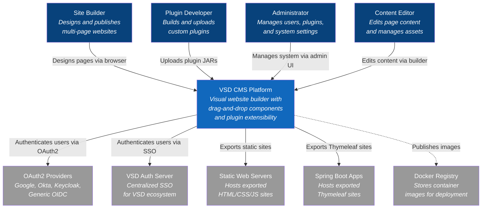
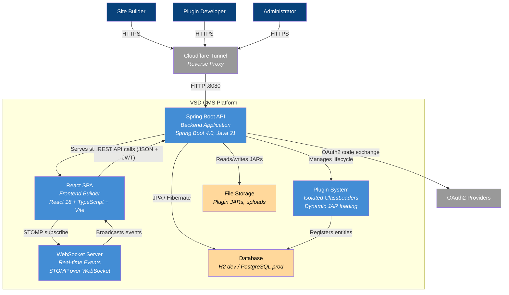
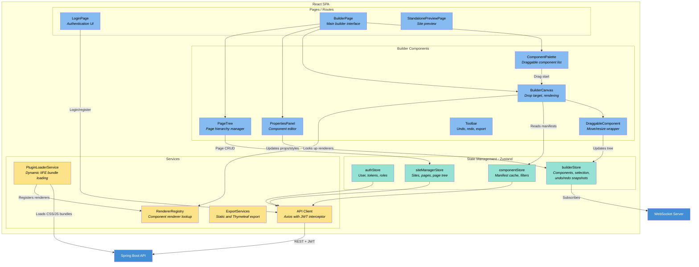
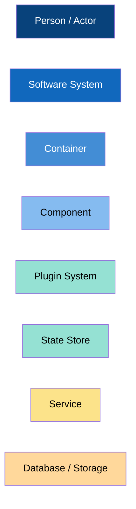

# C4 Architecture Model — VSD CMS

This document presents the VSD CMS architecture using the [C4 model](https://c4model.com/) at three levels of abstraction: System Context, Container, and Component.

> These diagrams complement the arc42 views in this directory. For detailed runtime scenarios, see [06-runtime-view.md](06-runtime-view.md). For deployment details, see [07-deployment-view.md](07-deployment-view.md).

---

## Level 1 — System Context

Shows the VSD CMS platform, its users, and the external systems it interacts with.

### Actors

| Actor | Role |
|-------|------|
| **Site Builder** | Designs multi-page websites using the visual drag-and-drop builder |
| **Plugin Developer** | Builds custom UI component and context provider plugins using the SDK |
| **Administrator** | Manages users, roles, plugins, and system configuration |
| **Content Editor** | Edits page content and manages assets within existing sites |

### External Systems

| System | Integration |
|--------|-------------|
| **OAuth2 Providers** | Google, Okta, Keycloak, generic OIDC for user authentication |
| **VSD Auth Server** | Centralized SSO service for the VSD ecosystem (RS256 JWT) |
| **Static Web Servers** | Target for exported static HTML/CSS/JS site packages |
| **Spring Boot Apps** | Target for exported Thymeleaf-based dynamic sites |
| **Docker Registry** | Stores VSD CMS container images for deployment |

---

## Level 2 — Container

Shows the major containers (applications and data stores) that make up the VSD CMS platform.

### Container Descriptions

| Container | Technology | Purpose |
|-----------|-----------|---------|
| **React SPA** | React 18.3, TypeScript 5.6, Vite | Visual drag-and-drop page builder with component palette, canvas, and property editor |
| **Spring Boot API** | Spring Boot 4.0, Java 21 | REST API serving authentication, page/site CRUD, component registry, and plugin management |
| **WebSocket Server** | STOMP over WebSocket | Real-time event broadcasting for component interactions and live preview |
| **Plugin System** | Custom ClassLoaders, child ApplicationContexts | Dynamically loads, isolates, and manages plugin JAR files at runtime |
| **Database** | H2 (dev) / PostgreSQL 16 (prod) | Stores users, sites, pages, component registry, plugin metadata. Schema managed by Flyway |
| **File Storage** | Local filesystem | Stores uploaded plugin JARs (`/app/plugins/`) and user-uploaded assets (`/uploads/`) |
| **Cloudflare Tunnel** | cloudflared | Exposes the application to the internet without opening inbound ports |

---

## Level 3 — Component: Backend (Spring Boot API)

Shows the key components within the Spring Boot backend container.

```mermaid
graph TB
    SPA["React SPA"]

    subgraph API ["Spring Boot API"]
        subgraph WEB ["Web Layer"]
            AUTH_CTRL["AuthController<br/><i>Login, register,<br/>token refresh</i>"]
            PAGE_CTRL["PageController<br/><i>Page CRUD</i>"]
            SITE_CTRL["SiteController<br/><i>Site management</i>"]
            COMP_REG_CTRL["ComponentRegistryController<br/><i>Component catalog</i>"]
            COMP_ADMIN_CTRL["ComponentAdminController<br/><i>Plugin upload,<br/>activate/deactivate</i>"]
            CTX_CTRL["ContextRegistryController<br/><i>Context providers</i>"]
            DIAG_CTRL["PluginDiagnosticsController<br/><i>Plugin health info</i>"]
        end

        subgraph SEC ["Security"]
            JWT_FILTER["JwtAuthenticationFilter<br/><i>Validates JWT tokens</i>"]
            DYN_FILTER["DynamicPublicApiFilter<br/><i>DB-driven public patterns</i>"]
            SEC_CONFIG["CmsSecurityConfig<br/><i>Filter chain setup</i>"]
        end

        subgraph SVC ["Service Layer"]
            AUTH_SVC["AuthService<br/><i>JWT issue/validate</i>"]
            PAGE_SVC["PageService<br/><i>Page operations</i>"]
            SITE_SVC["SiteService<br/><i>Site operations</i>"]
            COMP_REG_SVC["ComponentRegistryService<br/><i>Manifest cache</i>"]
            EVENT_SVC["EventBroadcastService<br/><i>WebSocket broadcast</i>"]
        end

        subgraph PLUGIN ["Plugin System"]
            PM["PluginManager<br/><i>Lifecycle orchestration</i>"]
            PCL["PluginClassLoader<br/><i>JAR isolation</i>"]
            PCM["PluginContextManager<br/><i>Child ApplicationContexts</i>"]
            PER["PluginEntityRegistrar<br/><i>JPA entity registration</i>"]
            PCR["PluginControllerRegistrar<br/><i>Dynamic bean registration</i>"]
        end

        subgraph REPO ["Persistence"]
            USER_REPO["UserRepository"]
            PAGE_REPO["PageRepository"]
            SITE_REPO["SiteRepository"]
            PLUGIN_REPO["PluginRepository"]
            COMP_REPO["ComponentRegistryRepository"]
        end
    end

    DB["Database"]

    SPA -->|"REST"| WEB
    SPA -->|"HTTP"| JWT_FILTER
    JWT_FILTER -->|"Validates"| AUTH_SVC
    DYN_FILTER -->|"Checks patterns"| COMP_REPO

    AUTH_CTRL --> AUTH_SVC
    PAGE_CTRL --> PAGE_SVC
    SITE_CTRL --> SITE_SVC
    COMP_REG_CTRL --> COMP_REG_SVC
    COMP_ADMIN_CTRL --> PM

    PAGE_SVC --> PAGE_REPO
    SITE_SVC --> SITE_REPO
    AUTH_SVC --> USER_REPO
    COMP_REG_SVC --> COMP_REPO
    PM --> PLUGIN_REPO
    PM --> PCL
    PM --> PCM
    PM --> PER
    PM --> PCR

    REPO -->|"JPA"| DB

    style SPA fill:#438dd5,color:#fff
    style DB fill:#ffd89b,color:#000
    style AUTH_CTRL fill:#85bbf0,color:#000
    style PAGE_CTRL fill:#85bbf0,color:#000
    style SITE_CTRL fill:#85bbf0,color:#000
    style COMP_REG_CTRL fill:#85bbf0,color:#000
    style COMP_ADMIN_CTRL fill:#85bbf0,color:#000
    style CTX_CTRL fill:#85bbf0,color:#000
    style DIAG_CTRL fill:#85bbf0,color:#000
    style JWT_FILTER fill:#f38181,color:#fff
    style DYN_FILTER fill:#f38181,color:#fff
    style SEC_CONFIG fill:#f38181,color:#fff
    style AUTH_SVC fill:#85bbf0,color:#000
    style PAGE_SVC fill:#85bbf0,color:#000
    style SITE_SVC fill:#85bbf0,color:#000
    style COMP_REG_SVC fill:#85bbf0,color:#000
    style EVENT_SVC fill:#85bbf0,color:#000
    style PM fill:#95e1d3,color:#000
    style PCL fill:#95e1d3,color:#000
    style PCM fill:#95e1d3,color:#000
    style PER fill:#95e1d3,color:#000
    style PCR fill:#95e1d3,color:#000
    style USER_REPO fill:#ffd89b,color:#000
    style PAGE_REPO fill:#ffd89b,color:#000
    style SITE_REPO fill:#ffd89b,color:#000
    style PLUGIN_REPO fill:#ffd89b,color:#000
    style COMP_REPO fill:#ffd89b,color:#000
```

### Backend Component Descriptions

| Component | Responsibility |
|-----------|---------------|
| **AuthController** | Handles login, registration, token refresh, and OAuth2 code exchange |
| **PageController / SiteController** | CRUD operations for pages and sites |
| **ComponentRegistryController** | Serves the component catalog to the frontend |
| **ComponentAdminController** | Plugin JAR upload, component activate/deactivate |
| **JwtAuthenticationFilter** | Intercepts requests to validate HS256 (local) and RS256 (SSO) JWT tokens |
| **DynamicPublicApiFilter** | Checks database-driven Ant-style patterns to skip auth for public endpoints |
| **PluginManager** | Orchestrates plugin install, activate, deactivate, and uninstall lifecycle |
| **PluginClassLoader** | Creates isolated classloaders per plugin JAR to prevent dependency conflicts |
| **PluginContextManager** | Manages child Spring ApplicationContexts for plugin bean isolation |
| **ComponentRegistryService** | Caches component manifests from plugins and serves them to the frontend |
| **EventBroadcastService** | Pushes real-time events to frontend via STOMP WebSocket topics |

---

## Level 3 — Component: Frontend (React SPA)

Shows the key components within the React frontend container.

### Frontend Component Descriptions

| Component | Responsibility |
|-----------|---------------|
| **BuilderPage** | Main builder interface composing palette, canvas, properties panel, and page tree |
| **ComponentPalette** | Displays available components grouped by category; initiates drag with `application/json` data |
| **BuilderCanvas** | Drop target that calculates insertion position, manages component rendering and nested containers |
| **DraggableComponent** | Wraps placed components with move handle, resize handles, and selection state |
| **PropertiesPanel** | Renders editable property and style fields based on component manifest |
| **PageTree** | Hierarchical page manager with dnd-kit drag-and-drop for reordering and nesting |
| **builderStore** | Central state for component tree, selection, clipboard, and undo/redo snapshots |
| **componentStore** | Caches component manifests from backend; provides filtered component lists |
| **PluginLoaderService** | Dynamically loads plugin frontend bundles (IIFE scripts) and CSS from backend |
| **RendererRegistry** | Singleton mapping of `pluginId:componentId` to React renderer components |
| **API Client** | Axios instance with request interceptor (JWT) and response interceptor (auto token refresh) |

---

## Legend

